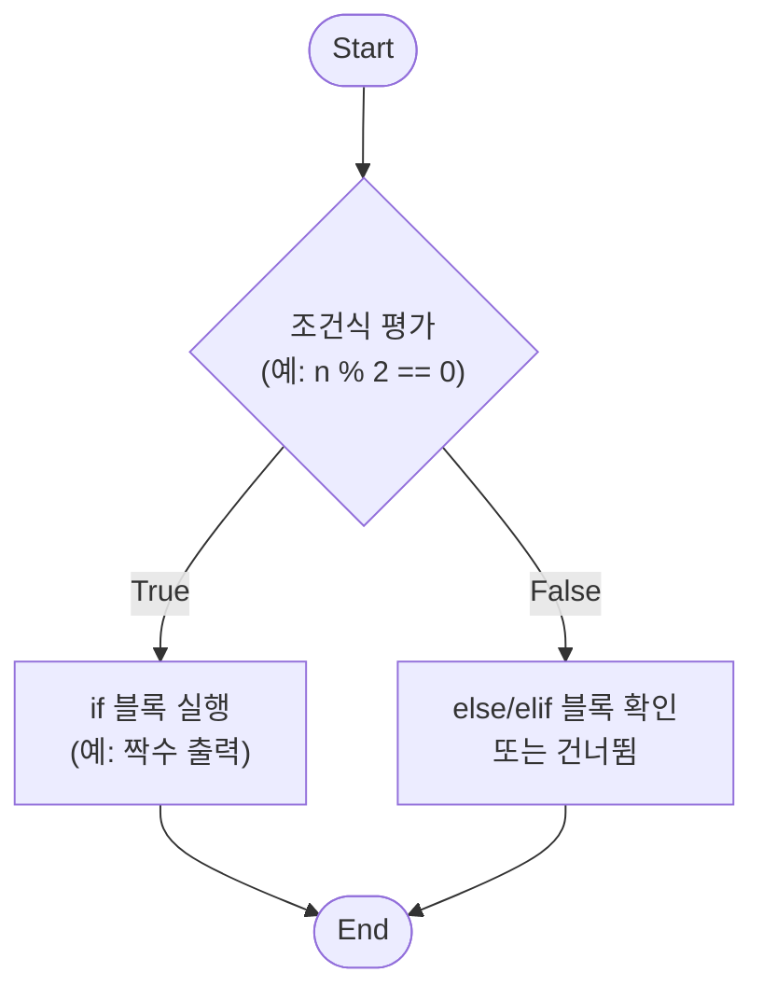
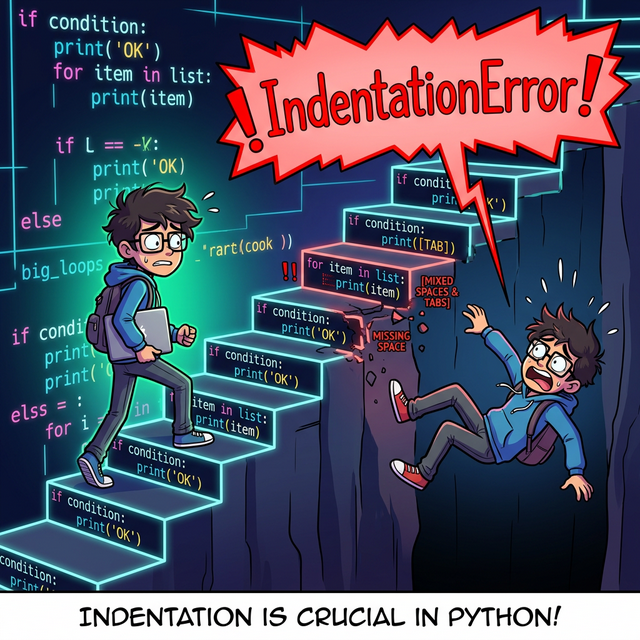

# 3.2.1 제어 흐름과 함수

## 조건문 if


*(웹툰 비유: 클럽 입구에 선 무서운 가드 로봇이 '나이가 20살 이상인가?'라는 조건식 표지판을 들고 있습니다. 15살 로봇은 '거짓(False)' 판정을 받아 쫓겨나고, 25살 로봇은 '참(True)' 판정을 받아 문 안으로 통과하는 재미있는 분기(Branching) 상황입니다.)*


*(조건문 개념도: 데이터 점이 조건식의 평가(참/거짓) 결과에 따라 서로 다른 블록으로 분기 처리되는 과정을 시각화한 애니메이션)*

데이터의 분기를 나누고 전처리를 하다 보면, 특정 조건에 맞게 값이나 그룹을 변경하는 일이 빈번합니다. 파이썬의 꽃이라고 할 수 있는 제어 흐름의 기본기, 조건문 `if`에 대해 알아봅니다.

### 조건문 흐름도 (Mermaid)

파이썬의 조건문이 실행되는 논리적인 흐름을 아래의 다이어그램으로 살펴볼 수 있습니다. 조건이 참(True)인지 거짓(False)인지에 따라 프로그램의 판별 경로가 엇갈리게 됩니다.



### 블록 문장 조건문 if (왜 중괄호 대신 들여쓰기를 쓸까?)

파이썬은 C, Java와 같은 기존 언어들과 달리 **중괄호 `{}` 대신 오직 '들여쓰기(Indentation)'**만을 사용하여 코드 블록을 묶고 구분합니다.


*(웹툰 비유: 왼쪽의 다른 언어 프로그래머는 수많은 중괄호 `{}` 거미줄에 갇혀 코드의 논리를 잃고 괴로워하고 있습니다. 하지만 오른쪽의 파이썬 프로그래머는 자로 잰 듯 완벽하게 정렬된 '들여쓰기 블록 계단'을 가뿐하게 오르며 여유롭게 코드를 식별합니다!)*

#### "가독성이 왕이다" (Readability Counts)
파이썬 창시자 귀도 반 로섬(Guido van Rossum)은 **"코드는 작성되는 시간보다 다른 사람에 의해서 읽히는 시간이 훨씬 길다"**고 굳게 믿었습니다. 

자바나 C에서는 중괄호만 맞으면 띄어쓰기를 엉망으로 섞어 써도 컴퓨터는 군말 없이 코드를 실행해 줍니다. 하지만 파이썬은 **"사람의 눈에 보이는 시각적 들여쓰기 구조가 곧 실제 컴퓨터가 인식하는 논리 구조와 100% 동일하도록"** 프로그래머에게 규칙을 강제합니다. 덕분에 코딩을 어제 시작한 초보자가 짠 코드든, 구글의 천재 해커가 짠 코드든 파이썬 코드는 항상 일직선으로 반듯하고 일관되어 **가독성이 폭발적으로 높아지는 마법**이 일어납니다.

관례적으로 **스페이스 4칸**을 사용합니다. 블록을 시작하기 전(예: `if` 조건식 끝)에는 반드시 콜론 `:`을 찍어 "이제부터 새로운 블록 계단이 시작된다"고 인터프리터에게 예고해야 합니다.


*(웹툰 비유: 잘 정렬된 블록 계단을 오르던 프로그래머가, 단 한 칸 삐져나온 거친 블록(잘못된 들여쓰기)을 밟고 헛디뎌 추락할 뻔합니다. 허공에 거대한 붉은색 `IndentationError!` 경고창이 번쩍입니다. 난간이 없는 계단에서는 발걸음을 정확히 맞춰야 하듯, 파이썬에서는 스페이스바 개수가 생명입니다.)*

> [!WARNING]
> **난간 없는 계단의 공포: `IndentationError`**
> 중괄호 지옥에서 해방된 대가는 **'엄격한 줄 맞춤'**입니다. 난간이 없는 계단과 같아서 발을 헛디디면 바로 추락합니다.
> 1. 스페이스바 4칸을 쳤다가, 다음 줄에서는 스페이스바 3칸을 치면 사정없이 에러가 발생합니다.
> 2. 특히 **비밀스러운 암살자, 탭(Tab) 키와 스페이스바(Space)를 섞어 쓰는 행위**는 절대 금물입니다. 눈에 보이지 않지만 파이썬은 이를 현미경처럼 찾아내어 `TabError`나 `IndentationError`를 뱉어냅니다. (최근의 VS Code 같은 에디터들은 Tab을 누르면 자동으로 스페이스 4칸으로 변환해 주어 우리를 구원해 줍니다.)

```python
n = 20

# 조건이 참이므로 들여쓰기 된 블록이 실행됨
if n % 2 == 0:
    print("짝수")
```
**출력:**
```
짝수
```
*(참고: 만약 `n = 21`이었다면 거짓이 되어 아무 일도 일어나지 않습니다.)*

### 양자택일 조건문 if ... else ...


*(웹툰 비유: 갈림길에 선 로봇이 표지판을 보고 있습니다. `날씨 == 맑음`이라는 조건이 참(True)이면 밝은 해변으로 가는 길을 택하고, 거짓(False)이면, 즉 그 외의 모든 날씨에는 아늑한 도서관으로 가는 다른 길을 택하게 됩니다! 오직 두 가지 길 중 하나만 선택할 수 있습니다.)*

특정 조건을 만족하는 경우와 만족하지 않는 경우에 다른 연산을 지정하는 구문입니다. 조건이 처음부터 거짓(False)이거나, 중간에 판별을 실패하면 자동으로 마지막 보루인 `else:` 내부의 블록이 무조건 실행됩니다.


*(다이어그램: `x > 4`라는 스위치를 만나, 조건을 통과한 참(True) 데이터 수레는 위쪽 철로(`y = 1`)를 타고, 거짓(False) 데이터 수레는 튕겨져서 아래쪽 철로(`y = 2`)로 우회하는 애니메이션입니다.)*

```python
x = 3

if x > 4:
    y = 1
else:
    y = 2

print(y)
```
**출력:**
```
2
```

### 삼항 연산자를 이용한 한 줄 조건문 (One-line if)


*(웹툰 비유: 거대한 다층 공장 기계(`if...else` 블록) 앞에서 멍하니 서 있던 프로그래머가, 그 육중한 기계와 완전히 똑같은 작업을 눈 깜짝할 새 처리해 내는 초소형 마법 지팡이(한 줄 조건문)를 보고 감탄하는 모습입니다. 파이썬에서는 가독성을 해치지 않는 선에서 코드를 한 줄로 우아하게 압축할 수 있습니다!)*

단순한 값 할당을 위한 `if ~ else` 구문은 한 줄로 합쳐서 매우 간결하게 표현할 수 있습니다. 


*(다이어그램: `참일때의값 if 조건식 else 거짓일때의값` 형태의 문법 구조 애니메이션입니다. 파이썬은 타 언어의 `조건 ? 참 : 거짓` 기호 대신, 영어 문장을 읽듯 매우 직관적이고 자연스러운 어휘를 사용합니다.)*

```python
age = 18

# 간결한 한 줄 표현
status = '성인' if age >= 20 else '미성년자'
print(status)
# 출력: 미성년자
```

**[심화 활용: 리스트 내포와 결합]**
데이터 분석 시 리스트 내포(List Comprehension) 안에 한 줄 조건문을 넣어 벡터처럼 각 원소 단위로 조건을 검사하고 변경할 수 있습니다.

```python
x = [1, -2, 3, -4, 5]
# 모든 원소를 순회하며 0을 기준으로 양/음수 라벨링
result = ["양수" if value > 0 else "음수" for value in x]
print(result)
```
**출력:**
```
['양수', '음수', '양수', '음수', '양수']
```

### 반복된 다중 조건문 if ... elif ... else


*(웹툰 비유: 복도에 여러 개의 잠긴 문이 순서대로 늘어서 있습니다. 로봇이 85번 키를 들고 첫 번째 `>= 90` 문에 꽂아보지만 열리지 않습니다(False). 다음 문인 `>= 80` 문에 꽂자 철칵! 하고 위풍당당하게 문이 열립니다(True). 로봇은 뒤에 남은 `>= 70` 문 따위는 쳐다보지도 않고 열린 방 안으로 들어가 버립니다. 이것이 `elif`의 핵심 원리인 **'순차적 숏서킷(Short-Circuit)'**입니다.)*

Python에서는 조건 판단이 3갈래 이상으로 나뉘는 경우 `elif` (else if의 줄임말) 구문을 사용합니다. 첫 조건부터 순차적으로 검사하며, 한 번이라도 참을 달성하면 하위 조건들은 스킵(건너뜀)합니다.

```python
point = 85

if 90 <= point:
    print('A')
elif 80 <= point:
    print('B')
elif 70 <= point:
    print('C')
else:
    print('F')
```
**출력:**
```
B
```

### 논리 연산자(and, or, not)를 활용한 다중 조건문

여러 조건을 동시에 평가해야 할 때는 논리 연산자를 사용합니다.
- `and`: 모든 조건이 참일 때 블록을 실행합니다.
- `or`: 하나라도 조건이 참이면 블록을 실행합니다.
- `not`: 조건의 참/거짓 값을 반대로 뒤집습니다.

```python
age = 25
has_ticket = True

# 두 조건을 모두 만족해야 입장 가능
if age >= 19 and has_ticket:
    print("관람이 가능합니다.")
else:
    print("입장할 수 없습니다.")
# 출력: 관람이 가능합니다.
```

### 포함 여부를 검사하는 멤버십 연산자 (in, not in)

리스트, 튜플, 문자열 등 연속형 자료 안에 특정 값이 들어 있는지 확인할 때 `in`과 `not in` 연산자를 활용하면 매우 직관적인 조건 처리가 가능합니다.

```python
allowed_users = ["Alice", "Bob", "Charlie"]
user = "David"

if user not in allowed_users:
    print(f"경고: {user}는 허가되지 않은 사용자입니다.")
```

### 중첩 조건문 (Nested if)


*(웹툰 비유: 로봇이 힘겹게 첫 번째 거대한 자물쇠 상자(`성적 >= 80`)를 열었는데, 그 안에 보물이 있는 게 아니라 **또 다른 두 번째 자물쇠 상자(`출석 == 100`)**가 들어있습니다! 로봇은 땀을 한 방울 흘리며 두 번째 열쇠까지 꽂아 넣고 나서야 비로소 진짜 황금 트로피(최종 합격)를 꺼냅니다. 퀘스트 안의 퀘스트, 이것이 바로 중첩 조건문입니다.)*

`if` 블록 안에 또 다른 `if` 블록을 중첩시켜, 조건 판별을 2중 3중으로 단계적이고 깊숙하게 들어갈 수도 있습니다. 단, 너무 많은 중첩 조건문(If depth)은 코드를 오른쪽으로만 길게 만들고 가독성을 크게 훼손하므로 적절히 분리하는 것이 좋습니다.

```python
score = 85
attendance = 100

if score >= 80:
    print("성적 평가는 통과했습니다.")
    
    # 1차 조건을 통과한 경우에만 내부 if문을 검사
    if attendance == 100:
        print("최종 합격: 장학금 지급 대상입니다!")
    else:
        print("최종 합격: 하지만 결석이 있어 장학금은 제외됩니다.")
else:
    print("성적 미달로 불합격입니다.")
```

### 파이썬의 암묵적인 참/거짓 (Truthy & Falsy)

파이썬에서는 굳이 세부적인 비교 연산자(`==`, `>`, `<`)를 쓰지 않아도 데이터 자체가 문맥에 따라 `True`나 `False`로 판별되는 **암묵적인 논리 평가** 특징이 있습니다. 데이터가 "비어 있느냐, 값이 없느냐"를 가장 파이썬답고 세련되게 검사하는 패턴입니다.

- **Falsy 평가 (거짓 처리)**: `0`, `0.0`, `""`(빈 문자열), `[]`(빈 리스트), `()`, `{}`, `None`, `False`
- **Truthy 평가 (참 처리)**: 위를 제외한, 값이 채워져 있는 모든 데이터

```python
user_name = ""  # 빈 문자열은 Falsy로 평가됨
items = []      # 빈 리스트도 Falsy로 평가됨

# user_name이 비어있으면 if문 조건은 False가 되어 else 블록으로 떨어짐
if user_name:
    print(f"환영합니다, {user_name}님.")
else:
    print("이름이 입력되지 않았습니다.")
    
# 리스트에 데이터가 있는지 없는지 직관적으로 확인
if not items:
    print("장바구니가 비어 있습니다.")
```

### [실전 예제] 게임 체력(HP) 상태 경고 시스템

조건 판단이 여러 갈래로 나뉘는 `if ~ elif ~ else` 구문은 실제 프로그래밍 로직을 분기하는 데 매우 흔하게 쓰입니다. 예를 들어 게임 캐릭터의 체력 상태에 따른 경고 시스템을 다음과 같이 설계할 수 있습니다.

```python
hp = 30

# 조건 1: 체력이 20 이하니?
if hp <= 20:
    print("⚠️ 위험! 포션을 사용하세요!") # 참일 때 실행
    
# 조건 2: (위 조건이 아니고) 체력이 50 이하니?
elif hp <= 50:
    print("주의! 체력을 관리하세요.")   # 조건 1은 거짓, 조건 2는 참일 때 실행
    
# 그 외 모든 경우
else:
    print("상태 양호. 전투를 계속합니다.") # 위 모든 조건이 거짓일 때 실행
```

### [데이터 분석] np.select() 조건 처리

Python 기본 제어문을 넘어 Pandas 등 대용량 데이터 전처리를 할 때, `numpy.select()`를 응용하면 중첩된 `if else` 없이 여러 조건을 깔끔하게 처리할 수 있습니다. 각 조건에 대한 결과 배열을 매핑합니다.

```python
import numpy as np

arr = np.array([1, -2, 3, -4, 0])

# 분기될 조건들의 리스트
conditions = [arr > 0, arr == 0, arr < 0]
# 조건에 매칭되어 반환될 값 리스트
choices = ["양수", "0", "음수"]

result = np.select(conditions, choices)
print(result)
```
**출력:**
```
['양수' '음수' '양수' '음수' '0']
```

---

## ☕ Java vs 🐍 Python 스나이퍼 비교

### 1. 블록 구조 (중괄호 vs 들여쓰기)
*   **Java**: 블록을 정의할 때 중괄호 `{ }` 를 사용합니다. 들여쓰기(Indentation)는 사람의 눈을 위해 정렬하는 것일 뿐, 논리에는 1도 영향을 미치지 않습니다.
*   **Python**: 중괄호가 아예 없습니다! 오직 **스페이스 4칸 들여쓰기**만으로 코드 블록을 인식합니다. 들여쓰기가 한 칸이라도 어긋나면 자비 없이 `IndentationError`가 터지는, 지구상에서 들여쓰기에 가장 집착하는 언어입니다.

### 2. 조건부 괄호
*   **Java**: `if (n % 2 == 0) {` 와 같이 논리식을 반드시 **소괄호 `( )`** 로 감싸야 합니다.
*   **Python**: `if n % 2 == 0:` 처럼 소괄호를 생략하는 것이 기본이자 파이썬다움(Pythonic)입니다. 대신 문장 끝에 반드시 콜론(`:`)을 찍어 "문장이 끝났고 이제부터 블록이 시작된다"고 인터프리터에게 강력하게 외쳐야 합니다.

### 3. 다중 분기 구문
*   **Java**: `else if` 로 단어를 띄워서 작성합니다.
*   **Python**: `elif` 라는 독특한 축약 키워드를 사용합니다. 

---

## 🎧 Vibe Coding

> **🗣️ 학생 프롬프트 (AI에게 이렇게 명령해 보세요):**
> "파이썬에서 점수를 입력받아 A, B, C, D, F 학점을 매겨주는 간단한 성적 판별기 코드를 작성해줘. 단, if, elif, else가 정확히 어떻게 분기되는지 옆에 자세한 주석을 달아주고, 내가 잘못된 값(음수나 100점 초과)을 넣었을 때의 중첩 if문 예외처리도 상세하게 추가해줘."

---

## 코딩 영단어 학습 📝

*   **`if`**: 만약 ~라면. (현실의 가정문과 똑같이, 코드 세계에서 선택의 기로를 만듭니다.)
*   **`else`**: 그 밖의, 다른. (모든 `if`와 `elif`의 검증을 통과하지 못한 '나머지 찌꺼기' 값들이 모조리 들어가는 쓰레기통이자 최후의 보루입니다.)
*   **`elif`**: else if 의 줄임말. (파이썬에서만 쓰는 독특한 줄임말입니다. 두 번째, 세 번째 플랜B 조건들을 계속해서 추가할 때 씁니다.)
*   **`Indent (Indentation)`**: 들여쓰다, 톱니 모양. (파이썬 코드의 목숨줄입니다. 콜론 뒤에 스페이스바 4번을 쳐서 코드를 우측으로 파이게 만드는 행위를 말합니다.)
