# 3.2.2 match 구문


*(패턴 매칭 개념도: 복잡잡한 데이터 화물을 그 형태와 내부 구조에 따라 알아서 척척 알맞은 트랙으로 분류시키는 최첨단 스마트 기차 분류장)*

Python 3.10 버전부터 새롭게 도입된 `match` 구문은 C, Java 등 다른 언어의 `switch-case` 문과 유사해 보이지만, **단순 값을 비교하는 것을 넘어 데이터의 '구조(형태)'까지 분해해서 매칭**할 수 있는 훨씬 강력하고 현대적인 기능입니다.


*(흐름도 애니메이션: 각기 다른 속성의 데이터 패키지가 중앙 스위치(분기점)에 도달한 뒤, 자신과 일치하는 `case` 선로를 찾아 진입하여 해당 블록의 로직을 실행하는 모습)*

## 기존 switch ~ case 구문과의 차별점

| 언어/구문 | 주요 특징 및 한계점 |
|---|---|
| **C/Java의 `switch`** | 주로 정수형(int), 문자(char), 문자열(String) 등 **단순한 단일 값의 일치 여부**만 검사할 수 있습니다. 각 `case`마다 `break`를 명시하지 않으면 밑으로 주욱 누수(fall-through)되는 귀찮은 점이 있습니다. |
| **Python의 `match`** | 숫자, 문자열 비교는 기본이고, 리스트 갯수, 튜플 내부의 변수 위치, 딕셔너리의 키 구조 등 **복합 자료구조 자체를 분해(Unpacking)**하여 매칭할 수 있습니다. `break`를 쓰지 않아도 매칭된 블록 하나만 실행되고 깔끔하게 종료됩니다. |

## 문법 및 키워드
구문에서 `match`와 `case`는 핵심 키워드입니다. C나 자바에 쓰이던 `default:` 키워드 대신 `case _:` (언더스코어) 문법을 기본값으로 사용합니다.

연산식 또는 변수 `exp`의 구조나 값을 각 `case` 블록의 패턴들과 위에서부터 순서대로 비교하고, 첫 번째로 구조/값이 일치하는 `case`를 찾으면 해당 `case` 내부 블록인 `statements`만 실행합니다. 
어떤 `case`와도 일치하지 않으면 옵션인 `case _:` 이후의 블록을 실행한다.

```python
match exp:
    case value1:
        statements
    case value2:
        statements
    case _:
        statements
```

- `exp`: `match` 구문에서 평가할 식(expression)이나 변수이며, 이 값이 어떤 `case`와 일치하는지 확인
- `value1`, `value2`, ...: 여러 개의 경우(case)를 정의하며, `exp`의 값과 각 경우를 비교
- `statements`: 각 경우에 해당하는 실행 문장이 정의되는 블록으로, `exp`의 값이 해당하는 경우, 해당 블록이 실행


## 예제
다음 구문 `match` 문장에서 `value`가 `apple`이므로 `case 'apple'`에 적용되어 출력 값은 사과이다.

```python
value = "apple"
match value:
    case 'apple':
        result = "사과"
    case 'banana':
        result = "바나나"
    case _:
        result = "기타"

print(result)
```
**출력:**
```
사과
```

다음은 `value`가 `banana`이므로 `result`에 저장된 값은 바나나이다.

```python
value = "banana"
match value:
    case 'apple':
        result = "사과"
    case 'banana':
        result = "바나나"

print(result)
```
**출력:**
```
바나나
```

다음은 `mango`로 비교할 값이 `case`에 없으므로 `case _:` 블록이 실행되어 `None`이 출력된다.

```python
value = "mango"

match value:
    case 'apple':
        result = "사과"
    case 'banana':
        result = "바나나"
    case _:
        result = None

print(result)
```
**출력:**
```
None
```

## 고급 활용: 구조적 패턴 매칭 (Structural Pattern Matching)

`match` 구문의 진정한 강력함은 리스트나 딕셔너리 같은 복합 자료형의 내부 '구조'를 통째로 인식하여 변환할 때 발휘됩니다.

### 1. 리스트(List) 구조 언패킹 매칭
들어오는 좌표 데이터 리스트의 원소 갯수와 인덱스 값에 따라 처리를 분기할 수 있습니다. 요소의 갯수뿐만 아니라 그 구성 요소를 곧바로 변수로 뽑아내어(Unpacking) 활용할 권한도 가집니다.

```python
# 2개의 요소가 들어있는 리스트
point = [10, 20]

match point:
    case [0, 0]:
        print("원점입니다.")
    case [x, 0]:
        print(f"X축 위의 점입니다. 위치 X = {x}")
    case [0, y]:
        print(f"Y축 위의 점입니다. 위치 Y = {y}")
    case [x, y]:
        print(f"일반 2차원 좌표: X={x}, Y={y}")
    case _:
        print("단순 2차원 좌표가 아닙니다.")
```
**출력:**
```
일반 2차원 좌표: X=10, Y=20
```

### 2. 딕셔너리(Dictionary) 구조 검증 매칭
웹 API JSON 응답과 같은 복잡한 딕셔너리 데이터에서 필수 키(Key)가 존재하는지, 데이터 뼈대가 잘 갖춰졌는지 점검할 때 매우 깔끔한 코드를 작성할 수 있습니다.

```python
response = {"status": 200, "data": "로그인 성공"}

match response:
    # 딕셔너리 안에 status: 200이 있고, data 키가 있다면 그 값을 msg 변수에 담아 실행
    case {"status": 200, "data": msg}:
        print(f"정상 처리됨: {msg}")
        
    case {"status": 404}:
        print("경고: 리소스를 찾을 수 없습니다.")
        
    # 에러 코드가 무엇이든 error 키가 포함되어 있으면 발생
    case {"status": code, "error": err_msg}:
        print(f"서버 오류 {code}: {err_msg}")
        
    case _:
        print("알 수 없는 응답 포맷입니다.")
```
**출력:**
```
정상 처리됨: 로그인 성공
```
