# 3.2.3 반복문 for


*(반복문 개념도: 데이터 점이 조건을 만족하는 동안 몸체(Body)를 맴돌다가, 조건이 종료되면 탈출하는 과정을 시각화한 애니메이션)*

파이썬에서 `for`문은 횟수와 구조를 중심으로 순회하는 데 사용되는 가장 핵심적이고 강력한 반복 구조입니다. 타 프로그래밍 언어들은 인덱스를 올리면서 반복하지만, 파이썬의 `for` 구문은 `in` 이후의 리스트, 튜플, 문자열 등 **항목이 있는 집합적 구조(Iterable)**를 처음부터 끝까지 하나씩 알아서 꺼내며 순회합니다.

## for 구문의 기본 사용법

반드시 콜론 `:`으로 헤더를 마무리해야 하며 탭(Tab) 자동 들여쓰기로 블록을 생성해야 합니다.

```python
# 내장 range(1, 6)을 이용해 1, 2, 3, 4, 5 까지 반복
for x in range(1, 6):
    print(x)
```

모임형 자료형(리스트 안의 원소 등)을 직접 꺼낼 수도 있습니다. 이렇게 하면 인덱스를 통한 번거로운 접근(`lst[i]`)이 필요 없어 코드가 매우 직관적이게 됩니다.

```python
fruits = ["apple", 2500, "banana", 500]
for item in fruits:
    print(item)
```

## [유용한 테크닉] f-string과 zip() 함수의 결합
데이터를 짝지어서 출력할 때 최신 파이썬의 꽃인 **f-string** 포매팅 기법(Python 3.6+)과 `zip()` 내장 함수를 묶어서 사용하면 매우 가독성이 높습니다.
- **f-string**: 중괄호 `{}` 안에 변수나 표현식을 직접 삽입해 문자열을 동적으로 생성
- **zip()**: 여러 개의 객체를 병렬로 묶어 같은 인덱스끼리 튜플로 매칭

```python
names = ["John", "Alice", "Bob"]
ages = [25, 30, 22]

# 서로 다른 두 리스트를 zip으로 묶어 병렬 반복 순회
for name, age in zip(names, ages):
    # f"..." 형태로 간편하게 변수 삽입 문자열 출력
    print(f"Name: {name}, Age: {age}살")
```
**출력:**
```
Name: John, Age: 25살
Name: Alice, Age: 30살
Name: Bob, Age: 22살
```

## 제어 흐름 조작: break와 continue 

`for` 반복문 내부에서 특정 조건을 만났을 때, 반복의 흐름을 강제로 제어할 수 있는 키워드입니다.

- `break`: 가장 가까이 있는 반복문을 **즉시 완전히 파괴**하고 탈출합니다. 더 이상 반복 순회를 진행하지 않습니다.
- `continue`: 현재 진행 중인 이번 차례의 반복 코드를 중단하고, **다음 차례(Next step)로 곧바로 건너뜁니다(Skip)**.

### break 예제 (리스트 조기 종료)
만약 리스트를 검사하다가 원하는 값을 찾으면 더 이상 루프를 순회하며 컴퓨팅 자원을 낭비할 필요가 없을 때 씁니다.

```python
targets = [10, 25, 13, 8, 99, 4]

for num in targets:
    if num == 8:
        print("💡 목표 숫자 8을 찾았습니다! 검색을 종료합니다.")
        break  # 반복문을 즉시 탈출
    print(num, "검색 중...")
```
**출력:**
```
10 검색 중...
25 검색 중...
13 검색 중...
💡 목표 숫자 8을 찾았습니다! 검색을 종료합니다.
```
*(99와 4는 출력되지 않음)*

### continue 예제 (특정 조건 건너뛰기)
조건에 맞지 않는 데이터는 별도의 처리를 하지 않고 무시한 뒤, 다음 루프로 넘어가고 싶을 때 사용합니다.

```python
# 1부터 5까지 순회하되, 짝수일 때는 건너뜁니다.
for n in range(1, 6):
    if n % 2 == 0:
        continue  # n이 짝수(2, 4)라면 아래 print를 무시하고 반복문 처음으로 되돌아감
    print(n, "은(는) 홀수입니다.")
```
**출력:**
```
1 은(는) 홀수입니다.
3 은(는) 홀수입니다.
5 은(는) 홀수입니다.
```

결론적으로 `for` 루프는 데이터 과학 및 웹 개발 처리 로직 전반에서 Python의 강력한 집합 자료형 순회 시스템과 합쳐져 가장 강력한 무기가 됩니다.
