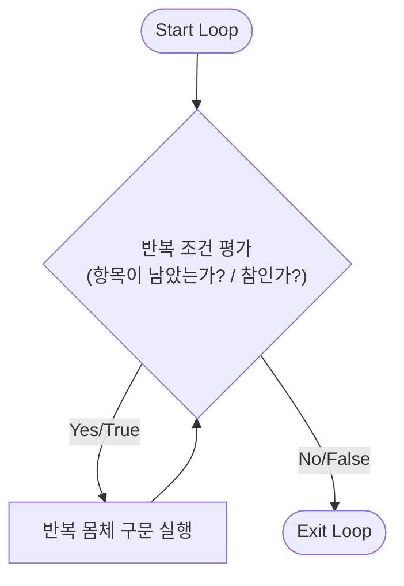
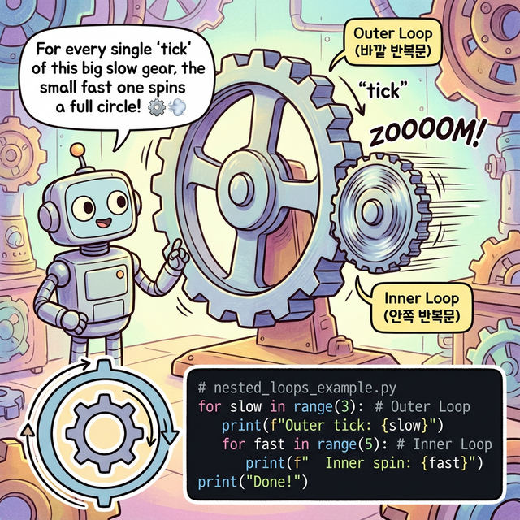

# 3.2.3 반복문 for와 while

## 학습목표
본 장에서는 주어진 집합 데이터를 처음부터 끝까지 순회하는 `for` 문과, 조건이 참인 동안 끝없이 회전하는 `while` 문의 기본적인 반복 제어 원리를 구조적으로 배웁니다.


타 프로그래밍 언어들은 루프(Loop)를 매우 중요하게 취급합니다. 왜냐하면 반복 작업 처리에 반복문 이외의 대안이 거의 없기 때문입니다. 반면 파이썬은 **리스트 내포(List Comprehension)**와 패키지의 **벡터화 연산(ex Numpy)**을 통해 반복 작업을 보다 간결하게 치환하는 경우가 많습니다. 그럼에도 불구하고 핵심 제어 구조인 `for`와 `while` 반복문은 흐름 명확성에 큰 이점이 있어 매우 기본적으로 알아야 합니다.

## 반복문 동작 흐름 (Mermaid)

반복문의 본질은 조건을 만족하는 동안 특정 블록의 코드를 끝없이 회전(Loop)시키는 것입니다. 아래 다이어그램은 반복문 기반 알고리즘의 전형적인 동작 흐름을 나타냅니다.



## 횟수와 구조 중심의 반복문 for


*(웹툰 비유: 회전 초밥집 컨베이어 벨트 앞에 앉은 로봇입니다. 접시(데이터)가 하나씩 다가오면 로봇이 집어 먹고(처리하고), 다음 접시가 올 때까지 기다립니다. 벨트 위에 초밥이 남아 있는 한 이 과정은 계속 반복되며, 초밥이 동나면 식사(루프)가 종료됩니다.)*

`for` 구문은 `in` 이후의 리스트, 튜플, 문자열 등 항목이 있는 집합적 구조를 하나씩 처음부터 끝까지 순회합니다. `for` 마지막 콜론 `:`은 반드시 필요하며 탭(Tab) 들여쓰기로 블록을 생성해야 합니다.


*(다이어그램: 컬렉션 바구니(`[A, B, C]`)에서 항목 하나가 튀어나와 변수 `item`에 담기고, 아래쪽 `print` 실행 블록으로 쏙 들어가 처리된 뒤 증발하는 과정을 순차적으로 반복하는 애니메이션입니다. 파이썬의 `for`문은 값을 일일이 세는 것이 아니라, "바구니에서 하나 꺼내기(Unpacking)"의 연속입니다.)*

```python
# 3.2.3 내장 range(1, 6)을 이용해 1부터 5까지 반복
for x in range(1, 6):
    print(x)
```

모임형 자료형(리스트 안의 원소 등)을 직접 꺼낼 수도 있습니다.

```python
fruits = ["apple", 2500, "banana", 500]
for item in fruits:
    print(item)
```

## [유용한 테크닉] f-string과 zip() 함수의 결합
데이터를 짝지어서 출력할 때 최신 파이썬의 꽃인 **f-string** 포매팅 기법(Python 3.6+)과 `zip()` 내장 함수를 묶어서 사용하면 매우 가독성이 높습니다.
- **f-string**: 중괄호 `{}` 안에 변수나 표현식을 직접 삽입해 문자열을 동적으로 생성
- **zip()**: 여러 개의 객체를 병렬로 묶어 같은 인덱스끼리 튜플로 매칭

```python
names = ["John", "Alice", "Bob"]
ages = [25, 30, 22]

# 3.2.3 서로 다른 두 리스트를 zip으로 묶어 병렬 반복 순회
for name, age in zip(names, ages):
    # f"..." 형태로 간편하게 변수 삽입 문자열 출력
    print(f"Name: {name}, Age: {age}살")
```
**출력:**
```
Name: John, Age: 25살
Name: Alice, Age: 30살
Name: Bob, Age: 22살
```

## 조건 중심의 반복문 while


*(웹툰 비유: 거대한 야광 쳇바퀴 안을 쉼 없이 달리는 로봇입니다. 쳇바퀴 위에는 `배터리 > 0%`라는 간판이 빛나고 있습니다. 배터리가 조금이라도 남아있는 한(True) 로봇은 절대 멈추지 않고 달립니다. 쳇바퀴 밖에서는 혹시 모를 고장에 대비해 다른 로봇이 거대한 빨간색 비상정지 `BREAK` 버튼을 들고 땀을 쥐며 대기하고 있습니다.)*

`while 조건식: 블록` 구문은 조건이 `True`인 동안은 영원히 블록을 반복 실행합니다. 


*(다이어그램: 데이터 입자가 `i <= 10`이라는 조건 스캐너를 통과합니다. `True` 판정을 받으면 아래쪽 처리장(`i += 1`)으로 떨어져 처리된 뒤, 롤러코스터 트랙을 타고 다시 위쪽 스캐너로 수직 상승하여 무한 루프 쳇바퀴를 형성합니다. 만약 스캐너에서 `False` 판정을 받는 순간, 비로소 오른쪽 Exit 통로로 튕겨 나갑니다.)* 

```python
i = 1
total = 0

#  i가 10 이하일 때까지만 계속 반복
while i <= 10:
    total += i
    i += 1  # 이 증감식이 없으면 끝나지 않음 (무한 루프)

print(total) # 결과: 55
```

## [유용한 테크닉] 무한 루프 탈출, break

만약 `while`의 조건식을 변수 없이 그냥 `True`로 강제 고정시켜버리면 이는 절대 스스로 끝나지 않는 무한 루프(Infinite Loop)가 됩니다. 이럴 땐 프로그램 내부에서 특정 종료 조건을 감지하여 `break` 명령어를 사용해 강제로 쳇바퀴를 깨부수고 탈출시킬 수 있습니다.

```python
i = 0
while True:  # 일단 영원히 반복!
    i += 3
    if i > 10:
        break    # 10을 초과하면 반복문을 강제로 파괴하고 종료함
    print(i)
```
**출력:**
```
3
6
9
```

## 이중 반복문 (Nested Loops)과 별 찍기


*(웹툰 비유: 거대한 바깥쪽 톱니바퀴(Outer Loop) 안에 작고 미친 듯이 빨리 도는 안쪽 톱니바퀴(Inner Loop)가 맞물려 있습니다. 거대한 톱니바퀴가 딱 한 칸(1회) '딸깍' 하고 움직일 때마다, 안쪽 톱니바퀴는 아예 한 바퀴 통째로(전체 반복) 미친 듯이 회전합니다. 이것이 바로 이중 반복문의 핵심 원리입니다!)*

반복문 안에 또 다른 반복문이 들어가는 구조를 **이중 반복문(Nested Loops)**이라고 부릅니다. 주로 2차원 데이터(표, 화면 픽셀 매트릭스)를 다룰 때 필수적으로 사용됩니다. 원리는 간단합니다. **바깥쪽 루프가 1번 실행될 때, 안쪽 루프는 처음부터 끝까지 전체를 반복**합니다. 

프로그래밍에서 이중 반복문의 원리를 깨우치는 가장 고전적이고 확실한 훈련법은 바로 **'별 찍기(Star Patterns)'**입니다. 아래 12가지 예제를 직접 타이핑해 보며 톱니바퀴가 맞물려 돌아가는 원리를 터득해 보세요! (`print` 함수의 `end=""` 옵션은 줄 바꿈을 하지 않고 이어서 출력하겠다는 뜻입니다.)

### 1. 정사각형 (Square)
```python
size = 5
for i in range(size):
    for j in range(size):
        print("*", end="")
    print() # 한 줄(안쪽 루프)이 끝나면 줄바꿈
```

### 2. 직각 삼각형 (Left-aligned Right Triangle)
```python
size = 5
for i in range(1, size + 1):
    for j in range(i):
        print("*", end="")
    print()
```

### 3. 역직각 삼각형 (Inverted Left-aligned Right Triangle)
```python
size = 5
for i in range(size, 0, -1):
    for j in range(i):
        print("*", end="")
    print()
```

### 4. 우측 정렬 직각 삼각형 (Right-aligned Right Triangle)
```python
size = 5
for i in range(1, size + 1):
    for j in range(size - i):
        print(" ", end="") # 공백 먼저 출력
    for j in range(i):
        print("*", end="") # 그다음 별 출력
    print()
```

### 5. 우측 정렬 역직각 삼각형 (Inverted Right-aligned Right Triangle)
```python
size = 5
for i in range(size, 0, -1):
    for j in range(size - i):
        print(" ", end="")
    for j in range(i):
        print("*", end="")
    print()
```

### 6. 정삼각형 (Pyramid)
```python
size = 5
for i in range(1, size + 1):
    for j in range(size - i):
        print(" ", end="")
    for j in range(2 * i - 1): # 별의 개수는 홀수로 증가 (1, 3, 5...)
        print("*", end="")
    print()
```

### 7. 역정삼각형 (Inverted Pyramid)
```python
size = 5
for i in range(size, 0, -1):
    for j in range(size - i):
        print(" ", end="")
    for j in range(2 * i - 1):
        print("*", end="")
    print()
```

### 8. 다이아몬드 (Diamond)
정삼각형과 역정삼각형을 합치면 다이아몬드가 됩니다.
```python
size = 5
# 위쪽 정삼각형
for i in range(1, size + 1):
    for j in range(size - i):
        print(" ", end="")
    for j in range(2 * i - 1):
        print("*", end="")
    print()
# 아래쪽 역정삼각형
for i in range(size - 1, 0, -1):
    for j in range(size - i):
        print(" ", end="")
    for j in range(2 * i - 1):
        print("*", end="")
    print()
```

### 9. 모래시계 (Hourglass)
역정삼각형과 정삼각형을 합치면 모래시계가 됩니다.
```python
size = 5
# 윗부분 (역삼각)
for i in range(size, 0, -1):
    for j in range(size - i):
        print(" ", end="")
    for j in range(2 * i - 1):
        print("*", end="")
    print()
# 아랫부분 (삼각, 윗부분 꼭짓점 제외)
for i in range(2, size + 1):
    for j in range(size - i):
        print(" ", end="")
    for j in range(2 * i - 1):
        print("*", end="")
    print()
```

### 10. 테두리만 있는 정사각형 (Hollow Square)
`if` 조건문을 추가하여 첫 줄/막 줄이거나 첫 칸/막 칸일 때만 별을 찍습니다.
```python
size = 5
for i in range(size):
    for j in range(size):
        if i == 0 or i == size - 1 or j == 0 or j == size - 1:
            print("*", end="")
        else:
            print(" ", end="")
    print()
```

### 11. 나비 모양 (Butterfly)
왼쪽 삼각형 모양과 오른쪽 삼각형 모양을 대칭으로 결합합니다.
```python
size = 5
# 위쪽 나비 날개
for i in range(1, size + 1):
    for j in range(i):
        print("*", end="")
    for j in range(2 * (size - i)):
        print(" ", end="")
    for j in range(i):
        print("*", end="")
    print()
# 아래쪽 나비 날개
for i in range(size - 1, 0, -1):
    for j in range(i):
        print("*", end="")
    for j in range(2 * (size - i)):
        print(" ", end="")
    for j in range(i):
        print("*", end="")
    print()
```

### 12. 평행사변형 (Parallelogram)
```python
size = 5
for i in range(1, size + 1):
    for j in range(size - i):
        print(" ", end="")
    for j in range(size):
        print("*", end="")
    print()
```

## [종합 실습] 텍스트 RPG 전투 시스템 만들기

결론적으로 조건문(`if`), 반복문(`for` 또는 `while`), 그리고 자료구조(리스트)를 잘 버무리면 제법 복잡한 로직도 손쉽게 구현할 수 있습니다. 위에서 배운 개념들을 모두 활용해 간단한 전투 예제를 만들어 봅시다.

**시나리오:**
1. 플레이어의 초기 체력은 100입니다.
2. 몬스터 리스트의 몬스터를 순서대로 만납니다. (`for` 반복문)
3. 랜덤하게 공격 데미지를 입습니다.
4. 중간에 체력이 0 이하가 되면 `break`로 전체 게임 오버 처리를 합니다.

```python
import random # 랜덤 숫자를 뽑기 위한 모듈

player_hp = 100
monsters = ["Slime", "Wolf", "Dragon"]

print("⚔️ 모험을 시작합니다!")

for monster in monsters:
    print(f"\n--- {monster}와의 전투 시작! ---")
    
    # 10에서 50 사이의 랜덤 데미지 생성
    damage = random.randint(10, 50) 
    player_hp -= damage
    
    print(f"으악! {monster}에게 {damage}의 데미지를 입었습니다.")
    
    # 체력 체크 통제 구문 (if ~ else)
    if player_hp <= 0:
        print(f"체력이 {player_hp}이 되었습니다.")
        print("💀 Game Over... 눈앞이 캄캄해집니다.")
        break # 반복문을 즉시 종료하고 빠져나갑니다.
    else:
        print(f"휴... 남은 체력: {player_hp}")

# 3.2.3 전체 전투 반복문이 정상적으로 끝난 뒤 생존 확인
if player_hp > 0:
    print("\n🎉 축하합니다! 모든 몬스터를 물리치고 승리했습니다!")
```

## 정리
`for`와 `while` 같은 반복문은 타 언어 대비 파이썬이 가지는 간결함에도 불구하고 절대 뺄 수 없는 핵심 논리 제어 구조입니다. 무한 루프 탈출을 통제하는 `break` 명령어와, 데이터를 우아하게 짝지어 순회하게 돕는 `zip()` 함수 등을 결합해 실전과 같은 매끄러운 코드를 작성해 보시기 바랍니다.

---

## ☕ Java vs 🐍 Python 스나이퍼 비교

### 1. for 문의 패러다임 변화 (Index vs Iteration)
*   **Java**: 전통적인 자바의 `for` 문은 인덱스(횟수)를 통제합니다. `for (int i=0; i<arr.length; i++)` 처럼 변수를 선언하고, 조건식을 걸고, 증감시킵니다.
*   **Python**: 파이썬의 `for` 구문은 자바의 **향상된 for 문(Enhanced for loop)인 `for (Type item : arr)` 과 사실상 역할이 동일**합니다. 횟수를 세는 구문이 아예 없고, "이 보따리(리스트)에 든 내용물을 처음부터 끝까지 하나씩 전부 꺼내!"라는 **이터레이션(Iteration, 순회)** 방식입니다. 만약 자바처럼 횟수가 필요하다면 `range()` 함수가 그 보따리를 대신 만들어주는 것입니다.

### 2. do ~ while 문의 부재
*   **Java**: 블록을 최소한 한 번은 무조건 실행하고 나서 나중에 조건을 검사하는 `do { } while(조건);` 제어문이 따로 존재합니다.
*   **Python**: 파이썬에는 `do ~ while`이 눈을 씻고 찾아봐도 **없습니다**. 만약 유사한 로직이 필요하다면 `while True:` 로 무한 루프를 열어두고, 안쪽 깊숙한 곳에서 `if 조건: break` 로 강제 탈출하는 방식을 사용해야 합니다.

---

## 🎧 Vibe Coding

> **🗣️ 학생 프롬프트 (AI에게 이렇게 명령해 보세요):**
> "파이썬 `while` 문과 `random` 모듈을 이용해서, 1부터 100 사이의 숨겨진 숫자를 맞추는 '업다운(Up & Down) 스무고개 게임'을 짜줘. 사용자가 `break`를 만날 때까지 계속 입력받을 수 있는 무한 루프 형태로 만들어주고 주석을 친절하게 달아줘."

---

## 코딩 영단어 학습 📝

*   **`for`**: ~를 위하여, ~(시간/거리) 동안. (`for item in list:` 는 "리스트 안에 있는 각각의 item들을 꺼내는 동안 주구장창 반복하겠다"는 의미입니다.)
*   **`while`**: ~하는 동안. (주로 논리적인 조건이 참으로 유지되는 '순간, 찰나, 기간'에 초점을 맞춥니다.)
*   **`break`**: 깨다, 부수다, 휴식 시간. (무한히 돌고 있는 루프의 사슬을 물리적인 힘으로 와장창 깨부수고 탈출하는 강력한 명령어입니다.)
