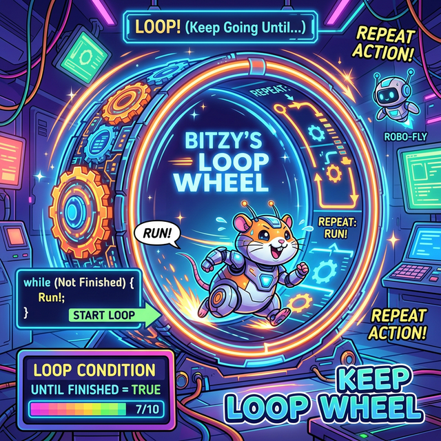
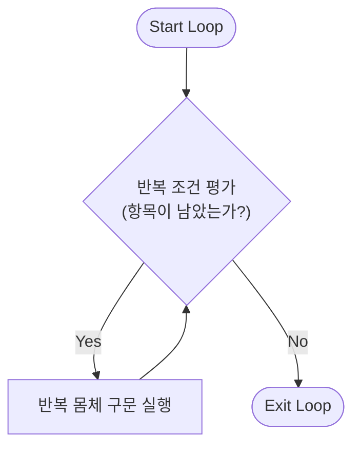
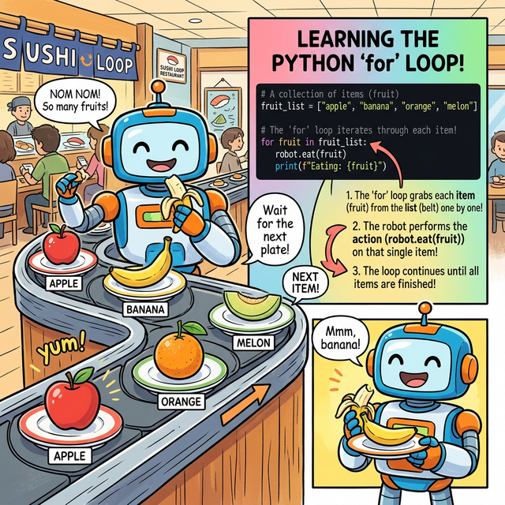

# 3.2.4 반복문 for (데이터 순회)

## 학습목표
본 장에서는 주어진 집합 데이터를 처음부터 끝까지 순회하는 `for` 문의 기본적인 반복 제어 원리를 배웁니다.



타 프로그래밍 언어들은 루프(Loop)를 매우 중요하게 취급합니다. 왜냐하면 반복 작업 처리에 반복문 이외의 대안이 거의 없기 때문입니다. 반면 파이썬은 **리스트 내포(List Comprehension)**와 패키지의 **벡터화 연산(ex Numpy)**을 통해 반복 작업을 보다 간결하게 치환하는 경우가 많습니다. 그럼에도 불구하고 핵심 제어 구조인 `for` 반복문은 흐름 명확성에 큰 이점이 있어 매우 기본적으로 알아야 합니다.

## 반복문 동작 흐름 (Mermaid)

반복문의 본질은 조건을 만족하는 동안 특정 블록의 코드를 끝없이 회전(Loop)시키는 것입니다. 아래 다이어그램은 반복문 기반 알고리즘의 전형적인 동작 흐름을 나타냅니다.



## 횟수와 구조 중심의 반복문 for


*(웹툰 비유: 회전 초밥집 컨베이어 벨트 앞에 앉은 로봇입니다. 접시(데이터)가 하나씩 다가오면 로봇이 집어 먹고(처리하고), 다음 접시가 올 때까지 기다립니다. 벨트 위에 초밥이 남아 있는 한 이 과정은 계속 반복되며, 초밥이 동나면 식사(루프)가 종료됩니다.)*

`for` 구문은 `in` 이후의 리스트, 튜플, 문자열 등 항목이 있는 집합적 구조를 하나씩 처음부터 끝까지 순회합니다. `for` 마지막 콜론 `:`은 반드시 필요하며 탭(Tab) 들여쓰기로 블록을 생성해야 합니다.


*(다이어그램: 컬렉션 바구니(`[A, B, C]`)에서 항목 하나가 튀어나와 변수 `item`에 담기고, 아래쪽 `print` 실행 블록으로 쏙 들어가 처리된 뒤 증발하는 과정을 순차적으로 반복하는 애니메이션입니다. 파이썬의 `for`문은 값을 일일이 세는 것이 아니라, "바구니에서 하나 꺼내기(Unpacking)"의 연속입니다.)*

```python
# 3.2.3 내장 range(1, 6)을 이용해 1부터 5까지 반복
for x in range(1, 6):
    print(x)
```

모임형 자료형(리스트 안의 원소 등)을 직접 꺼낼 수도 있습니다.

```python
fruits = ["apple", 2500, "banana", 500]
for item in fruits:
    print(item)
```

## [유용한 테크닉] f-string과 zip() 함수의 결합
데이터를 짝지어서 출력할 때 최신 파이썬의 꽃인 **f-string** 포매팅 기법(Python 3.6+)과 `zip()` 내장 함수를 묶어서 사용하면 매우 가독성이 높습니다.
- **f-string**: 중괄호 `{}` 안에 변수나 표현식을 직접 삽입해 문자열을 동적으로 생성
- **zip()**: 여러 개의 객체를 병렬로 묶어 같은 인덱스끼리 튜플로 매칭

```python
names = ["John", "Alice", "Bob"]
ages = [25, 30, 22]

# 서로 다른 두 리스트를 zip으로 묶어 병렬 반복 순회
for name, age in zip(names, ages):
    # f"..." 형태로 간편하게 변수 삽입 문자열 출력
    print(f"Name: {name}, Age: {age}살")
```
**출력:**
```
Name: John, Age: 25살
Name: Alice, Age: 30살
Name: Bob, Age: 22살
```

---

## ☕ Java vs 🐍 Python 스나이퍼 비교

### 1. for 문의 패러다임 변화 (Index vs Iteration)
*   **Java**: 전통적인 자바의 `for` 문은 인덱스(횟수)를 통제합니다. `for (int i=0; i<arr.length; i++)` 처럼 변수를 선언하고, 조건식을 걸고, 증감시킵니다.
*   **Python**: 파이썬의 `for` 구문은 자바의 **향상된 for 문(Enhanced for loop)인 `for (Type item : arr)` 과 사실상 역할이 동일**합니다. 횟수를 세는 구문이 아예 없고, "이 보따리(리스트)에 든 내용물을 처음부터 끝까지 하나씩 전부 꺼내!"라는 **이터레이션(Iteration, 순회)** 방식입니다. 만약 자바처럼 횟수가 필요하다면 `range()` 함수가 그 보따리를 대신 만들어주는 것입니다.

---

## 🎧 Vibe Coding

> **🗣️ 학생 프롬프트 (AI에게 이렇게 명령해 보세요):**
> "파이썬 `for` 문과 `zip()` 함수를 사용해서, 3명의 학생 이름과 수학 점수가 각각 담긴 두 개의 리스트를 순회하며 '{이름} 학생의 수학 점수는 {점수}점입니다'라는 문장을 예쁘게 출력해주는 간단한 코드를 짜줘. 데이터는 아무거나 넣어도 돼."

---

## 코딩 영단어 학습 📝

*   **`for`**: ~를 위하여, ~하는 것에 대하여. (`for item in list:` 는 "리스트 안에 있는 각각의 item을 집어올 때마다 반복하겠다"는 뉘앙스입니다.)
*   **`Iteration`**: 반복, 순회. (리스트와 같이 여러 개가 들어있는 상자에서 하나씩 꺼내어 살펴보는 '행위 그 자체'를 뜻하는 핵심 프로그래밍 용어입니다.)
