# 3.2.4 반복문 while


*(while문 개념도: 데이터 점이 조건식을 판별하여 참(True)이면 내부 블록을 실행하고, 거짓(False)이면 궤도를 이탈하여 탈출(Exit)하는 동작을 묘사한 애니메이션)*

구조적이고 명확한 범위(List, Range)를 순회하는 `for` 문과 달리, `while` 반복문은 **"특정 조건이 참(True)인 동안 계속해서"** 블록을 무한히 반복 실행하는 데 초점이 맞춰져 있습니다.

## while의 기본 구조

`while 조건식: 블록` 구문을 사용합니다. 블록 안에서 반드시 무언가 `조건식`을 `False`로 바꿔줄 수 있는 장치(증감식 등)를 마련해 주어야만 무한 루프에 빠지지 않고 끝낼 수 있습니다.

```python
i = 1
total = 0

# i가 10 이하일 때까지만 계속 반복 (조건 검사)
while i <= 10:
    total += i
    i += 1  # 이 증감식이 없으면 조건이 영원히 참이 되며 루프가 끝나지 않음

print("1부터 10까지의 합:", total) # 결과: 55
```

## 제어 흐름 조작: 무한 루프와 break / continue

`while`은 횟수 제한 없이 무한정 반복시켜놓고, 특정 신호(Signal)를 받았을 때 종료하도록 코딩하는 경우가 실무에서 아주 흔합니다. 이때 사용하는 것이 `True` 고정식과 `break`, `continue`입니다.

- `break`: 루프를 **즉시 파괴하고 완전히 탈출**합니다.
- `continue`: 현재 바퀴를 즉시 멈추고 **다시 처음 조건문 판단 지점으로 회귀**하여 다음 루프를 시작합니다.

```python
number = 0

# 의도적인 무한 루프 생성
while True:
    number += 1
    
    # 3의 배수이면 이번 루프를 아예 무시하고 루프 최상단으로 돌아감
    if number % 3 == 0:
        continue
    
    print(number)
    
    # number가 10에 도달하면 무한 반복 루프 파괴 (프로세스 종료 장치)
    if number >= 10:
        break
```
**출력:**
```
1
2
4
5
7
8
10
```

## 파이썬에서의 do ~ while 패턴 구현

C나 Java 같은 언어에는 최초 1회는 무조건 블록을 실행하고 다 끝난 뒤조건을 평가하는 `do ~ while` 구조가 있습니다. 파이썬 문법에는 내부에 이런 고유 명칭의 키워드가 없지만, 무한 루프(`while True:`)와 내부의 `break`를 결합하여 완벽하게 동일하고 우아한 구조를 만들어낼 수 있습니다. 

루프의 **가장 첫 부분에 실질적인 동작(do)을 배치**하고, **루프의 제일 마지막에 조건 분기로 탈출(while)** 구조를 짜면 됩니다.

```python
# 파이썬으로 구현한 do ~ while 테크닉
while True:
    # 1. 무조건 한 번은 먼저 실행되는 블록 (do 부분)
    command = input("게임을 계속 진행하시겠습니까? (y/n): ")
    
    # 2. 실행 후 조건을 판별하여 루프 탈출 (while 부분)
    if command == 'n':
        print("게임을 종료합니다.")
        break
        
    print("게임을 계속합니다...")
```

## [종합 실습] 텍스트 RPG 전투 시스템 만들기

위에서 배운 구조적 개념들을 모두 활용해 간단한 턴제 전투 예제를 만들어 봅시다. 무한 루프(`while True`) 안에서 서로 공격을 주고받다가 체력이 떨어지면 `break`로 종료하는 직관적인 설계입니다.

**시나리오:**
1. 플레이어와 몬스터의 초기 체력을 설정합니다.
2. 매 턴 무한 루프 안에서 랜덤하게 공격 데미지를 교환합니다.
3. 중간에 한 쪽 체력이 0 이하가 되면 `break`로 전체 게임 오버 처리를 합니다.

```python
import random # 랜덤 숫자를 뽑기 위한 모듈

player_hp = 100
monster_hp = 100

print("⚔️ 거대한 보스 몬스터와의 전투를 시작합니다!")

# 전투가 언제 끝날지 모를 때는 무한 while 루프와 break 조합이 최적
while True:
    print(f"\n[Player: HP {player_hp} / Monster: HP {monster_hp}]")
    
    # 상호 랜덤 데미지 계산
    monster_damage = random.randint(10, 30) 
    player_damage = random.randint(20, 40)
    
    # 서로 공격
    player_hp -= monster_damage
    monster_hp -= player_damage
    
    print(f"으악! 몬스터에게 {monster_damage}의 피해를 입었습니다.")
    print(f"치명타! 몬스터에게 {player_damage}의 피해를 입혔습니다!")
    
    # 체력 체크 통제 구문 (if ~ break)
    if player_hp <= 0:
        print("💀 Game Over... 눈앞이 캄캄해집니다.")
        break
        
    elif monster_hp <= 0:
        print("🎉 축하합니다! 보스 몬스터를 물리치고 승리했습니다!")
        break
```
