# 3.2.5 예외 처리

## 학습목표
본 장에서는 프로그램 실행 중 발생하는 예기치 못한 에러를 안전하게 방어하고 복구하는 **`try-except` 예외 처리** 구문의 중요성과 작동 원리를 이해합니다. 더 나아가, 무조건 실행되어야 하는 `finally` 블록의 역할과, 고의로 에러를 발생시키는 `raise` 키워드의 개념을 파악하여 실전처럼 견고한 코드를 작성하는 법을 익힙니다.


*(예외 처리 개념도: 초록색 정상 점은 `try` 블록을 무사히 거쳐 `finally`로 빠져나가지만, 빨간색 에러 점은 중간에 번개(에러)를 맞고 비상망(`except`)으로 떨어져 처리된 후 빠져나가는 두 갈래 흐름을 묘사한 애니메이션)*

## 예외 처리 (Exception Handling)

프로그램 실행 중 발생하는 에러(예외)를 우아하게 대비/처리하여, 프로그램이 의도치 않게 갑자기 강제 침몰하는 것을 막아내는 튼튼한 방어 로직을 배웁니다.
일반적으로 파이썬 프로그램은 예기치 못한 에러(ZeroDivisionError, IndexError 등)가 발생하면 그 즉시 **비정상 종료(Crash)**됩니다. 하지만 우리가 이용하는 웹 서버나 24시간 도는 봇 프로그램이 사소한 에러 하나 때문에 완전히 꺼져버린다면 매우 곤란할 것입니다.

이때 안전망 역할을 해주는 필수 방어적 코딩 기법이 바로 **`try-except`** 예외 처리 구문입니다.

### 기본 구조: `try-except`

**"일단 블록 안의 코드를 시도해봐(try). 만약 에러가 터지면(except) 이렇게 조치해."**

```python
try:
    # 에러가 발생할 가능성이 있는 논리 코드
    number = 10 / 0
except ZeroDivisionError:
    # 에러가 감지되었을 때 비상탈출하여 실행할 복구 코드
    print("0으로 나눌 수 없습니다! (프로그램은 계속 실행됩니다)")
```

### [실행 결과]
```text
0으로 나눌 수 없습니다! (프로그램은 계속 실행됩니다)
```
(붉은색의 시스템 에러 메시지를 뿜지 않고, 우리가 핸들링한 문구가 출력되며 프로그램은 비정상 종료 없이 매끄럽게 계속 실행됩니다.)

### 다양한 에러 개별적으로 잡기

여러 종류의 각기 다른 에러를 성격에 맞게 각각 다르게 분기 처리할 수도 있습니다.

```python
try:
    arr = [1, 2, 3]
    print(arr[5]) # 없는 배열 인덱스 접근 시도 (IndexError 발생)
except IndexError:
    print("배열의 범위를 벗어난 접근입니다!")
except ZeroDivisionError:
    print("수학적 오류입니다.")
except Exception as e:
    # Exception은 모든 에러를 포괄하는 최상위 클래스 개념입니다.
    print(f"알 수 없는 에러가 통보되었습니다: {e}")
```

## 고급 예외 처리: else와 finally

`try-except` 구문은 에러가 나지 않고 성공했을 때만 실행할 `else` 블록, 에러의 유무와 상관없이 무조건 마지막에 실행되어야 하는 `finally` 블록과 결합하여 완벽한 에러 통제 파이프라인을 구축할 수 있습니다.

```python
try:
    print("1. 파일 열기 시도 중...")
    file_data = open("document.txt", "r")
    
except FileNotFoundError:
    print("2. [오류] 파일을 찾을 수 없습니다. 예외가 잡혔습니다.")
    
else:
    # try 블록이 에러 없이 무사히 통과했을 때만 실행됨
    print("3. [성공] 파일을 무사히 열었습니다. 데이터를 읽습니다.")
    print(file_data.read())
    
finally:
    # 에러가 났든 안 났든, 심지어 return으로 빠져나가려 해도 무조건 실행됨
    print("4. [마무리] 자원을 해제하고 파일 시스템을 닫습니다.")
```

- **`finally`의 중요성**: 파일 시스템 닫기, 켜두었던 데이터베이스(DB) 연결 끊기 등 프로그램이 죽더라도 이 자원 처리만큼은 **반드시** 하고 죽으라는 최후의 보루 역할을 합니다.

## 고의로 에러 일으키기 (raise)

프로그램 입장에서 문법적 에러는 아니지만, **서비스 기획 논리상 에러로 규정해야 하는 상황**일 때 개발자가 직접 비상벨을 눌러 에러를 강제로 발생시킵니다. 이를 `raise`라고 합니다.

```python
def check_age(age):
    if age < 0:
        # 나이가 음수일 수는 없으므로, 적절한 에러 객체를 생성하여 던짐
        raise ValueError("나이는 음수가 될 수 없습니다!")
    print(f"당신의 나이는 {age}살 이군요.")

try:
    check_age(-5)
except ValueError as e:
    print(f"사용자 에러 발생: {e}")
```

이렇게 `raise`를 활용하면 내 코드를 활용하는 다른 모듈 쪽으로, 현재 통제권 바깥에서 부적절한 처리가 발생했음을 명확히 통보해 줄 수 있습니다.

## 정리
지금까지 우리는 에러를 단순히 피해야 할 두려운 존재로 여겼지만, `try-except-finally`라는 튼튼한 방어망을 치고 나면 에러마저도 프로그램의 정상적인 제어 흐름 안으로 편입시킬 수 있습니다. 특히 크롤링 머신이나 데이터를 임포트하는 기능을 24시간 가동시켜야 할 실무에서, 이 예외 처리 로직은 서버가 죽지 않고 버티게 해 주는 가장 든든한 생명줄 역할을 톡톡히 해낼 것입니다.
