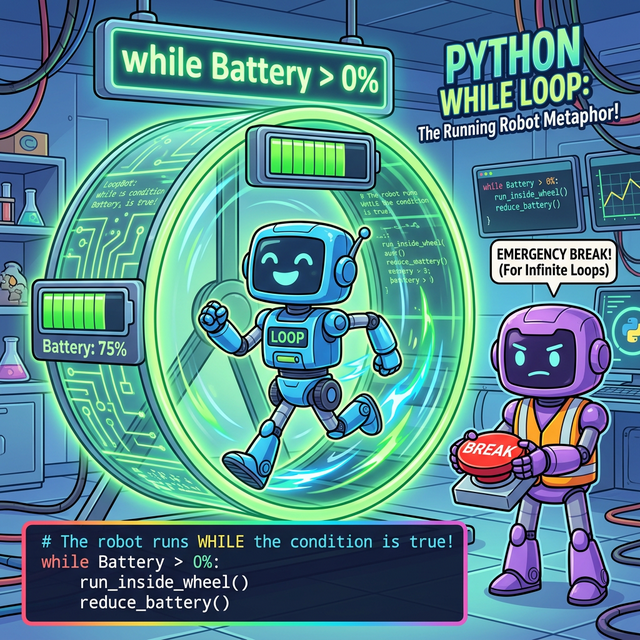

# 3.2.5 반복문 while (조건 반복과 제어)

## 학습목표
본 장에서는 주어진 조건이 참(True)인 동안 끝없이 회전하는 **`while` 문의 원리와, 무한 루프를 파괴하는 강력한 비상 정지 버튼 `break`의 활용법**을 배웁니다. 아울러 중첩 반복문(Nested Loops) 구조를 시각적인 별 찍기 실습과 텍스트 RPG 전투 시스템으로 완벽히 마스터합니다.

## 조건 중심의 반복문 while


*(웹툰 비유: 거대한 야광 쳇바퀴 안을 쉼 없이 달리는 로봇입니다. 쳇바퀴 위에는 `배터리 > 0%`라는 간판이 빛나고 있습니다. 배터리가 조금이라도 남아있는 한(True) 로봇은 절대 멈추지 않고 달립니다. 쳇바퀴 밖에서는 혹시 모를 고장에 대비해 다른 로봇이 거대한 빨간색 비상정지 `BREAK` 버튼을 들고 땀을 쥐며 대기하고 있습니다.)*

`while 조건식: 블록` 구문은 조건이 `True`인 동안은 영원히 블록을 반복 실행합니다. 


*(다이어그램: 데이터 입자가 `i <= 10`이라는 조건 스캐너를 통과합니다. `True` 판정을 받으면 아래쪽 처리장(`i += 1`)으로 떨어져 처리된 뒤, 롤러코스터 트랙을 타고 다시 위쪽 스캐너로 수직 상승하여 무한 루프 쳇바퀴를 형성합니다. 만약 스캐너에서 `False` 판정을 받는 순간, 비로소 오른쪽 Exit 통로로 튕겨 나갑니다.)* 

```python
i = 1
total = 0

#  i가 10 이하일 때까지만 계속 반복
while i <= 10:
    total += i
    i += 1  # 이 증감식이 없으면 끝나지 않음 (무한 루프)

print(total) # 결과: 55
```

## [유용한 테크닉] 무한 루프 탈출, break

만약 `while`의 조건식을 변수 없이 그냥 `True`로 강제 고정시켜버리면 이는 절대 스스로 끝나지 않는 무한 루프(Infinite Loop)가 됩니다. 이럴 땐 프로그램 내부에서 특정 종료 조건을 감지하여 `break` 명령어를 사용해 강제로 쳇바퀴를 깨부수고 탈출시킬 수 있습니다.

```python
i = 0
while True:  # 일단 영원히 반복!
    i += 3
    if i > 10:
        break    # 10을 초과하면 반복문을 강제로 파괴하고 종료함
    print(i)
```
**출력:**
```
3
6
9
```


## [종합 실습] 텍스트 RPG 전투 시스템 만들기

결론적으로 조건문(`if`), 반복문(`for` 또는 `while`), 그리고 자료구조(리스트)를 잘 버무리면 제법 복잡한 로직도 손쉽게 구현할 수 있습니다. 위에서 배운 개념들을 모두 활용해 간단한 전투 예제를 만들어 봅시다.

**시나리오:**
1. 플레이어의 초기 체력은 100입니다.
2. 몬스터 리스트의 몬스터를 순서대로 만납니다. (`for` 반복문)
3. 랜덤하게 공격 데미지를 입습니다.
4. 중간에 체력이 0 이하가 되면 `break`로 전체 게임 오버 처리를 합니다.

```python
import random # 랜덤 숫자를 뽑기 위한 모듈

player_hp = 100
monsters = ["Slime", "Wolf", "Dragon"]

print("⚔️ 모험을 시작합니다!")

for monster in monsters:
    print(f"\n--- {monster}와의 전투 시작! ---")
    
    # 10에서 50 사이의 랜덤 데미지 생성
    damage = random.randint(10, 50) 
    player_hp -= damage
    
    print(f"으악! {monster}에게 {damage}의 데미지를 입었습니다.")
    
    # 체력 체크 통제 구문 (if ~ else)
    if player_hp <= 0:
        print(f"체력이 {player_hp}이 되었습니다.")
        print("💀 Game Over... 눈앞이 캄캄해집니다.")
        break # 반복문을 즉시 종료하고 빠져나갑니다.
    else:
        print(f"휴... 남은 체력: {player_hp}")

# 전체 전투 반복문이 정상적으로 끝난 뒤 생존 확인
if player_hp > 0:
    print("\n🎉 축하합니다! 모든 몬스터를 물리치고 승리했습니다!")
```

## 정리
`while` 루프와 `break` 명령어는 파이썬 개발에 있어 절대 뺄 수 없는 핵심 논리 제어 구조입니다. 무한 루프 탈출을 통제하는 `break`를 명확히 이해하고, 이중 반복문의 톱니바퀴 구조를 별 찍기로 수련하면서 프로그래밍 사고력을 한층 깨우치시길 바랍니다.

---

## ☕ Java vs 🐍 Python 스나이퍼 비교

### do ~ while 문의 부재 (파이썬만의 무한 루프 제어 철학)
*   **Java**: 블록을 최소한 한 번은 무조건 실행하고 나서 나중에 조건을 검사하는 `do { } while(조건);` 제어문이 따로 존재합니다.
*   **Python**: 파이썬에는 언어 스펙상 `do ~ while` 구조가 아예 **없습니다**. 왜냐하면 "한 문법 규칙(while)으로 똑같은 일을 달성할 수 있다면 새로운 문법을 만들지 않는다"는 Pythonic 디자인 원칙 때문입니다. 파이썬에서는 `do ~ while`과 똑같은 효과를 원한다면 `while True:` 로 무조건 열어두고 안에서 최초 실행 후 `if 조건: break` 로 탈출하는 명시적인 방식을 주로 사용합니다.

---

## 🎧 Vibe Coding

> **🗣️ 학생 프롬프트 (AI에게 이렇게 명령해 보세요):**
> "파이썬 `while` 문과 `random` 모듈을 이용해서, 1부터 100 사이의 숨겨진 숫자를 맞추는 '업다운(Up & Down) 스무고개 게임' 코드를 짜줘. 내가 정답을 맞출 때까지 수없이 오답을 입력하더라도 `break`를 만날 때까지 반복해서 물어보는 무한 루프 형태로 만들어줘."

---

## 코딩 영단어 학습 📝

*   **`while`**: ~하는 동안. (논리적인 조건이 참으로 유지되는 '기간'을 중심으로 빙빙 도는 특징을 뜻합니다.)
*   **`break`**: 깨다, 부수다, 멈추다. (무한히 돌고 있는 루프 사슬의 한가운데를 도끼로 쾅! 내리쳐 깨버리고 강제로 빠져나오는 아주 강력한 제동 명령어입니다.)
