# 3.2.6 이중 반복문과 12가지 별 찍기

## 학습목표
본 장에서는 단일 차원의 제어를 넘어, 반복문 안에 또 다른 반복문을 중첩시키는 **이중 반복문(Nested Loops)**의 톱니바퀴 원리를 정확하게 시각적으로 이해합니다. 아울러 프로그래머들의 영원한 기초 수련법인 **별 찍기(Star Patterns) 12선** 알고리즘을 직접 돌려보며 2차원 공간 지각력을 극대화합니다.

## 이중 반복문 (Nested Loops)의 톱니바퀴 원리


*(웹툰 비유: 거대한 바깥쪽 톱니바퀴(Outer Loop) 안에 작고 미친 듯이 빨리 도는 안쪽 톱니바퀴(Inner Loop)가 맞물려 있습니다. 거대한 톱니바퀴가 딱 한 칸(1회) '딸깍' 하고 움직일 때마다, 안쪽 톱니바퀴는 아예 한 바퀴 통째로(전체 반복) 미친 듯이 회전합니다. 이것이 바로 이중 반복문의 핵심 원리입니다!)*

반복문 안에 또 다른 반복문이 들어가는 구조를 **이중 반복문(Nested Loops)**이라고 부릅니다. 주로 2차원 매트릭스, 표 형태의 데이터, 화면 픽셀 매트릭스를 다룰 때 필수적으로 사용됩니다. 원리는 매우 직관적이고 강력합니다. **바깥쪽 루프가 1번 실행될 때마다, 안쪽 루프는 아예 새로 초기화되어 처음부터 끝까지 전체를 반복**합니다. 

```python
# 구구단 2단, 3단 출력 예제
for i in range(2, 4):         # 외부 루프: 2, 3 두 번 돎
    print(f"--- {i}단 ---")
    for j in range(1, 10):    # 내부 루프: 외부가 1번 돌 때마다 1~9 전체를 다 돎
        print(f"{i} x {j} = {i*j}")
```

---

## 2차원 공간 프로그래밍: 12가지 별 찍기 대방출

프로그래밍 논리 구조에서 이중 반복문의 원리를 가장 빠르고 확실하게 체득시켜 주는 최고의 훈련법은 단연 **'별 찍기(Star Patterns)'**입니다. 

기억해야 할 핵심 기술은 `print()` 함수의 옵션 중 하나인 `end=""` 입니다. 이 옵션은 출력 후 강제로 다음 줄로 넘어가는 엔터(개행) 동작을 무시하고 **옆으로 다닥다닥 붙여서 출력**하게 만듭니다. 안쪽 톱니바퀴(내부 루프)가 돌며 수평으로 별을 긋고 나면, 바깥쪽 루프에서 빈 `print()`를 던져 가로줄을 완성하고 다음 줄로 넘어갑니다.

아래 12가지 패턴을 에디터에 직접 복사하거나 타이핑해가며 톱니바퀴가 어떻게 돌아가는지 눈으로 확인해 보세요!

### 1. 정사각형 (Square)
가장 기본이 되는 N x N 사이즈 출력입니다.

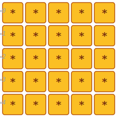

```python
size = 5
for i in range(size):
    for j in range(size):
        print("*", end="")
    print() # 한 줄(안쪽 루프 5회)이 끝나면 줄바꿈 처리!
```

### 2. 직각 삼각형 (Left-aligned Right Triangle)
행수(i)가 늘어날 때마다 찍는 별의 개수(j)도 순차적으로 늘어납니다.

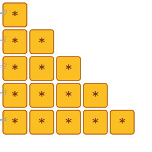

```python
size = 5
for i in range(1, size + 1):
    for j in range(i):  # j는 i까지만 돕니다.
        print("*", end="")
    print()
```

### 3. 역직각 삼각형 (Inverted Left-aligned Right Triangle)
다섯 개부터 시작해서 밑으로 내려갈수록 줄어듭니다.

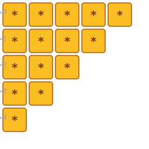

```python
size = 5
for i in range(size, 0, -1):
    for j in range(i):
        print("*", end="")
    print()
```

### 4. 우측 정렬 직각 삼각형 (Right-aligned Right Triangle)
별표 앞에 빈 공백(Space)을 의도적으로 채워 넣어 우측 끝으로 별을 밀어냅니다.

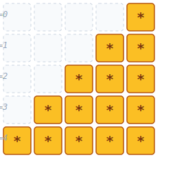

```python
size = 5
for i in range(1, size + 1):
    for j in range(size - i):
        print(" ", end="") # 허공인 공백 문자 먼저 출력
    for j in range(i):
        print("*", end="") # 그다음 진짜 별 출력
    print()
```

### 5. 우측 정렬 역직각 삼각형 (Inverted Right-aligned Right Triangle)

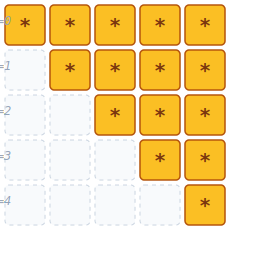

```python
size = 5
for i in range(size, 0, -1):
    for j in range(size - i):
        print(" ", end="")
    for j in range(i):
        print("*", end="")
    print()
```

### 6. 정삼각형 (Pyramid)
공백으로 한가운데로 밀어 넣고, 한 줄을 넘어갈 때마다 별 1개씩이 아니라 `2 * i - 1` 공식을 이용해 홀수 단위(1 $\to$ 3 $\to$ 5)로 퍼져나가게 만듭니다. 가장 중요한 공식입니다!

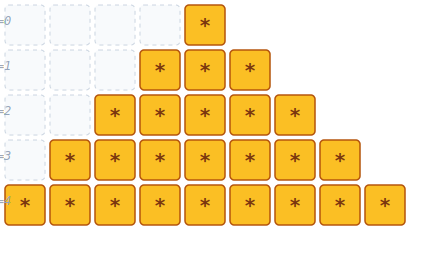

```python
size = 5
for i in range(1, size + 1):
    for j in range(size - i):
        print(" ", end="")
    for j in range(2 * i - 1): # 별의 개수는 홀수로 확산
        print("*", end="")
    print()
```

### 7. 역정삼각형 (Inverted Pyramid)

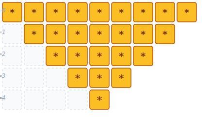

```python
size = 5
for i in range(size, 0, -1):
    for j in range(size - i):
        print(" ", end="")
    for j in range(2 * i - 1):
        print("*", end="")
    print()
```

### 8. 다이아몬드 (Diamond)
위쪽을 찍는 정삼각형 코드 블록을 실행하고, 밑으로 꺾여 들어가는 역정삼각형 코드 블록을 연달아 이어 붙이면 아름다운 다이아몬드가 됩니다.

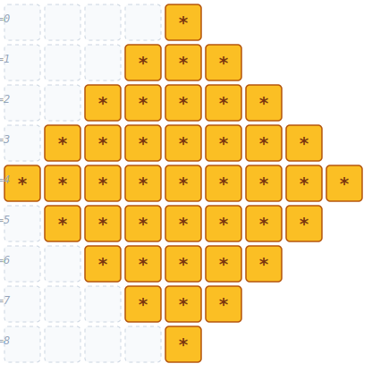

```python
size = 5
# 위쪽 정삼각형
for i in range(1, size + 1):
    for j in range(size - i):
        print(" ", end="")
    for j in range(2 * i - 1):
        print("*", end="")
    print()
# 아래쪽 역정삼각형 (가장 두꺼운 윗줄과 사이즈가 동일하면 중복되므로 -1 부터 시작)
for i in range(size - 1, 0, -1):
    for j in range(size - i):
        print(" ", end="")
    for j in range(2 * i - 1):
        print("*", end="")
    print()
```

### 9. 모래시계 (Hourglass)
역정삼각형 코드를 먼저 쏘고 그 아래 정삼각형을 쏘되, 만나는 모서리 꼭짓점이 중복되지 않도록 방어하는 것이 포인트입니다.

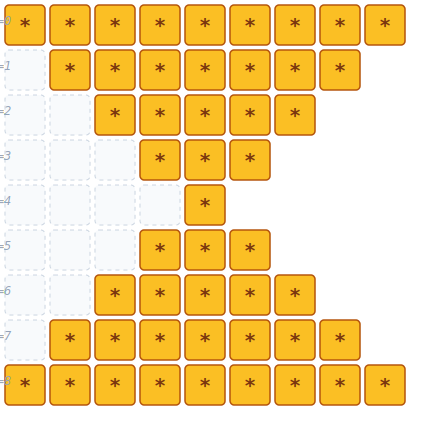

```python
size = 5
# 윗부분 (역삼각 깔때기)
for i in range(size, 0, -1):
    for j in range(size - i):
        print(" ", end="")
    for j in range(2 * i - 1):
        print("*", end="")
    print()
# 아랫부분 (삼각, 윗부분 꼭짓점 중복 제외 위해 2부터 시작)
for i in range(2, size + 1):
    for j in range(size - i):
        print(" ", end="")
    for j in range(2 * i - 1):
        print("*", end="")
    print()
```

### 10. 테두리만 있는 정사각형 (Hollow Square)
정사각형과 똑같이 돌되, 중간에 `if` 문을 걸어 **안쪽 칸일 경우 별 대신 우주 공간처럼 틈새 공백 문자**를 발사합니다.

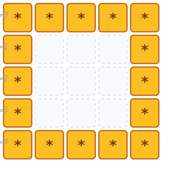

```python
size = 5
for i in range(size):
    for j in range(size):
        # 첫 줄이거나, 마지막 줄이거나, 맨 앞이거나, 맨 끝일 때만 별 도장!
        if i == 0 or i == size - 1 or j == 0 or j == size - 1:
            print("*", end="")
        else:
            print(" ", end="") # 내부 속 공간
    print()
```

### 11. 나비 모양 (Butterfly)
왼쪽 날개(삼각형 모양)를 쏘고 공간을 비운 뒤 오른쪽 날개(역방향 삼각형을 대칭 거울)를 결합합니다.

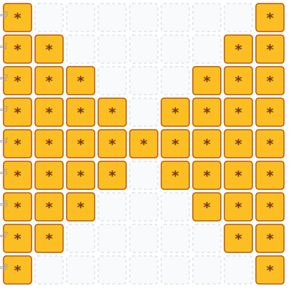

```python
size = 5
# 위쪽 전개 날개
for i in range(1, size + 1):
    for j in range(i):
        print("*", end="")
    for j in range(2 * (size - i)):
        print(" ", end="")
    for j in range(i):
        print("*", end="")
    print()
# 아래쪽 좁혀지는 날개
for i in range(size - 1, 0, -1):
    for j in range(i):
        print("*", end="")
    for j in range(2 * (size - i)):
        print(" ", end="")
    for j in range(i):
        print("*", end="")
    print()
```

### 12. 평행사변형 (Parallelogram)

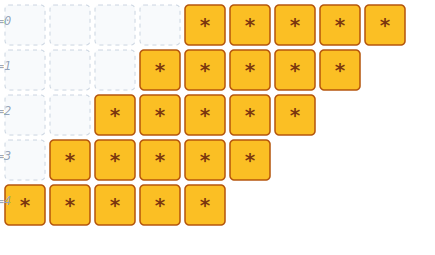

```python
size = 5
for i in range(1, size + 1):
    for j in range(size - i): # 아래 행렬로 갈수록 공백 개수를 점진적으로 갉아먹음
        print(" ", end="")
    for j in range(size):     # 별의 총개수는 무조건 유지
        print("*", end="")
    print()
```

---

## 🎧 Vibe Coding

> **🗣️ 학생 프롬프트 (AI에게 이렇게 명령해 보세요):**
> "내가 파이썬 이중 반복문을 공부하고 있는데, `print`와 공백 문자를 이용해서 '내 이름 스펠링 영문자 첫 글자(예: K)'를 거대한 별표 아트(ASCII Art)로 콘솔창에 7x7 크기로 그려주는 코드를 짜줘. 그리고 `if`, `else` 분기 처리가 정확히 픽셀 단위로 어떻게 되었는지 상세히 주석 달아줘."
