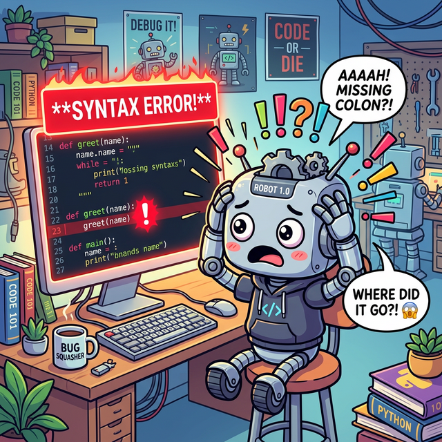
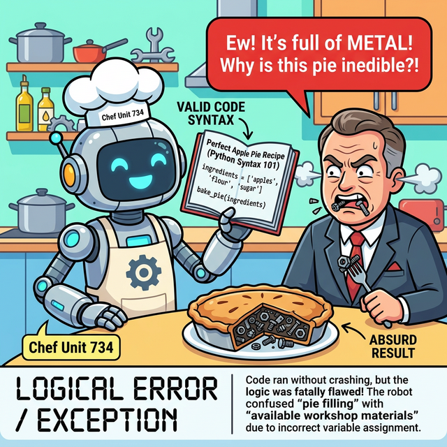

# 에러의 두 가지 종류 (Syntax vs Logical)

코딩을 하다 보면 숱하게 에러를 만나게 됩니다. 에러는 크게 두 가지 범주로 나눌 수 있습니다.

---

## 1. 문법 에러 (Syntax Error)
`오타`를 내거나 `들여쓰기`를 틀리는 등 파이썬 언어의 **문법 규칙을 어겼을 때** 발생합니다. 

이 경우 파이썬 인터프리터가 코드를 아예 읽지도 못하기 때문에 `실행조차 되지 않고` 곧바로 에러 문구를 뱉어냅니다. 

이는 프로그램이 시작되기도 전에 발견되므로 고치기 매우 쉽습니다.

*(웹툰 비유: 코드에 콜론(`:`)이나 오타가 발생하자 파이썬 번역기 로봇이 "해독 불가!"를 외치며 거대한 빨간색 경고등(Syntax Error)을 울리는 장면입니다. 실행조차 되지 않고 즉시 차단됩니다.)*

---

## 2. 예외/논리 에러 (Logical Error / Exception)
문법은 완벽해서 프로그램이 정상적으로 **실행되던 도중** 발생하는 에러입니다. 

"숫자 10을 0으로 나누어라" 혹은 "배열의 5번째 요소가 없는데 가져와라" 같은 `논리적 모순`이 발생했을 때 터집니다. 

우리가 제어 구조인 `try...except`로 `방어`하고 낚아채야 하는 대상이 바로 런타임에 발생하는 이 **예외(Exception)**입니다.

*(웹툰 비유: 요리사 로봇이 레시피(문법) 형태는 완벽하게 지켰지만, '사과' 대신 실수로 '나사못'을 잔뜩 넣고 구운 '나사못 파이'를 심사위원에게 제출하여 심사위원이 먹고 기절하는 장면입니다. 코드는 일단 실행되었지만 결과가 논리적으로 완전히 파탄난 런타임 에러 상황을 의미합니다.)*

---

## 🎧 정규 학습 & Vibe Coding

> **🗣️ 학생 프롬프트 (AI에게 이렇게 명령해 보세요):**
> "파이썬에서 `Syntax Error`가 발생하는 매우 단순한 예시 하나와, 문법은 맞지만 `Logical Error(Exception)` 중 하나인 `IndexError`가 발생하는 예시 코드를 각각 1개씩 작성해 줘. 그리고 각각 왜 그런 에러가 나는지 3줄 이내로 핵심만 비유를 들어서 짧게 설명해 줘."

---

## 📝 코딩 영단어 학습

* **Syntax**: 구문, 문법. (언어의 철자법이나 문장 규칙을 뜻합니다.)
* **Logical**: 논리적인. (컴퓨터 입장에선 문법상 맞지만 인간의 기획 의도와 어긋나는 상태를 뜻합니다.)
* **Runtime**: 실행 시간. (코드를 작성하는 시간이 아니라, 실제로 프로그램이 돌아가고 있는 순간을 말합니다.)
* **Exception**: 예외. (기본적인 규칙에서 벗어나는 이례적인 런타임 에러 상황을 말합니다.)
