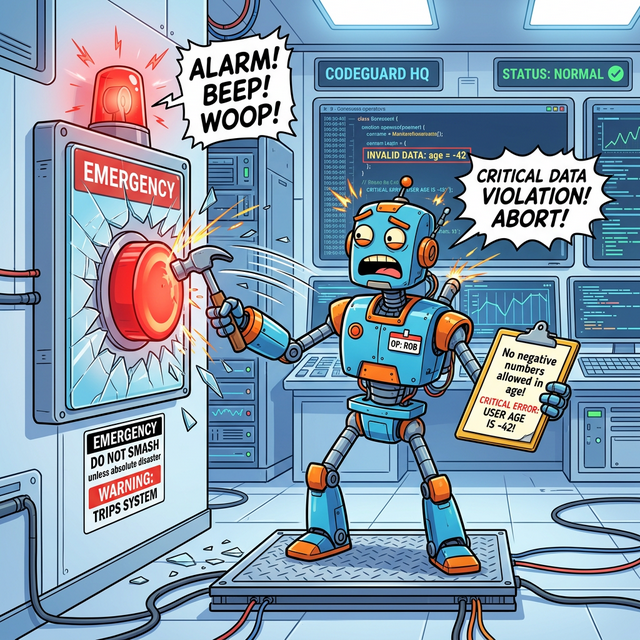

# 5. 고의로 에러 일으키기

프로그램의 문법(Syntax)은 완벽하더라도, **서비스 기획이나 비즈니스 로직상 절대 허용해서는 안 되는 상황**이 발생할 수 있습니다. 예를 들어 "나이가 음수(-5살)로 입력됨" 같은 논리적 오류 상황입니다. 

문법적으로 에러가 아니기 때문에 파이썬은 정상적으로 실행해 버리려 하지만, 이대로 놔두면 나중에 데이터베이스나 중요한 시스템 로직이 완전히 꼬이게 됩니다. 

## raise
이때 개발자가 직접 나서서 시스템 전체에 경보 비상벨을 울리고 실행을 중단시켜야 하는데, 이 행위가 바로 **`raise`** 입니다.


*(웹툰 비유: 평단하고 조용한 시스템 제어실. 기계 자체에는 전혀 문제가 없지만, "나이는 음수가 될 수 없다!"라는 회사 수칙(기획)을 지키기 위해 로봇 관리자가 망치로 빨간색 `EMERGENCY(비상)` 버튼의 유리를 깨서 스스로 에러 경보를 강제로 터뜨리는 장면입니다.)*

> **💡 용어 비교: 다른 언어의 `throw`**
> Java, C++, JavaScript 등 많은 프로그래밍 언어에서는 에러를 던진다는 의미로 **`throw`** 키워드를 사용합니다. 
> 하지만 파이썬에서는 동일한 역할을 수행하기 위해 에러를 끌어올린다는 의미의 **`raise`** 키워드를 사용합니다. 이름만 다를 뿐, 개발자가 강제로 예외를 발생(통보)시키는 완전하게 동일한 기능입니다!

## `raise` 사용 예제 코드

```python
def check_age(age):
    # 문법적으론 이상 없지만, 비즈니스 기획상 허용할 수 없는 '음수' 값 침입 감지!
    if age < 0:
        # 적절한 에러 클래스(ValueError)를 직접 생성하여 바깥으로 던짐(raise)
        raise ValueError("나이는 음수가 될 수 없습니다!")
        
    print(f"당신의 나이는 {age}살 이군요.")

try:
    check_age(-5)
except ValueError as e:
    # raise로 발생시킨 에러를 안전망에서 받아 처리합니다.
    print(f"사용자 에러 잡힘: {e}")
```

이렇게 함수 안에서 `raise` 구문을 활용하면 나중에 다른 개발자가 내 코드를 호출할 때, "현재 허용되지 않는 부적절한 값이 들어왔다!"라는 사실을 강하게 통보(문구 포함)해 줄 수 있어 안전하고 견고한 애플리케이션 설계의 기초가 됩니다.

---

## 🎧 강제 에러 방출 & Vibe Coding

> **🗣️ 학생 프롬프트 (AI에게 이렇게 명령해 보세요):**
> "은행 계좌(Account) 클래스의 출금(withdraw) 메서드를 파이썬으로 만들어봐. 출금하려는 금액이 현재 잔액보다 크면 문법적으론 이상 없어도 비즈니스 논리상 말이 안 되니까, 개발자가 고의로 `raise` 키워드를 써서 `ValueError`를 발생(던지는)시키는 예제 코드를 작성해. 다른 언어의 `throw`와 어떻게 비슷한지도 한 줄로 설명해 줘."

---

## 📝 코딩 영단어 및 동의어 정리

* **Raise**: 들어 올리다, 일으키다. (파이썬에서 깊숙이 숨어있는 에러 상황을 수면 위로 강제로 끄집어 올려 경보를 울릴 때 씁니다.)
* **Throw**: 던지다. (Java나 JS 등 다른 언어에서 `raise`와 완벽히 동일한 의미로 쓰이는 키워드입니다. 에러를 바깥으로 던진다는 뜻입니다.)
* **Intentional**: 의도적인. (버그나 실수가 아닌 시나리오에 의해 *고의로* 발생시킨 에러를 지칭할 때 자주 쓰입니다.)
* **Validation**: 유효성 검사. (입력된 데이터가 비즈니스 규칙에 맞는지(예: 나이가 양수인지) 검증하는 방어 과정입니다.)
