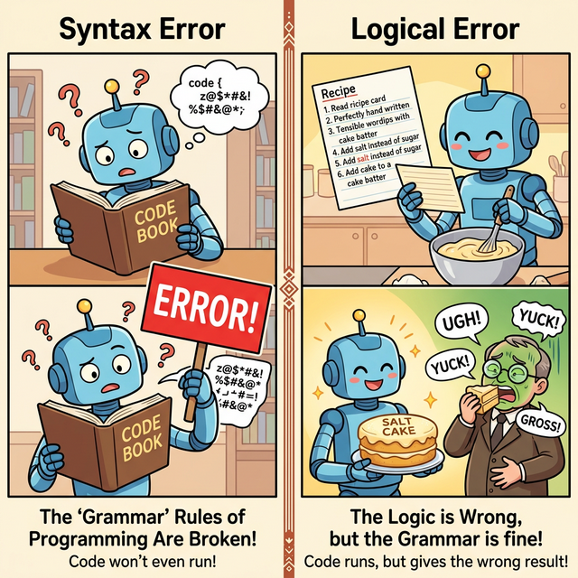

# 3.2.7 예외 처리

## 학습목표
본 장에서는 프로그램 실행 중 발생하는 예기치 못한 에러를 안전하게 방어하고 복구하는 **`try-except` 예외 처리** 구문의 중요성과 작동 원리를 이해합니다. 더 나아가, 무조건 실행되어야 하는 `finally` 블록의 역할과, 고의로 에러를 발생시키는 `raise` 키워드의 개념을 파악하여 실전처럼 견고한 코드를 작성하는 법을 익힙니다.

---

## 에러의 두 가지 종류 (Syntax Error vs Logical Error)

코딩을 하다 보면 숱하게 에러를 만나게 됩니다. 에러는 발생 시점에 따라, 프로그램이 실행되기 전 발생하는 **문법 에러(Syntax Error)**와 실행 중에 발생하는 **논리/예외 에러(Logical Error, Exception)**로 나뉩니다. 두 가지 에러의 차이점과 정확한 원인을 먼저 알아보겠습니다.

👉 [에러의 종류 상세 보기 (문법 에러 vs 논리 에러)](./01_error_types/)

*(웹툰 비유: 왼쪽 로봇은 해독 불가능한 외계어(오타)가 적힌 책을 보고 뇌 정지가 와 에러 간판을 들고 있습니다(문법 에러). 오른쪽 로봇은 레시피는 완벽하게 쓰여 있어서 그대로 요리를 완성했지만, 설탕 대신 소금을 넣으라는 잘못된 논리 때문에 완성된 소금 케이크를 먹고 심사위원이 기절해 버립니다(논리 에러).)*

---

## 든든한 안전망: `try-except` 예외 처리

에러가 발생해도 프로그램이 강제 종료(Crash)되지 않고 안전하게 복구 프로세스를 거치도록 방어하는 핵심 문법 구조입니다. 에러 종류별 분기 처리 등 기본적 실전 예시를 다룹니다.

👉 [`try-except` 기본 구조와 사용법 알아보기](./02_try_except/)

## 다양한 에러 개별적으로 잡기

발생할 수 있는 예외가 여러 가지일 때 한 번에 퉁치지 않고 `IndexError`, `KeyError` 등 특정 에러마다 맞춤형으로 분기하여 잡는 다중 예외 처리 방식을 알아봅니다.

👉 [다양한 에러 개별 맞춤 처리 (다중 except)](./03_multiple_exceptions/)

---

## 고급 예외 처리: `else`와 `finally`

`try-except` 구문에서 에러가 없을 때만 실행되는 `else` 블록과, 에러 발생 여부와 상관없이 무조건 마지막에 실행되어야 하는 `finally` 블록을 활용하여 완벽한 에러 통제 파이프라인을 구축해 봅니다.

👉 [`else`와 `finally` 완벽 활용 가이드](./04_advanced_exceptions/)

---

## 고의로 에러 일으키기 (`raise`)

문법적 오류는 아니지만, 서비스 기획이나 비즈니스 로직상 에러로 규정해야 하는 상황일 때 개발자가 직접 강제로 에러 비상벨을 울리는 `raise` 키워드의 활용법을 알아봅니다.

👉 [강제로 에러 발생시키기 (`raise`)](./05_raise_exception/)

---

## ☕ Java vs 🐍 Python 예외 처리 비교

두 언어의 차이점(`catch` vs `except`), 그리고 컴파일러가 강제하는 체크 예외(Checked Exception)의 유무 등 핵심적인 구조적 차이를 스나이퍼 비교를 통해 명확히 이해합니다.

👉 [Java와 Python의 예외 처리 패러다임 비교](./06_java_vs_python/)

---

## 🎧 단원 종합 Vibe Coding

> **🗣️ 학생 프롬프트 (AI에게 이렇게 명령해 보세요):**
> "지금까지 파이썬의 예외 처리 단원(`try`, `except`, `else`, `finally`, `raise`)을 모두 공부했어. 이 5가지 핵심 키워드가 하나의 코드 안에서 전부 적절하게 활용되는 '종합 선물 세트' 같은 완벽한 뱅킹(입출금) 예제 코드를 하나 작성해 줘. 그리고 이 예외 처리 구조가 실무에서 왜 중요한지 3줄 이내로 요약해 봐."

---

## 📝 핵심 코딩 영단어 총정리

* **Exception**: 예외. (정상적인 프로그램 실행 흐름을 깨뜨리는 이례적인 사건이나 런타임 에러 객체를 말합니다.)
* **Try-Catch / Try-Except**: 시도하고 낚아채기. (프로그래밍 세계에서 에러를 방어하는 가장 근본적인 디자인 패턴 명칭입니다.)
* **Crash**: 비정상 종료. (안전망(Except)이 없어서 프로그램이 시스템 바닥에 추락해 완전히 멈추어 버리는 현상입니다.)
* **Throw / Raise**: 던지다 / 일으키다. (개발자가 능동적으로 룰을 어긴 데이터를 발견하고 시스템에 직접 에러 경보를 울리는 통보 행위입니다.)

