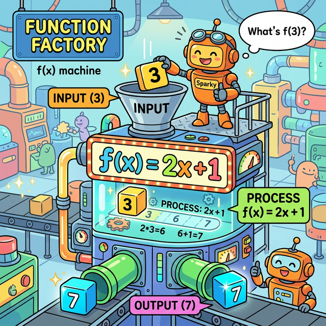
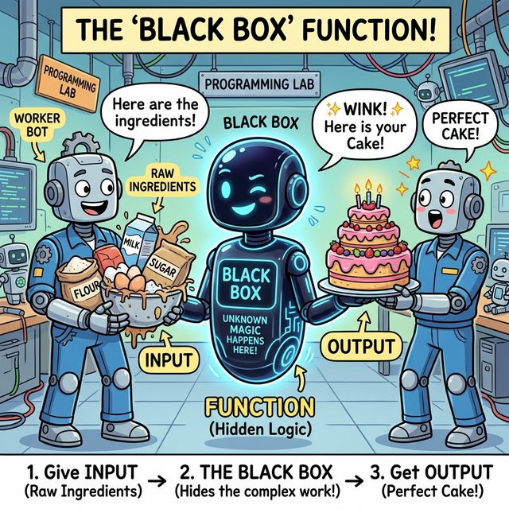
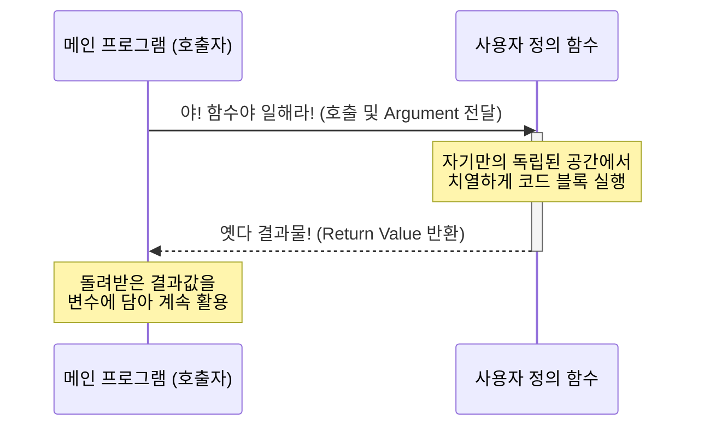

# 3.3.1 함수란 무엇인가?

## 학습목표
본 장에서는 코드를 단순히 나열하는 초보적인 단계에서 벗어나, 논리를 **재사용 가능한 캡슐**로 무장시키는 **함수(Function)**의 3대 필수 요소인 **입력(Input), 처리(Process), 출력(Output)**의 논리적 흐름을 깨우칩니다.

특히, 수학의 함수(Function) 개념이 어떻게 프로그래밍의 블랙박스(Black Box) 설계 철학으로 이어지는지 그 뿌리와 원형을 아주 상세하고 깊이 있게 탐구합니다.

---

## 1. 수학적 관점: 마법의 연산 기계 (The Math Machine)

프로그래밍의 '함수(Function)'라는 단어는 본래 수학에서 그대로 빌려온 용어입니다. 수학에서 함수 $f(x)$는 **"어떤 상자(기계)에 값 $x$를 집어넣으면, 내부에서 정해진 규칙에 따라 연산(Process)을 거친 뒤, 전혀 다른 새로운 값 $y$를 뱉어내는 마법의 기계"**를 의미합니다.

*(웹툰 비유: 거대한 톱니바퀴가 돌아가는 '수학 함수 기계'입니다. 로봇이 기계 위쪽 깔때기에 숫자 `3` 블록(Input)을 집어넣자, 기계 내부의 `f(x) = 2x + 1` 이라는 규칙(Process)을 거쳐, 아래쪽 파이프에서 숫자 `7` 블록(Output)이 툭 떨어집니다.)*

*(다이어그램: 수학적 관점에서의 함수 동작 원리입니다. 파란색 데이터 입자(Input)가 함수 기계 내부로 쏙 빨려 들어가 치열하게 가공된 후, 초록색의 전혀 새로운 데이터 입자(Output)로 변환되어 나가는 과정을 보여주는 수학적 데이터 흐름 애니메이션입니다.)*

프로그래밍의 함수도 이 수학적 원리와 **100% 동일한 해부학적 구조**를 가지고 있습니다.
1.  **입력 (Input / Parameter)**: 함수 기계 깔때기에 던져 넣는 원재료입니다. 파이썬에서는 괄호 `()` 안에 던져주는 변수들을 의미합니다.
2.  **처리 (Process / Body)**: 들어온 원재료를 지지고 볶고 연산하는 기계 내부의 동작입니다. 파이썬에서는 들여쓰기 된 코드 블록(로직)을 의미합니다.
3.  **출력 (Output / Return)**: 가공이 모두 끝난 뒤 기계 밑구멍으로 튀어나오는 최종 결과물입니다. 파이썬에서는 `return` 키워드를 통해 뱉어내는 값입니다.

---

## 2. 공학적 관점: 치밀한 블랙박스 (The Black Box)

수학의 기계 원리를 소프트웨어 공학으로 가져오면, 함수는 곧 **'블랙박스(Black Box)'**가 됩니다. 비행기의 블랙박스처럼 내부가 꽁꽁 숨겨져 있다는 뜻이 아니라, **"속에 무슨 복잡한 부품이 들었는지는 알 필요 없고, 겉에 달린 버튼(Input)과 튀어나오는 결과(Output)만 알면 누구나 쓸 수 있다"**는 **구현 은닉(Information Hiding)**과 **추상화(Abstraction)**의 위대한 철학을 담고 있습니다.

*(웹툰 비유: 평범한 로봇이 밀가루, 계란, 설탕 등 지저분한 날것의 재료(Input)를 정체를 알 수 없는 시커먼 '블랙박스 로봇'에게 전해줍니다. 블랙박스 로봇은 속에서 무슨 마법을 부렸는지 전혀 보여주지 않은 채, 1초 만에 완벽하게 구워진 3단 케이크(Output)를 내밀며 윙크합니다.)*

*(다이어그램: 호출자(Caller)는 함수 내부에 어떤 난해한 코드가, 몇 만 줄이나 들어있는지 일절 알지 못합니다. 그저 약속된 규격의 봉투(Input)를 우체통에 넣으면, 목적지에 약속된 소포(Output)가 도착한다는 사실만 믿고 사용합니다. 이것이 바로 거대한 소프트웨어를 레고 블록처럼 조립할 수 있게 해주는 기능적 격리(Isolation) 애니메이션입니다.)*

### 왜 함수를 블랙박스로 만들어야 할까요?
만약 여러분이 스마트폰의 전원 버튼을 누를 때마다 화면이 켜지는 '과정'—*배터리에서 전압이 인가되고, 디스플레이 패널의 액정이 배열되며, 백라이트가 켜지는 수만 가지 전기적 신호*—을 모두 당신의 머리로 직접 통제해야 한다면 어떨까요? 스마트폰을 쓰는 것 자체가 고통일 것입니다.
우리는 그저 **"전원 버튼을 누른다(호출)"** ➔ **"화면이 켜진다(결과)"** 라는 깔끔한 인터페이스만 누립니다. 

코딩도 마찬가지입니다. 누군가가 미리 잘 짜둔 `print()`, `len()`, `sum()` 같은 훌륭한 내장 함수(블랙박스)들이 있기 때문에, 우리는 그 안에서 모니터 픽셀이 어떻게 그려지는지 신경 쓰지 않고 단어 하나로 모든 복잡성을 퉁칠 수 있는 것입니다.

---

## 3. 함수의 위대한 3대 존재 이유

그렇다면 우리는 왜 굳이 귀찮게 코드를 함수로 묶어서 만들어야 할까요? 코드를 위에서 아래로 그냥 쭈욱 길게 적어내려가면 안 될까요?

### ① 코드의 재사용성 (DRY 원칙: Don't Repeat Yourself)
똑같은 행동을 하는 코드를 복사&붙여넣기로 여러 번 작성하는 것은 프로그래머에게 죄악(Spaghetti Code)입니다. 코드를 길게 복사해 두면 나중에 수정할 일이 생겼을 때 복사한 10군데를 일일이 다 찾아다니며 고쳐야 합니다. 하지만 그것을 함수라는 '명령어' 하나로 묶어두면, 함수 내부의 코드 딱 한 줄만 고쳐도 그것을 호출하는 수천만 군데의 프로그램이 일제히 고쳐지는 마법을 경험하게 됩니다.

### ② 논리의 모듈화와 분할 정복 (Divide & Conquer)
RPG 게임을 만든다고 상상해 봅시다. '캐릭터 이동', '몬스터 타격', '아이템 습득', '채팅창 렌더링' 이 수백만 줄의 코드가 한 파일에 섞여 있다면 당장 내일 코드의 미아가 될 것입니다. 하지만 이 거대한 덩어리를 `move_character()`, `attack()`, `get_item()` 이라는 작은 함수(부품)들로 쪼개서 만들면(모듈화), 각 개발자는 자기가 맡은 톱니바퀴 하나에만 집중해서 고장 난 곳만 치밀하게 뜯어고칠 수 있습니다.

### ③ 가독성 (Readability)
함수는 그 자체로 프로그램의 '목차'가 됩니다. 내부 로직이 아무리 어려워도 함수 이름을 `calculate_tax()`라고 명명해 두면, 동료 개발자나 미래의 나 자신은 그 세부 코드를 읽기도 전에 "아하, 여기서 세금을 계산하고 다음 줄로 넘어가겠군!" 하고 전체 문맥을 소설책처럼 술술 읽어 내려갈 수 있습니다.

---

## 4. 함수 작동 흐름 (Mermaid)

함수를 정의해 두고, 메인 프로그램에서 "호출(Call)"하여 결과값을 돌려받기까지의 위임과 회수 과정을 아래 시퀀스 다이어그램으로 시각화했습니다.

---

## ☕ Java vs 🐍 Python 스나이퍼 비교

### 1. 극단적으로 간결한 정의 방식 (def 키워드)
*   **Java**: 자바에서 함수(메서드)를 하나 만들려면 험난한 관문을 거쳐야 합니다. 접근 제어자(`public`), 정적 여부(`static`), 가장 중요한 **반환 데이터 타입(`int`, `String` 등)**을 가장 먼저 선언해야 합니다.
    *   `public static int add(int a, int b) { return a + b; }`
*   **Python**: 파이썬은 이 모든 선언의 압박을 단 세 글자 **`def` (Define)** 로 퉁칩니다. 파이썬은 동적 타입 언어이므로 들어오는 입력값도, 뱉어내는 반환값도 미리 귀띔해 줄 필요가 없습니다. 그저 실행해 볼 뿐입니다.
    *   `def add(a, b): return a + b`

### 2. 일급 객체 (First-Class Citizen)의 대우
*   **Java**: 자바 8 이전까지 자바의 메서드는 오로지 '클래스'라는 거대한 성벽 안에 종속된 부속품일 뿐이었습니다. 함수 그 자체를 변수에 담거나 다른 함수에 던져줄 수 없었습니다.
*   **Python**: 파이썬에서 함수는 **변수나 숫자와 완벽히 동등한 지위(일급 객체)**를 누립니다. 함수 덩어리 자체를 숫자 `3`이나 문자열 `"hello"`처럼 변수에 틱 하고 대입할 수도 있고, 다른 함수의 인자로 `add` 함수 뭉치를 통째로 집어던질 수도 있는 극도의 유연성을 자랑합니다.

---

## 🎧 Vibe Coding

> **🗣️ 학생 프롬프트 (AI에게 이렇게 명령해 보세요):**
> "파이썬에서 함수의 입력(매개변수)과 반환(return)의 개념이 잘 이해가 안 가. 숫자 2개를 입력하면 그 안에서 더하기, 빼기, 곱하기, 나누기를 한 결과값 4개를 동시에 한꺼번에 리턴하는 '만능 사칙연산 함수' 코드를 작성해주고, 어떻게 함수가 여러 개의 값을 돌려줄 수 있는지 파이썬만의 특징(Tuple Unpacking)을 사용해서 아주 친절하게 주석을 달아줘."

---

## 코딩 영단어 학습 📝

*   **Function**: 기능, 작용, (수학의) 함수. (단어 자체에 이미 '어떤 목적을 달성하게 해주는 동작 메커니즘'이라는 뜻이 내포되어 있습니다.)
*   **Define (`def`)**: 규정하다, 정의하다. (파이썬에서 새로운 함수를 창조하고, 그것의 룰을 세상(메모리)에 선포할 때 쓰는 키워드입니다.)
*   **Argument (인자)**: 주장, 논거, (수학/컴퓨터의) 독립변수. (함수라는 판사에게 "이 재료를 바탕으로 판단해 주십시오" 하고 호출자가 집어 던져 넘기는 실제 데이터 값입니다.)
*   **Parameter (매개변수)**: 한도, 매개변수. (함수의 설계도 단에서, 나중에 Argument들이 날아오면 임시로 받아줄 그릇(변수 이름)들의 명칭입니다.)
*   **Return**: 돌려주다, 돌아가다. (함수가 자신에게 주어진 모든 톱니바퀴 연산을 마치고, 최종 계산서를 자신을 부른 주인(호출자)에게 던져주고 무대에서 퇴장하는 명령어입니다.)
*   **Abstraction**: 추상화. (세상 복잡한 블랙박스 내부 기어비는 다 숨겨버리고, 사용자가 쓰기 편한 엑셀 페달(껍데기)만 겉으로 딸랑 드러내 놓는 공학 최고의 미덕입니다.)
