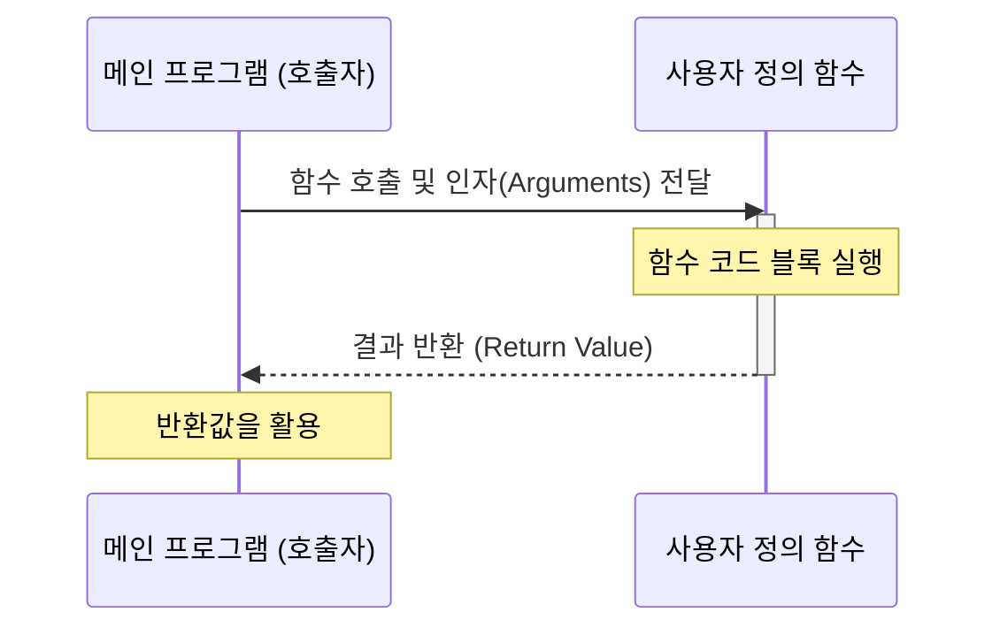

# 3.3.1 함수란 무엇인가?

*(함수 개념도: 원재료(입력)를 받아 기계 내부(함수 몸체)에서 가공을 무한 반복하는 구조의 애니메이션)*

### 비유로 이해하는 함수: 마법 오븐과 쿠키 공장

함수(Function)는 **"재료를 넣으면, 요리를 만들어주는 마법 오븐"**과 같습니다. 매번 밀가루 반죽하고 온도를 맞추는 대신, 함수를 만들어두면 "오븐아, 쿠키 구워줘!" 한 마디로 내부의 모든 복잡한 과정이 자동 실행되어 결과를 돌려줍니다.

함수 작동의 본질은 다음과 같은 3단계로 이루어집니다:
1. **입력(Input)**: 함수가 작동하기 위해 필요한 재료 (매개변수/인자)
2. **처리(Process)**: 전달받은 재료를 지시된 알고리즘에 따라 가공 및 연산
3. **출력(Output)**: 최종적으로 도출된 결과물을 반환 (반환값)

### 함수 작동 흐름 (Mermaid)

함수를 정의하고 호출하여 결과값을 돌려받는 일련의 동작 과정을 아래의 시퀀스 다이어그램으로 시각화했습니다.

