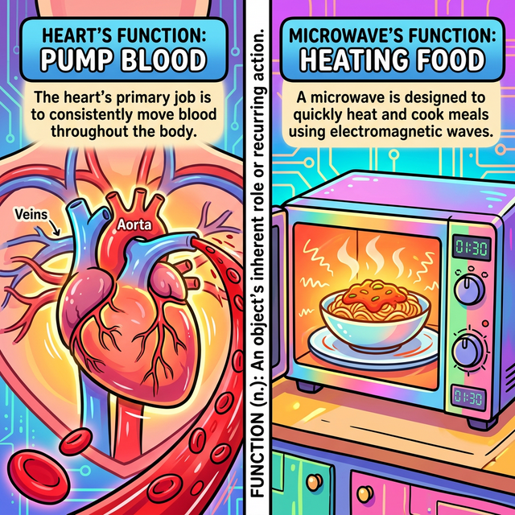
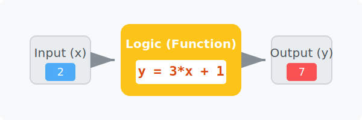

# 3.3.1 함수의 어원과 수학적 기원

## 학습목표
본 장에서는 프로그래밍의 가장 거대한 뼈대인 **'함수(Function)'**라는 단어가 도대체 어디서 왔는지 그 어원적 의미를 파헤칩니다. 영어 사전 속 '동작, 역할'이라는 뜻이 어떻게 수학의 $y = ax + b$ 대응 관계로 발전했고, 마침내 현대 프로그래밍의 **'독립적이고 일관적인 논리 처리 블랙박스'**로 진화했는지 그 근원적 철학을 완벽하게 이해합니다.

---

## 1. 어원적 접근: Function은 본래 "동작, 역할"이다

코딩을 처음 배우는 학생들이 가장 낯설어하는 단어 1위가 바로 '함수'입니다. 한자로 상자 함(函)에 셈 수(數)를 써서 "상자 속의 숫자 마법"이라는 뜻으로 번역되었기 조차 어렵습니다.

하지만 영어권 사람들에게 **"Function(펑션)"**은 아주 흔한 일상생활 단어입니다. 영어 사전을 찾아보면 그 뜻은 다음과 같습니다.
1. **기능, 작용**
2. **역할, 목적**
3. **(제대로) 작동하다, 역할하다**


*(웹툰 비유: 심장이 쿵쾅거리는 그림 위에 `Heart's Function : Pumping Blood` 라고 적혀있고, 전자레인지 그림 위에 `Microwave's Function : Heating Food` 라고 적혀있습니다. 각 사물이 가진 고유하고 **반복적인 '역할(역할/기능)'**이 바로 Function의 핵심 본질임을 보여줍니다.)*

이처럼 Function의 본질은 무언가 복잡한 수식이 아니라, **"외부에서 자극(Input)이 주어졌을 때, 자기가 맡은 고유의 임무(동작)를 묵묵히 수행하고 결과를 내어주는 것"**입니다. 심장의 펑션이 피를 뿜는 것이듯, 프로그래밍에서의 펑션(함수)은 '특정한 계산이나 동작을 수행하도록 묶어놓은 코드 덩어리'를 의미합니다.

---

## 2. 수학적 기원: y = ax + b 와 '대응(Mapping)'의 탄생

그렇다면 이 일상용어였던 Function이 어떻게 오늘날 컴퓨터 논리의 핵심으로 자리 잡았을까요? 그 중간 다리 역할을 한 것이 바로 **수학(Mathematics)**입니다.

과거 수학자들은 자연현상을 관찰하다가 한 가지 놀라운 사실을 발견합니다. 
> "어? 온도가 올라갈수록 아이스크림 판매량이 늘어나네? **원인(온도)이 변하면 결과(판매량)도 규칙적으로 변하는구나!**"

여기서 수학의 위대한 발명품인 **변수(Variable)** 개념이 등장합니다. 수학자들은 원인이 되는 값을 $x$, 결과가 되는 값을 $y$로 두고 그 규칙을 $y = ax + b$ 같은 수식으로 묶어버렸습니다.

### "대응(Correspondence)"의 발생
수식 구조 안에서 $x$에 숫자 `1`을 넣으면 $y$가 `3`이 되고, $x$에 `2`를 넣으면 $y$가 `5`가 됩니다. 이렇게 원인인 $x$ 값 하나에 결과인 $y$ 값이 짝을 지어 결정되는 관계를 수학에서는 **대응(Mapping, Correspondence)**이라고 불렀습니다.


*(다이어그램: $X$ 그룹(원인)의 데이터들이 $y = 2x + 1$ 이라는 마법의 파이프를 통과하자마자 형형색색의 $Y$ 그룹(결과) 별표로 확정되어 튀어나오는 매핑 과정. "1개의 입력은 정확히 1개의 결과만 보장한다"는 인과율의 화살표가 선명하게 빛납니다.)*

수학자들은 이처럼 **"입력이 주어지면 내부의 규칙(수식)을 거쳐 결과를 일관되게 뱉어내는 기계적인 대응 시스템"**의 모습이 마치 사물이 제 기능을 하는 모습과 똑같다고 생각하여 이를 **수학적 '함수(Function)'**라고 명명하게 됩니다.

---

## 3. 프로그래밍으로의 진화: 일관적인 '논리 처리 동작'

수학의 함수가 단순히 "숫자를 넣어 숫자를 뽑아내는 식"이었다면, 컴퓨터 프로그래밍 세계로 넘어오면서 이 개념은 무한대로 확장됩니다.

### "숫자를 넘어서 모든 종류의 데이터를 대응시킨다"
컴퓨터 세계에서의 함수는 숫자뿐만 아니라, **문자열, 사용자 클릭, 파일, 이미지** 등 모든 형태의 데이터를 원인($x$, Input)으로 받을 수 있습니다. 그리고 그 안에서 단순한 사칙연산이 아닌, 무수히 많은 `if`문과 `for` 루프가 섞인 **일관적이고 비대한 논리 처리 동작**을 수행한 뒤 새로운 결과($y$, Output)를 만들어 냅니다.

```python
# 일관적인 논리 처리를 담당하는 현대 프로그래밍의 함수(Function)
def translate_word(korean_word):
    # 단순한 수식이 아니라, 조건 분기와 매핑이라는 거대한 논리 덩어리입니다.
    # 하지만 "입력을 받아 역할을 수행하고 결과를 반환한다"는 철학은 똑같습니다.
    dictionary = {"사과": "Apple", "바나나": "Banana"}
    
    if korean_word in dictionary:
        return dictionary[korean_word] # 1:1 확정 대응 처리!
    else:
        return "Unknown"
```

결론적으로, 현대 코딩에서 함수를 짠다는 것은 수학에서 $y = f(x)$ 라는 공식을 만드는 행위의 연장선입니다. 우리는 함수라는 껍데기(def) 안에 **1. 어원적 의미인 '독립적인 고유의 동작/임무'**와 **2. 수학적 의미인 '입력과 출력의 철저한 인과율(대응)'** 철학을 모두 담아 거대한 소프트웨어를 조립하는 기어봉을 만드는 것입니다.

---

## 🎧 Vibe Coding

> **🗣️ 학생 프롬프트 (AI에게 이렇게 명령해 보세요):**
> "수학의 1차 함수 방정식 $y = 3x + 5$ 를 파이썬 함수 `def linear_func(x):` 로 그대로 똑같이 표현해서 짜줘. 그리고 그 밑에 for 루프를 돌려서 x 에 1부터 5까지 집어넣었을 때 y 값이 어떻게 일관성 있게(대응되어) 매핑되어 출력되는지 콘솔에서 확인하는 코드도 같이 줘."

---

## 코딩 영단어 학습 📝

*   **Function**: 기능, 동작, 목적, 함수. (어떤 것이 마땅히 수행해야 할 고유의 역할. 이 개념 하나가 수학과 컴퓨터 구조 전체를 관통하는 알파이자 오메가입니다.)
*   **Variable**: 변수. (변할 수 있는 값. 온도($x$)나 아이스크림 판매량($y$)처럼 세상의 불확실성을 담아두는 빈 상자입니다.)
*   **Correspondence / Mapping**: 대응, 매핑. (이쪽 집단의 원소 하나가 저쪽 집단의 원소 하나와 확고하고 운명적으로 짝지어지는 논리적 연결선입니다.)
