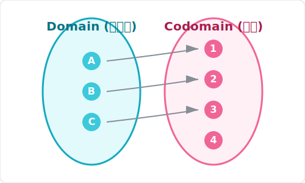
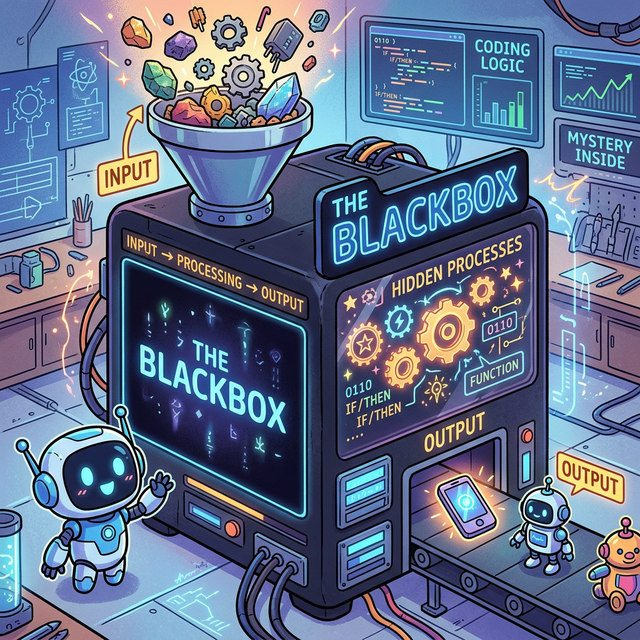
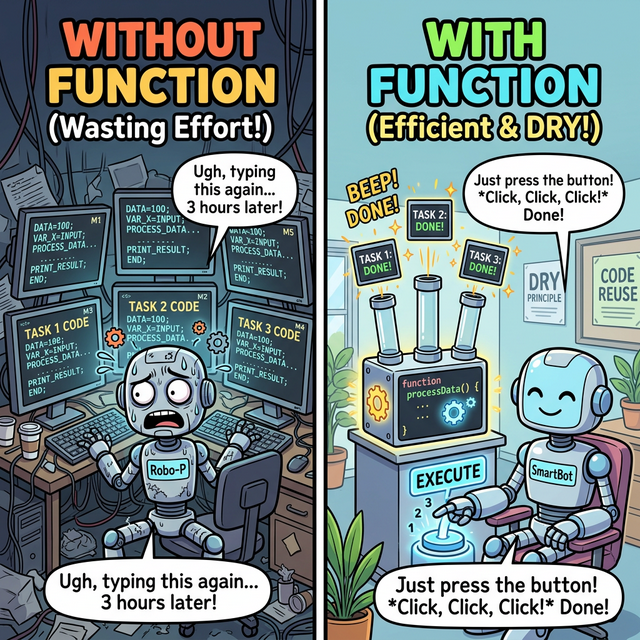

# 3.3.2 함수 블랙박스와 매핑(Mapping) 시스템

## 학습목표
본 장에서는 코드를 단순히 나열하는 초단계를 벗어나, 수학의 **'정의역(Domain)과 공역(Codomain)'**이라는 철저한 입력/출력 통제 규칙을 프로그래밍의 블랙박스(Black Box) 설계 철학과 연결합니다. 입력(Input), 처리(Process), 출력(Output)의 3대 필수 요소가 어떻게 소프트웨어라는 거대 공장의 핵심 부품이 되는지 깨우칩니다.

---

## 1. 수학적 관점: 정의역(Domain)과 공역(Codomain)의 통제

프로그래밍의 '함수(Function)'는 본래 수학의 엄격한 자판기 시스템에서 파생되었습니다. 수학 세계에서 불량품 함수로 판정받지 않기 위해서는, 자판기에 집어넣을 수 있는 동전의 종류(입력 데이터 풀)인 **정의역(Domain)**과, 튀어나올 잠재적 음료의 종류(출력 타깃 풀)인 **공역(Codomain)**을 명확히 규정해야만 합니다.

이러한 수학의 제약조건은 **"아무 쓰레기 데이터나 집어넣으면 프로그램이 터진다"**는 현대 코딩의 가장 본질적인 에러 핸들링 논리로 발전하게 됩니다.

*(다이어그램: 정의역(Domain, $X$) 집합에 있는 숫자 `1, 2, 3`이 중간의 거대한 $f(x)$ 톱니바퀴 연산 기계를 거치면서, 공역(Codomain, $Y$) 집합에 있는 특정 결괏값 `A, B, C`로 한 치의 오차도 없이 일대일(혹은 다대일)로 정확하게 매핑(Mapping)되어 레이저 빔처럼 꽂히는 무결점 수학적 흐름입니다.)*

프로그래밍의 함수도 이 수학적 원리의 3단계를 100% 동일하게 가져왔습니다.
1.  **입력 (Input / Parameter)** = 정의역($X$) 통제 구역. 기계에 던져 넣게 허락된 원재료입니다. 파이썬에서는 `()` 안에 던져주는 변수들을 의미합니다.
2.  **처리 (Process / Logic)** = $f(x)$ 톱니바퀴. 들어온 원재료를 지지고 볶고 연산하는 기계 내부 동작입니다.
3.  **출력 (Output / Return)** = 공역($Y$) 내에서 확정된 치역 매핑 결과. 가공이 끝나 기계 밑구멍으로 튀어나오는 영광스러운 최종 결과물(`return`)입니다.

---

## 2. 공학적 관점: 치밀한 블랙박스 (The Black Box)

수학의 엄격한 기계 원리를 소프트웨어 공학으로 가져오면, 함수는 곧 **'블랙박스(Black Box)'**가 됩니다. 비행기의 블랙박스처럼 내부가 숨겨져 있다는 뜻이 아니라, **"속에 무슨 복잡한 부품이 들었는지는 알 필요 없고, 겉에 달린 버튼(Input)과 튀어나오는 결과(Output)만 알면 누구나 가져다 쓸 수 있다"**는 **구현 은닉(Information Hiding)**과 **추상화(Abstraction)**의 위대한 철학을 담고 있습니다.

*(웹툰 비유: 평범한 로봇이 밀가루, 계란, 설탕 등 지저분한 날것의 재료(Input)를 정체를 알 수 없는 시커먼 '블랙박스 로봇'에게 전해줍니다. 블랙박스 로봇은 속에서 무슨 마법을 부렸는지 전혀 보여주지 않은 채, 1초 만에 완벽하게 구워진 3단 케이크(Output)를 내밀며 윙크합니다.)*

### 왜 함수를 블랙박스로 만들어야 할까요?
스마트폰 전원 버튼을 누를 때 폰 내부에서 일어나는 수만 가지 전기 회로의 파장 흐름(배터리 인가, 액정 배열 등)을 우리가 일일이 계산하며 살지 않는 것과 같습니다. 우리는 그저 **"전원 버튼을 누른다(Input 호춯)"** $\to$ **"화면이 켜진다(Output 도출)"** 라는 깔끔한 인터페이스만 누립니다. 

코딩도 마찬가지입니다. 누군가가 미리 머리 터지게 짜둔 `print()`, `len()`, `sum()` 같은 훌륭한 블랙박스들이 이미 있기 때문에, 모니터 픽셀이 어떻게 그려지는지 신경 끄고 단어 하나로 모든 복잡성을 잊어버리는 것입니다.

---

## 3. 함수의 위대한 3대 존재 이유

우리는 왜 굳이 귀찮음을 무릅쓰고 코드를 함수로 묶어서 만들어야 할까요? 코드를 위에서 아래로 그냥 쭈욱 길게 적어내려가면 안 될까요?

### ① 코드의 재사용성 (DRY 원칙: Don't Repeat Yourself)

*(웹툰 비유: 왼쪽 그림의 `Without Function(함수 없음)` 로봇은 다크서클이 턱까지 내려온 채 완전히 똑같이 생긴 복잡한 계산 코드를 모니터 3대에 걸쳐 일일이 중복으로 타이핑하며 땀을 뻘뻘 흘립니다. 반면 오른쪽 그림의 `With Function(함수 사용)` 스마트 로봇은 그 길고 복잡한 코드를 깔끔한 '함수 상자(Function Box)' 안에 딱 한 번만 예쁘게 포장해 둔 뒤, 버튼 하나만 여유롭게 `딸깍!` 3번 눌러서 똑같은 결과물을 눈 깜짝할 새에 쏟아내는 마법을 보여줍니다!)*

소프트웨어를 만들다 보면, '회원 가입 환영 이메일 보내기'나 '장바구니 총합 할인율 계산하기'처럼 완전히 똑같은 흐름의 복잡한 논리 작업들이 여기저기서 수십 번씩 필요해집니다. 똑같은 행동을 하는 코드를 10군데에 그대로 복붙하는 것은 프로그래머에게 죄악(Spaghetti Code)입니다. 나중에 정책이 바뀌어 코드를 1줄 고쳐야 할 때 10군데를 모두 찾아가 일일이 고쳐야 하는 끔찍한 대참사가 일어납니다.

이때 뛰어난 개발자들은 그 반복되는 긴 작업(논리 흐름) 코드 전체를 하나의 캡슐 상자 안에 깔끔하게 묶어버립니다(**'함수화, Bundling'**). 이렇게 함수라는 '명령어 캡슐' 안에 넣어두고 이름만 호출하면, 나중에 함수 내부의 코드 딱 한 줄만 고쳐도 그것을 호출하는 수백만 군데의 프로그램 생태계가 일제히 자동 업데이트되는 최고의 마법(**재사용성**)을 경험하게 됩니다.

### ② 논리의 모듈화와 분할 정복 (Divide & Conquer)
RPG 게임을 만들 때 거대한 'main' 통뼈 파일 하나에 수백만 줄의 코드를 다 때려 박으면 당연히 미아가 됩니다. 이 덩어리를 `move_character()`, `attack()`, `get_item()` 이라는 독립된 작은 블랙박스 함수 부품들로 쪼개서 만들면(모듈화), 개별 부품만 독립적으로 테스트하고 고장 난 곳만 떼어내서 빠르게 수리할 수 있습니다.

### ③ 가독성 (Readability)
함수는 그 자체로 내가 쓴 코드의 '논리적 목차'가 됩니다. 내부의 복잡한 연산을 읽기도 전에, 함수 이름을 `calculate_tax()`라고 명명해 두면 "아하, 여기서 머리 아프게 세금을 떼고 다음 줄로 넘어가겠군!" 하고 소설책처럼 메인 프로그램의 뼈대를 술술 읽어 내려갈 수 있습니다.

---

## 🎧 Vibe Coding

> **🗣️ 학생 프롬프트 (AI에게 이렇게 명령해 보세요):**
> "파이썬에서 함수의 입력(매개변수)과 반환(return)의 개념이 잘 이해가 안 가. 숫자 2개를 입력하면 그 안에서 더하기, 빼기, 곱하기, 나누기를 한 결과값 4개를 동시에 한꺼번에 리턴하는 '만능 사칙연산 함수' 코드를 작성해주고, 어떻게 함수가 여러 개의 값을 돌려줄 수 있는지 파이썬만의 특징(Tuple Unpacking)을 사용해서 아주 친절하게 주석을 달아줘."

---

## 코딩 영단어 학습 📝

*   **Function**: 기능, 작용, (수학의) 함수. (단어 자체에 이미 '어떤 목적을 달성하게 해주는 동작 메커니즘'이라는 뜻이 내포되어 있습니다.)
*   **Define (`def`)**: 규정하다, 정의하다. (파이썬에서 새로운 함수를 창조하고, 그것의 룰을 세상(메모리)에 선포할 때 쓰는 키워드입니다.)
*   **Argument (인자)**: 주장, 논거, (수학/컴퓨터의) 독립변수. (함수라는 판사에게 "이 재료를 바탕으로 판단해 주십시오" 하고 호출자가 집어 던져 넘기는 실제 데이터 값입니다.)
*   **Parameter (매개변수)**: 한도, 매개변수. (함수의 설계도 단에서, 나중에 Argument들이 날아오면 임시로 받아줄 그릇(변수 이름)들의 명칭입니다.)
*   **Return**: 돌려주다, 돌아가다. (함수가 자신에게 주어진 모든 톱니바퀴 연산을 마치고, 최종 계산서를 자신을 부른 주인(호출자)에게 던져주고 무대에서 퇴장하는 명령어입니다.)
*   **Abstraction**: 추상화. (세상 복잡한 블랙박스 내부 기어비는 다 숨겨버리고, 사용자가 쓰기 편한 엑셀 페달(껍데기)만 겉으로 딸랑 드러내 놓는 공학 최고의 미덕입니다.)
*   **Reuse (Reusability)**: 재사용성. (한 번 잘 만들어둔 코드를 수정 없이 여기저기서 수십 번 반복해서 다시 꺼내 쓰는 프로그래밍 최고의 덕목입니다.)
*   **Bundling**: 묶음, 포장. (복잡하게 흩어진 논리적 흐름들을 하나의 거대한 캡슐(함수) 박스로 깔끔하게 포장하는 행위입니다.)
