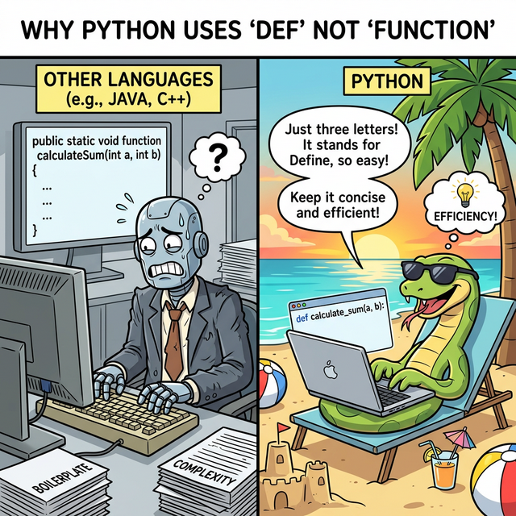
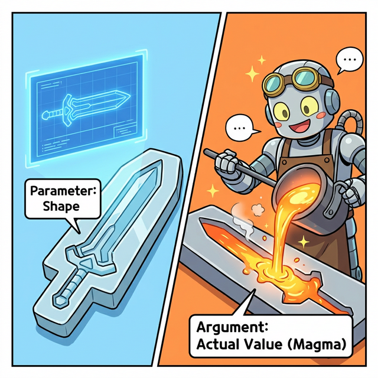
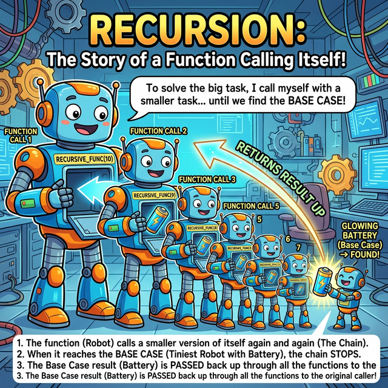

# 3.3.2 함수 선언과 사용

## 학습목표
본 장에서는 학생들이 파이썬 프로그래밍을 배울 때 가장 큰 벽으로 느끼는 **'함수의 흐름(Control Flow)'**을 파헤칩니다. `def` 키워드로 함수를 만드는 기법부터, 호출(Call)될 때 프로그램 메모리의 흐름이 어떻게 다른 공간으로 워프(Jump)했다가 되돌아오는지(Return) 그 복잡한 궤적을 완벽히 이해합니다. 더 나아가, 함수가 자기 자신을 끝없이 호출하는 마법 같은 **재귀(Recursion)**의 원리까지 상세히 정복합니다.

---

## 1. 함수 선언하기 (Why `def`?)

파이썬에서 함수를 새롭게 창조하는 행위를 가리켜 **'정의한다(Define)'**고 표현합니다. 다른 많은 언어들이 함수를 만들 때 `function`이라는 길고 번거로운 단어를 쓰지만, 파이썬은 왜 단 세 글자인 `def`를 사용할까요?


*(웹툰 비유: 자바나 C++ 로봇이 땀을 뻘뻘 흘리며 `public static void function...` 이라는 수십 자의 계약서를 쓰고 있는 동안, 해변 의자에 누워 선글라스를 낀 파이썬 뱀파이어는 여유롭게 단 세 글자 `def`만 틱 치고 미소를 짓고 있습니다. 파이썬의 궁극적인 철학인 "단순함과 우아함"을 보여줍니다.)*

파이썬의 철학은 **"실용적이고 읽기 쉬워야 하며, 불필요한 타이핑은 지양한다"**입니다. 8글자나 되는 `function`을 매번 치는 것은 프로그래머의 손가락을 피곤하게 만듭니다. 그래서 **"새로운 명령어를 정의(Define)한다"**라는 뜻의 앞 세 글자 **`def`**만을 따와서 가장 직관적이고 쿨한 예약어를 탄생시켰습니다.

### 기본 선언 문법

```python
# 'def' 키워드로 함수명과 입력받을 통로(매개변수)를 정의합니다.
def make_greeting(name):
    """이곳은 함수가 무슨 일을 하는지 적어두는 독스트링(설명서) 공간입니다."""
    message = f"안녕하세요, {name}님! 환영합니다."
    
    # 작업이 다 끝나면 그 결과를 호출한 쪽으로 탁 던져줍니다.
    return message
```

---

## 2. 매개변수(Parameter) vs 인수(Argument)

함수에서 가장 헷갈리는 용어가 바로 **파라미터(Parameter)**와 **아규먼트(Argument)**입니다. 둘 다 "함수에 넣어주는 값"이라고 뭉뚱그려 알고 있으면 나중에 객체지향을 배울 때 뼈아픈 타격을 입습니다. 이 둘의 차이는 하늘과 땅 차이입니다!


*(웹툰 비유: 왼쪽의 텅 빈 검 푸른 '홀로그램 도면(틀)'이 바로 파라미터(Parameter)입니다. "이 틀에는 무언가 들어올 거다~" 하고 선언만 해둔 빈 공간입니다. 반대로 오른쪽의 대장장이 로봇이 펄펄 끓는 진짜 마그마(실제 데이터)를 그 틀 안에 들이붓고 있는데, 이 들이붓는 진짜 알맹이 데이터가 바로 아규먼트(Argument)입니다.)*

*   **매개변수(Parameter)**: 함수를 처음 **설계(def)할 때 뚫어놓은 구멍(이름표)**입니다. 아직 값이 없습니다. 
    *   `def make_cookie(flavor):` 여기서 `flavor`는 파라미터입니다.
*   **인수/인자 (Argument)**: 함수를 실제로 **실행(Call)할 때 그 구멍에 쑤셔 넣는 진짜 데이터 값**입니다.
    *   `make_cookie("초코")` 여기서 `"초코"`라는 텍스트 덩어리가 실제 작동하는 아규먼트입니다.

---

## 3. 함수 호출과 제어 흐름의 도약 (Control Flow Jump)

학생들이 함수에서 가장 멘붕에 빠지는 지점은 코드가 1줄, 2줄, 3줄 위에서 아래로 정직하게 흐르다가, **함수를 만나는 순간 갑자기 흐름이 사라지고 위아래로 널뛰기를 한다는 점**입니다. 이를 '제어 흐름의 도약(Control Jump)'이라고 부릅니다.


*(다이어그램: 메인 프로그램(Main Program)을 일직선으로 차례차례 읽고 내려오던 초록색 실행 불빛이, 2번 라인에서 `calc_tax(100)`이라는 함수 호출 코드를 만납니다. 그러자 불빛이 보라색 포탈 안으로 쑥 빨려 들어가, 전혀 다른 메모리 공간에 있는 `calc_tax()` 함수의 방으로 떨어집니다. 거기서 세금 계산 지시사항을 모두 마친 불빛은, 계산 결과(Return)를 보따리에 싸들고 황금색 귀환 포탈을 타서, 아까 본인이 떠났던 바로 그 메인 프로그램의 2번 라인으로 기가 막히게 정확히 되돌아옵니다.)*

### 호출(Call)과 복귀(Return)의 마법
1.  **점프(Jump)**: 메인 프로그램이 실행되다가 함수 이름을 부르는 순간, 하던 일을 모두 일시정지(`Pause`)하고 책갈피를 꽂아둡니다. 그리고 실행권(제어권)을 복사하여 함수가 살고 있는 곳으로 순식간에 순간이동합니다.
2.  **격리된 공간(Scope)**: 함수는 자신만의 닫힌 방에서 들어온 재료(Argument)를 가지고 열심히 지지고 볶습니다. 이 방에서 일어나는 일은 메인 프로그램쪽에서 알지 못합니다.
3.  **반환(Return)**: 함수 끄트머리에서 `return 결괏값` 문장을 만나면, 함수는 방을 폭파해버리고 계산된 엑기스(결과물) 하나만 들고 아까 책갈피를 꽂아두었던 메인 프로그램의 그 자리로 다시 순간이동하여 돌아옵니다.

만약 `return`을 돌려주지 않으면 파이썬은 빈털터리라는 의미로 `None`이라는 빈 껍데기를 몰래 쥐어주고 돌아옵니다.

### 다중 반환의 쾌감 (Tuple Packing)
파이썬은 아주 호탕한 언어입니다. 다른 언어에서는 값이 2개면 리스트나 객체로 귀찮게 싸서 줘야 하지만, 파이썬은 `return` 뒤에 쉼표(`,`)만 찍어주면 다수의 결괏값을 한 큐에 튜플 포장지로 감싸서 쿨하게 던져줍니다.

```python
def math_master(x, y):
    add = x + y
    sub = x - y
    return add, sub  # 값 2개를 동시에 배출!

# 튜플 언패킹(Unpacking)으로 두 변수에 우겨넣기
result_add, result_sub = math_master(10, 3) 
print(f"더하기: {result_add}, 빼기: {result_sub}") # 출력: 더하기 13, 빼기 7
```

---

## 4. 궁극의 마법: 재귀 함수 (Recursive Functions)

함수 챕터의 최종 보스는 단연 **재귀(Recursion)**입니다. 재귀 함수란 **"함수 내부에서 뜬금없이 자기 자신을 또 부르는 함수"**를 뜻합니다. 거울 속에 비친 거울을 쳐다보는 것과 같죠.


*(웹툰 비유: 거대한 대장 로봇이 배를 열더니 살짝 작은 자신의 클론 형상을 한 로봇을 꺼냅니다. 그 클론이 무언가 일을 하려다 다시 자기 배를 열어 더 작은 클론을 꺼내고... 이 무한 반복의 늪에 빠지다, 구석에 있는 아주 콩알만 한 가장 막내 로봇이 "어? 난 더 이상 꺼낼 클론이 없고 배터리(Base Case)가 있네?" 라며 배터리를 꺼내 바로 윗 형에게 넘겨주면, 형들이 연쇄적으로 값을 넘겨받아 마침내 대장 로봇이 완성된 에너지를 얻게 됩니다.)*

### 콜 스택 (Call Stack)과 종료 조건
자기 자신을 계속 부르게 되면 컴퓨터의 메모리(콜 스택)에 함수들이 탑처럼 끝없이 쌓이게 됩니다. 그러다 결국 컴퓨터 메모리가 터져버리는 끔찍한 에러(`RecursionError`)가 발생합니다.
따라서 재귀 함수를 만들 때는 **"이 조건이 되면 이제 그만 부르고 돌아가자!"**라는 철저한 제동 장치, 즉 **종료 조건(Base Case)**을 맨 위에 반드시 만들어 두어야 합니다.

수학의 '팩토리얼(Factorial, 5! = 5 * 4 * 3 * 2 * 1)' 연산이 재귀로 표현하기 가장 완벽한 예시입니다.


*(다이어그램: `fact(3)`이 완료되려면 `fact(2)`의 대답을 기다려야 하고, `fact(2)`는 `fact(1)`을, `fact(1)`은 `fact(0)`을 호출하며 콜 스택 깊은 곳으로 점점 들어갑니다(Push). 마침내 `fact(0)`이 종료 조건(Base Case)을 만나 숫자 `1`을 확정 짓고 위로 돌려주면, 그때부터 멈춰있던 형들이 거꾸로 올라가며 연쇄적으로 곱셈을 팍팍 터뜨리며(Pop) 최종 답을 들고 돌아오는 폭포수 같은 과정입니다.)*

```python
def factorial(n):
    # 1. 절대 잊어선 안되는 브레이크 (Base Case)
    if n <= 0:
        return 1 
    
    # 2. 자기가 자기 자신보다 크기(n)를 1칸씩 줄여가며 계속 파고들어 호출합니다.
    return n * factorial(n - 1) 

print("3 팩토리얼의 결과:", factorial(3))
```

처음엔 헷갈리지만, 복잡한 트리 구조를 뒤지거나 데이터 디렉토리를 탐색할 때 이 재귀 함수의 위력은 상상을 초월합니다.

---

## ☕ Java vs 🐍 Python 스나이퍼 비교

### 1. 극단적으로 유연한 파라미터 전달 (Keyword Arguments)
*   **Java**: 매개변수를 넘길 때 함수가 요구하는 순서(Position)를 무조건 기계처럼 철저하게 지켜야만 합니다.
*   **Python**: 파라미터 이름을 직접 지목해서 꽂아버리는 **키워드 가변 인수(Keyword Argument)**가 지원됩니다. `make_cookie(sugar=30, flavor="초코")`처럼 순서를 내 마음대로 뒤집어엎어서 던져줘도 파이썬이 알아서 원래 구멍을 찾아 값을 매핑해 줍니다. 

### 2. 가변 매개변수 (*args, **kwargs)
*   **Java**: 몇 개의 값이 들어올지 모를 때 오버로딩(Overloading)을 여러 개 수작업으로 지루하게 만들거나 베리애딕(`...`) 문법을 써야 합니다.
*   **Python**: 별표 하나(`*args`)로 무한대의 튜플 꾸러미를, 별표 두 개(`**kwargs`)로 무한대의 딕셔너리 꾸러미를 마법의 주머니처럼 통째로 다 빨아들여 처리할 수 있습니다. 

---

## 🎧 Vibe Coding

> **🗣️ 학생 프롬프트 (AI에게 이렇게 명령해 보세요):**
> "재귀 함수(Recursion)의 개념을 이용해서 1부터 내가 입력한 숫자 N까지의 합을 구하는 파이썬 코드를 짜줘. 단, 함수가 자기 자신을 호출하면서 파고들 때마다 `N이 3일 때 진입`, `N이 2일 때 진입` 같은 상태를 print 문으로 콘솔에 전부 찍어서 출력되게 해줘. 그래야 함수가 콜 스택에 쌓이는 게 눈으로 보이니까."

---

## 코딩 영단어 학습 📝

*   **Parameter**: 매개변수. (도면, 거푸집, 틀. 설계도에 존재하는 공간의 이름입니다.)
*   **Argument**: 인수, 인자. (실제 데이터. 설계도의 틀에 들이붓는 현장의 자재입니다. 수학 증명에서의 '논거'라는 뜻에서 파생되어 함수에 힘을 싣는 실제 근거 값이라는 뉘앙스를 가집니다.)
*   **Return**: 돌려주다, 반환하다. (제어 흐름의 도약 구조에서, 남의 방에서 일을 끝내고 짐을 싸서 '원래 호출되었던 내 둥지로 되돌아간다'는 핵심적인 물리적 점프의 뉘앙스를 담고 있습니다.)
*   **Recursion**: 재귀, 되풀이. (라틴어 currere(달리다)에 re(다시)가 붙어, 왔던 길을 다시 되짚어 달린다는 뜻입니다. 마트료시카 인형처럼 까도 까도 자기 자신이 나오다 가장 작은 놈을 만나면 역순으로 다시 닫고 올라오는 행위입니다.)
*   **Base Case**: 기저 조건, 바닥 조건. (재귀 함수가 무한 루프의 늪에 빠져 메모리가 터지기(Stack Overflow) 직전에, 브레이크를 걸고 바닥을 치고 다시 수면 위로 올라오게 만드는 유일한 탈출 조건문입니다.)
