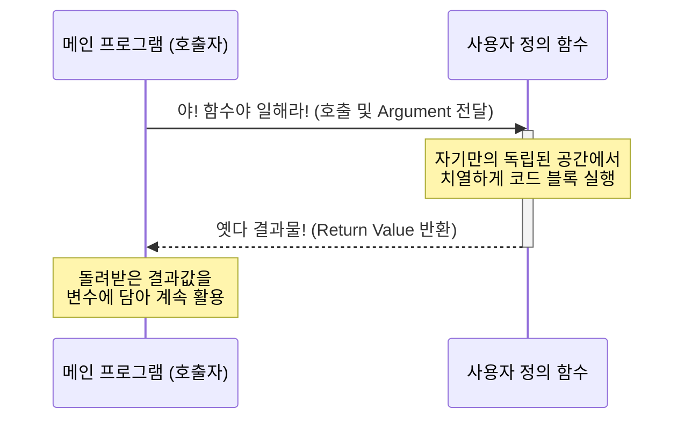

# 3.3.3 함수 작동 흐름 시퀀스 다이어그램

## 학습목표
본 장에서는 메인 프로그램이 함수를 '호출(Call)'하여 요청을 위임하고, 함수가 자기만의 독립된 공간에서 치열하게 연산한 뒤 그 결과물을 다시 '반환(Return)'하여 메인 프로그램으로 돌아오는 전체 작동 흐름을 시퀀스 다이어그램을 통해 직관적으로 조망합니다.

---

## 1. 함수 작동 흐름 (Mermaid)

함수를 정의해 두고, 메인 프로그램에서 인자(Argument)를 담아 "호출(Call)"하여 결과값(Return Value)을 돌려받기까지의 위임과 회수 과정을 아래 시퀀스 다이어그램으로 시각화했습니다.

위 다이어그램에서 보듯, 함수는 호출되는 순간 메인 프로그램의 메모리 흐름에서 일시적으로 벗어나 자신만의 독립된 실행 환경(블랙박스)을 시동합니다. 모든 처리를 마치고 나면 흔적을 지우고 오직 결과값 하나만 호출자에게 배달한 뒤 깔끔하게 사라집니다.

## ☕ Java vs 🐍 Python 스나이퍼 비교

### 1. 극단적으로 간결한 정의 방식 (def 키워드)
*   **Java**: 자바에서 함수(메서드)를 하나 만들려면 험난한 관문을 거쳐야 합니다. 접근 제어자(`public`), 정적 여부(`static`), 가장 중요한 **반환 데이터 타입(`int`, `String` 등)**을 가장 먼저 선언해야 합니다.
    *   `public static int add(int a, int b) { return a + b; }`
*   **Python**: 파이썬은 이 모든 선언의 압박을 단 세 글자 **`def` (Define)** 로 퉁칩니다. 파이썬은 동적 타입 언어이므로 들어오는 입력값도, 뱉어내는 반환값도 미리 귀띔해 줄 필요가 없습니다. 그저 실행해 볼 뿐입니다.
    *   `def add(a, b): return a + b`

### 2. 일급 객체 (First-Class Citizen)의 대우
*   **Java**: 자바 8 이전까지 자바의 메서드는 오로지 '클래스'라는 거대한 성벽 안에 종속된 부속품일 뿐이었습니다. 함수 그 자체를 변수에 담거나 다른 함수에 던져줄 수 없었습니다.
*   **Python**: 파이썬에서 함수는 **변수나 숫자와 완벽히 동등한 지위(일급 객체)**를 누립니다. 함수 덩어리 자체를 숫자 `3`이나 문자열 `"hello"`처럼 변수에 틱 하고 대입할 수도 있고, 다른 함수의 인자로 `add` 함수 뭉치를 통째로 집어던질 수도 있는 극도의 유연성을 자랑합니다.

---

## 🎧 Vibe Coding

> **🗣️ 학생 프롬프트 (AI에게 이렇게 명령해 보세요):**
> "파이썬으로 간단하게 물건 가격과 할인율을 입력받아 최종 가격을 계산하는 함수를 만들어줘. 그리고 메인 프로그램에서 이 함수를 호출할 때 흐름이 어떻게 해당 함수로 넘어갔다가, 다시 계산 결과를 들고 메인으로 돌아오는지 시퀀스 구조가 잘 보이도록 `print()` 문으로 흐름을 찍어주는 주석 가득한 예제 코드를 작성해 줘."

---

## 코딩 영단어 학습 📝

*   **Sequence**: 순서, 차례. (프로그램의 동작이 호출과 반환의 시간적 순서에 따라 어떻게 흘러가는지 보여주는 다이어그램입니다.)
*   **Caller**: 호출자. (함수에게 일을 시키기 위해 메인 프로그램 쪽에서 이름을 부르는 주체입니다.)
*   **Activate / Deactivate**: 활성화 / 비활성화. (함수가 호출되어 메모리 상에서 독립적인 블랙박스 공장이 가동(Activate)되고, 일이 끝나면 소멸(Deactivate)하는 생명주기를 나타냅니다.)
