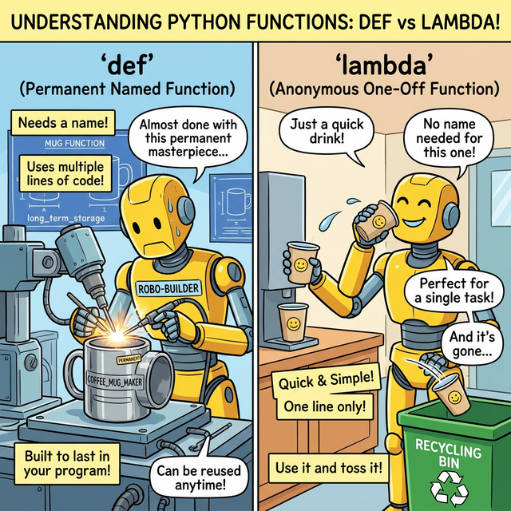

# 3.3.3 변수 스코프와 람다 함수

## 학습목표
본 장에서는 함수 내부 코드와 바깥세상을 엄격히 가로막는 **'변수의 유효 범위(Scope)'** 개념과 닫힌 문을 부수는 `global` 키워드의 작동 원리를 명확히 파악합니다. 더 나아가, `def`로 이름표조차 붙일 시간 없이 즉석에서 1줄로 생성하고 폐기하는 강력한 일회용 익명 함수, **람다(Lambda)**의 용도를 전격 해부합니다.

---

## 1. 변수의 유효 범위 (Scope)와 Global 키워드

일반적으로 함수 안에 선언된 변수들은 바깥의 세상(전역 공간)에 전혀 영향을 주지 않고 철저하게 고립됩니다. 안쪽에 생성된 함수 공간을 **지역 스코프(Local Scope)**라고 하며 바깥쪽 공간을 **전역 스코프(Global Scope)**라고 부릅니다.

```python
y = 2 # 이 y는 바깥세상의 '전역 변수'입니다

def my_func(x):
    y = 10 # 함수 내부에서 탄생한 전혀 다른 고립된 '지역 변수'
    return x + y

print(my_func(5)) # 작동 결과: 15
print(y)          # 지역 변수가 아무리 10으로 둔갑해도 전역 변수 y는 끄떡없이 2를 유지합니다.
```

### 전역 변수를 조종하는 열쇠, `global`
함수는 블랙박스처럼 바깥세상과 단절되는 것이 원칙이지만, 간혹 함수 안의 복잡한 로직을 타고 난 뒤 함수 바깥 스코프에 있는 전역 변수의 상태를 물리적으로 꼭 수정해야 하는 강력한 요구 사항이 발생할 때가 있습니다. (예: 게임 전체의 생존자 수 차감, 글로벌 설정값 변경)

이럴 때는 함수 내부에서 `global` 키워드를 선언하여 **"지금부터 등장하는 변수 `y`는, 함수 내부에서 새로 만든 놈이 아니라 저 바깥에 있는 진짜 전역 변수 `y`를 원격으로 조종하겠다!"** 라고 명시해야만 합니다.

```python
y = 2 

def update_global():
    global y # 바깥세상의 y와 동기화하는 만능 열쇠!
    y = y * 10
    print("내부에서 수정된 전역 변수:", y) 

update_global()
print("바깥에서도 영구적으로 변경된 전역 변수:", y)

# 내부에서 수정된 전역 변수: 20
# 바깥에서도 영구적으로 변경된 전역 변수: 20
```

---

## 2. 이름 없는 마법의 한 줄 문장, 람다 (Lambda)

함수(`def`)가 너무 거창하고 무겁게 느껴질 때가 있습니다. 코드가 단 1줄에 그치는 매우 시시한 계산식인데 굳이 `def` 키워드를 쓰고, 들여쓰기를 하고, 함수 이름을 작명하느라 골머리를 앓는 대신 **이름표조차 붙이지 않고 쓰고 버리는 강력한 일회용 함수**가 바로 람다(Lambda)입니다. 

### 왜 '익명 함수'라고 안 부르고 '람다'라고 부를까요?

"이름 없는 함수(Anonymous Function)와 똑같은 말인데, 왜 하필 람다(Lambda)라는 외계어 같은 이름을 고집하나요?" 코딩을 갓 배운 학생들이 가장 많이 던지는 질문입니다.


*(웹툰 비유: 고대의 위대한 천재 마법사 수학자 '알론조 처치(Alonzo Church)' 형상의 RPG 마법사가 번쩍이는 그리스 문자 람다(λ) 지팡이를 들고 있습니다. 그의 주변에는 무거운 기계어가 아닌, 순수한 논리 그 자체인 수학 공식 `λx.x+1`이 허공에 떠 있습니다.)*

이 독특한 이름은 1930년대, 컴퓨터가 존재하기도 전에 활동했던 미국의 천재 수학자 **알론조 처치(Alonzo Church)**의 구상에서 유래했습니다. 그는 모든 가능한 계산을 오직 **'이름 없는 수학적 함수 매핑'**만으로 논리적으로 증명하기 위해 **람다-대수(Lambda Calculus)**라는 무시무시한 논리 체계를 창시했습니다. 이때 그는 함수 매개변수를 묶어주는 기호로 그리스 문자 람다(λ)를 썼습니다.

현대 컴퓨터 과학자들은 이 위대한 선구자의 수학적 업적에 대한 오마주(존경)를 바치기 위해, 파이썬을 포함한 수많은 프로그래밍 언어에서 '익명 함수'를 만들 때 `lambda`라는 키워드를 고유 명사처럼 사용하게 된 것입니다.

> 💡 **[참고] 실생활 수학에서 람다($\lambda$)의 3가지 얼굴**
> 사실 그리스 문자 람다는 수학과 과학의 다양한 분야에서 '단골 기호'로 쓰입니다.
> 1. **수학적 논리학 (가장 똑같은 형태)**: 방금 배운 알론조 처치의 **'람다 대수(Lambda Calculus)'**입니다. $f(x)=x+1$ 대신 입력을 받는 구멍 표시에 불과한 $\lambda x.x+1$ 로 함수 이름($f, g, h$) 짓기의 귀찮음을 해결한 순수 논리 기호입니다. (이 의미가 파이썬까지 그대로 온 것입니다!)
> 2. **선형대수학 (대학 수학)**: 행렬을 잡고 늘이거나 줄일 때, 원래 방향을 유지하면서 크기만 변하는 특정 배율인 **'고윳값(Eigenvalue)'**을 나타내는 핵심 기호입니다. 인공지능(AI) 수학의 뼈대입니다.
> 3. **확률과 통계**: 포아송 분포(Poisson Distribution)에서 **'발생 횟수의 평균'**을 뜻합니다. (예: 이 콜센터는 1시간에 평균적으로 전화가 5번 온다 $\rightarrow \lambda = 5$)

### 일반 함수(def) vs 람다 익명 함수(lambda)의 생명주기 차이


*(웹툰 비유: 왼쪽 로봇은 철심을 깎아 평생 쓸 무겁고 고급스러운 커스텀 스텐 머그잔(def 함수)을 이름표까지 붙여 정성스레 만들고 있습니다. 반면 오른쪽 로봇은 정수기 옆에 쌓인 싸구려 일회용 종이컵(lambda 익명 함수)을 툭 뽑아 물을 단숨에 마신 뒤, 미련 없이 쓰레기통에 쿨하게 버려버립니다.)*

1.  **일반 함수(`def`)**: 메모리 상에 자기 이름표를 달고 **영구적인 방**을 하나 얻어서 거주합니다. 언제든지 다른 줄에서 이름을 부르면 튀어나와서 일을 합니다. (마치 고급 스텐 머그잔처럼)
2.  **람다 함수(`lambda`)**: 이름표가 없어 파이썬 메모리 주소록에 등록되지 않습니다. 코드가 실행되는 바로 그 찰나의 순간에 허공에서 잠시 계산을 수행하고, 결괏값을 뱉자마자 **흔적도 없이 메모리에서 소멸(Garbage Collected)**해 버립니다. (마치 1초 쓰고 버리는 일회용 종이컵처럼)


*(다이어그램: 위쪽의 `def add(x,y)`는 보라색 영구 메모리 방을 만들어 대기하다가 결과를 주는 무거운 과정입니다. 아래쪽의 `lambda x, y: x+y`는 함수 상자가 메모리에 둥지를 틀기도 전에 점선으로 허공에 순식간에 나타났다가 `7`을 뱉는 순간 파스슥 하고 연기처럼 증발(소멸)해버리는 아주 날렵하고 경쾌한 실행 흐름을 묘사합니다.)*

---

## 3. 람다 함수 선언과 극강의 활용법

### 기본 문법 (단 1줄 규칙)
람다 함수는 오직 한 줄(One-liner)로만 작성해야 하며, 그 자체가 자동으로 반환값(`return`)이 되기 때문에 `return`이라는 글자조차 적을 수 없습니다.

```python
# 일반 방식 (3줄 차지)
def add_ten(x):
    return x + 10

# 람다 방식 (1줄, 익명)
# 매개변수 집어넣고(x:) : 그 즉시 계산해서 뱉어낼 수식(x + 10)
lambda_add = lambda x: x + 10
print(lambda_add(5)) # 15
```

### 진정한 람다의 무대: 일급 객체로서의 인자 전달

사실 위 코드처럼 람다에 `lambda_add`라는 변수 이름표를 억지로 붙일 거면, 차라리 `def`를 쓰는 게 정신 건강에 좋습니다. (PEP8 파이썬 코딩 규약에서도 지양합니다.)

람다 함수가 진짜 미친 듯한 위력을 발휘할 때는, **함수의 인자(Argument)로 또 다른 함수 몸통을 통째로 쑤셔 넣어야 할 때**입니다. (파이썬이 함수를 변수 취급하는 일급 객체 시스템이기에 가능합니다.)

데이터 분석에서 리스트를 다룰 때 필수적인 `map`, `filter`, `sorted` 함수들에 일회용 조건식을 주입할 때 가장 파워풀하게 활용됩니다.

```python
# 1. 학생 성적 리스트가 있습니다. [이름, 점수]
students = [('Alice', 85), ('Bob', 95), ('Charlie', 70)]

# 이 리스트를 내림차순 정렬하고 싶습니다. 
# 하지만 리스트 안에 튜플이 있어서 파이썬이 어디를 기준으로 정렬해야 할지 모릅니다.

# 이때, "튜플의 1번째 원소(점수 x[1])를 기준으로 벤치마킹 해줄래?" 라는 
# 아주 작고 귀찮은 기준 함수를 1회용 람다로 휙 던져줍니다.
students.sort(key=lambda x: x[1], reverse=True)

print(students)
# [('Bob', 95), ('Alice', 85), ('Charlie', 70)] 점수순 정렬 완벽 성공!
```

---

## ☕ Java vs 🐍 Python 스나이퍼 비교

### 1. 람다 표현식의 직관성 (익명 클래스 제거)
*   **Java**: 자바 7 시절까지만 해도 익명 함수 하나 만들려면 `new Runnable() { public void run() { ... } }` 이라는 끔찍한 익명 클래스 보일러플레이트(Bolierplate)를 주절주절 읊어야만 했습니다. (자바 8부터 허겁지겁 `(x) -> x + 10` 같은 람다식 표기법을 도입하긴 했습니다.)
*   **Python**: 파이썬은 태생부터 일급 객체 성향을 물려받아, 함수형 프로그래밍의 정수인 `lambda` 키워드가 코드의 극강의 다이어트를 실현시켜 줍니다.

---

## 🎧 Vibe Coding

> **🗣️ 학생 프롬프트 (AI에게 이렇게 명령해 보세요):**
> "파이썬 코드로 `name`과 `age`를 딕셔너리로 가진 리스트를 만들어줘. 그리고 일반적인 `def` 함수를 따로 만들어서 나이 순서대로 정렬하는 방법(1번)과, 아무 이름도 짓지 않고 1줄짜리 `lambda` 함수를 `sort()` 기능 안에 던져넣어서 일회용으로 아주 짧게 정렬하는 방법(2번)을 함께 비교하는 코드를 작성해서 실행해 줘. 왜 lambda가 편한지 실감 나게 말이야."

---

## 코딩 영단어 학습 📝

*   **Global**: 전 세계적인, 전반적인, 전역의. (프로그램 생태계 전체를 호령하는 범우주적인 바깥쪽 메모리 공간입니다.)
*   **Local**: 지역의, 현지의. (함수라는 작고 좁은 방구석 한정으로만 잠시 존재했다 사라지는 찰나의 메모리 공간입니다.)
*   **Anonymous**: 익명의, 이름을 알 수 없는. (해커 단체 어노니머스와 어원이 같습니다. 함수에 이름표(아이디)를 주지 않고 복면을 씌워 쓰고 버리는 은밀한 파이썬의 자객 기술입니다.)
*   **Lambda**: 람다, 그리스 알파벳의 11번째 글자(λ). (수학자 알론조 처치가 1930년대에 고안한 '이름 없는 마법의 함수 대수학'을 기리기 위해 프로그래머들이 채택한 전설적인 예약어입니다.)
*   **Garbage Collection**: 쓰레기 수집. (람다 같은 일회용 함수가 메모리에 잠시 띄워져서 임무를 완수하고 나면, 파이썬 인터프리터 안에 귀신같이 숨어 사는 청소부(가비지 컬렉터)가 나타나 곧바로 쓸어버립니다.)
