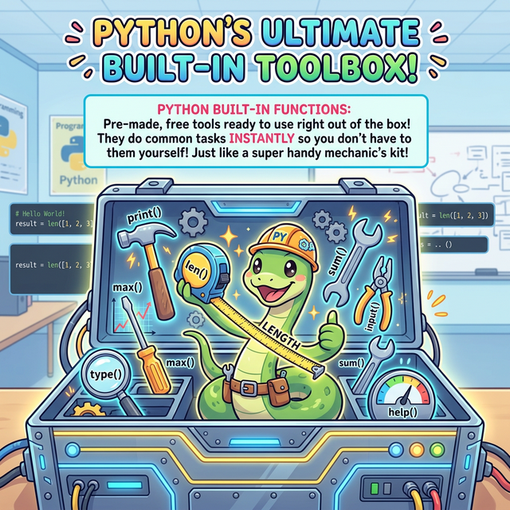

# 3.3.4 내장 함수와 기본 메서드 활용

## 학습목표
본 장에서는 별도 패키지 설치 없이 파이썬이 기본 탑재하고 있는 강력하고 유용한 뼈대 수공구들인 **내장 함수(Built-in Function)**와, 각각의 데이터 공장(객체)이 지원하는 전용 **메서드(Method)**를 두루 익힙니다. 이 도구들을 능숙하게 다루는 것이야말로 진정한 파이썬 코더로 거듭나는 기초 체력입니다.

---

## 1. 든든한 다용도 공구함: 파이썬 내장 함수

파이썬은 무거운 패키지나 모듈을 (`import math` 처럼) 별도로 부르지 않아도 언제 어디서나 즉시 뽑아 쓸 수 있는 수많은 **내장 함수(Built-in Function)**를 기본으로 대여해 줍니다. 


*(웹툰 비유: 거대하고 번쩍이는 최고급 만능 공구함이 열려 있습니다. 그 안에는 평범한 렌치나 망치 대신 `print()`, `len()`, `max()`, `type()` 이라는 이름표가 빛나는 최첨단 마법 도구들이 꽉 차 있습니다. 귀여운 파이썬 정비공 스네이크가 `len()` 줄자를 쫙 뽑아 들고 엄지를 척 들어 올리며 "이건 무료 기본 템이야!"라고 외치고 있습니다.)*

이 공구들은 여러분이 파이썬을 설치하는 바로 그 순간부터 메모리 한편에 항시 대기하고 있습니다.

### 대표적인 내장 함수 총정리 표

| 분류 | 함수 이름 | 기능 설명 | 사용 예시 |
| :--- | :--- | :--- | :--- |
| **입출력** | `print()` | 콘솔 화면에 데이터를 예쁘게 출력합니다. | `print("Hello!")` |
| | `input()` | 사용자의 키보드 타이핑 값을 문자열(`str`)로 받아옵니다. | `ans = input("나이: ")` |
| **통계/수학** | `max()` / `min()` | 여러 값들 중 가장 큰 값 / 가장 작은 값을 즉시 뽑아냅니다. | `max(10, 50, 3)` $\rightarrow$ 50 |
| | `abs()` | 숫자의 부호를 떼버린 순수한 거릿값(절댓값)을 반환합니다. | `abs(-99)` $\rightarrow$ 99 |
| | `round()` | 지정한 소수점 자리에서 반올림을 깔끔하게 처리합니다. | `round(3.1415, 2)` $\rightarrow$ 3.14 |
| | `sum()` | 리스트나 튜플 안에 들어있는 모든 숫자를 싹 다 더해줍니다. | `sum([1, 2, 3])` $\rightarrow$ 6 |
| **정보 파악** | `len()` | (Length) 문자열의 길이나 리스트의 데이터 개수를 잽니다. | `len("Python")` $\rightarrow$ 6 |
| | `type()` | 이 데이터가 도대체 정수인지, 문자인지, 딕셔너리인지 **근본 족보(타입)**를 감별해 냅니다. | `type(3.14)` $\rightarrow$ `<class 'float'>` |

---

## 2. 데이터의 껍데기를 벗기는 마법: 캐스팅 (Type Casting)

**캐스팅(Casting)** 은 데이터의 근본 자료형을 강제로 다른 자료형으로 뒤바꾸는(마치 뱀이 허물을 벗듯) 마법 같은 내장 함수들입니다.
특히 `input()`으로 사용자에게 받은 숫자는 겉보기엔 숫자여도 컴퓨터는 **문자열(글자)**로 취급하기 때문에 곱하기, 나누기를 하려면 반드시 캐스팅 기계에 한 번 넣었다 빼야 합니다.


*(다이어그램: 컨베이어 벨트를 타고 들어오는 분홍색 `"2026"`이라는 문자열 상자가 있습니다. 이 상자가 중간에 있는 거대한 보라색 `int()` 숫자 변환기 용광로 안으로 들어갑니다. 용광로가 한바탕 가동되더니, 반대쪽 컨베이어 벨트로는 완전히 껍데기가 벗겨진 파란색 순수 수학 정수 `2026` 상자가 튀어나오는 역동적인 형 변환 과정입니다.)*

| 캐스팅 함수 | 변환 목표 | 기능 설명 및 예방 효과 | 예시 |
| :--- | :--- | :--- | :--- |
| `int(값)` | **정수형** | 문자로 된 "100"이나 소수점 "3.14"를 깔끔한 정수로 강제 변환합니다. | `int("50") + 10` $\rightarrow$ 60 |
| `float(값)` | **실수형** | 정수나 문자를 소수점이 달린 정밀한 실수로 확장합니다. | `float(3)` $\rightarrow$ 3.0 |
| `str(값)` | **문자형** | 숫자를 문자로 포장합니다. (숫자와 문자를 `+`로 이어 붙일 때 에러 방지용) | `"올해는 " + str(2026)` |
| `bool(값)` | **논리형** | 값이 비어있거나 0이면 `False`, 뭐라도 꽉 차 있으면 `True`로 극단적 판별을 합니다. | `bool("")` $\rightarrow$ False |

```python
# [위험!] 에러가 나는 흔한 초보자 코드
age_str = input('당신의 나이는? (예: 15) : ')
# print(age_str + 5) # 🚨 에러 폭발! "15"(문자) 와 5(숫자)는 서로 더할 수 없습니다!

# [안전!] 캐스팅(형 변환)을 거친 완벽한 코드
age_num = int(age_str)  # 마법의 캐스팅
print(f"5년 뒤 당신의 나이는 {age_num + 5}세 입니다.")
```

---

## 3. 객체들의 전용 필살기: 메서드 (Method)

내장 함수가 '누구에게나 평등하게 쓰이는 공용 도구'라면, **메서드(Method)**는 리스트, 딕셔너리, 문자열 같은 **각각의 데이터 성(Castle)에 소속된 전속 마법사(전용 함수)**입니다.
반드시 객체 뒤에 마침표(`.`)를 찍어서 호출합니다. 

### ① 문자열(`str`) 전용 메서드
글자를 깔끔하게 가공하거나 쪼개고 합칠 때 사용하는 텍스트 다듬기 전용 필살기들입니다.

| 메서드 형태 | 설명 | 실전 예제 |
| :--- | :--- | :--- |
| `.upper()` / `.lower()` | 모든 문자를 무자비하게 대문자/소문자로 밀어버립니다. | `"Hi".upper()` $\rightarrow$ `"HI"` |
| `.replace(old, new)` | 타겟 단어(`old`)를 찾아내 새로운 단어(`new`)로 전부 갈아 끼웁니다. | `"사과 좋아".replace("사과", "수박")` |
| `.split(구분자)` | 하나의 거대한 문장을 특정 기호(구분자)로 난도질하여 **리스트(List)**로 쪼개줍니다. | `"A,B,C".split(",")` $\rightarrow$ `['A', 'B', 'C']` |
| `.strip()` | 실수로 양쪽에 끼어 들어간 지저분한 공백이나 엔터키를 세차하듯 날려버립니다. | `"  안녕  ".strip()` $\rightarrow$ `"안녕"` |

### ② 리스트(`list`) 전용 메서드
데이터를 줄 세우고, 추가하고, 도려내는 창고 정리 전용 필살기입니다.

| 메서드 형태 | 설명 | 실전 예제 |
| :--- | :--- | :--- |
| `.append(값)` | 리스트 맨 끝 꼬리에 새로운 데이터를 조용히 밀어 넣습니다. | `lst.append(99)` |
| `.remove(값)` | 리스트 속에서 정확히 그 '값'을 찾아내 흔적도 없이 지워버립니다. | `lst.remove("스팸")` |
| `.pop(인덱스)` | 지정한 위치(혹은 맨 뒤)의 아이템을 리스트에서 완전히 도려내어 바깥으로 '반환(툭!' 하고 뱉음)'합니다. | `last_item = lst.pop()` |
| `.sort()` | 리스트 내부를 쑥대밭에서 오름차순(기본) 이나 내림차순으로 아주 예쁘게 재정렬합니다. | `lst.sort(reverse=True)` |

---

## ☕ Java vs 🐍 Python 스나이퍼 비교

### 1. 전역 내장 함수의 유무
*   **Java**: 철저한 객체지향의 노예이기 때문에 전역 함수라는 개념 자체가 없습니다. 최댓값을 구하려면 `Math.max()`, 출력을 하려면 `System.out.println()`, 문자열 변환은 `String.valueOf()` 처럼 무조건 어떤 "클래스(Class)" 소속인지를 읊어야 하는 지독한 소속감에 시달립니다.
*   **Python**: `print()`, `max()`, `len()` 은 그 어떤 클래스에도 소속되지 않은 자유로운 전역 내장 함수입니다. 코드 타이핑의 피로도가 압도적으로 줄어듭니다.

### 2. 형 변환 (Casting)의 철학
*   **Java**: 소괄호를 앞에 붙여 `(int) 3.14` 처럼 캐스팅하는 무뚝뚝한 문법 이외에도, `Integer.parseInt("100")` 같이 파싱 유틸리티를 뒤져야 하는 복잡함이 있습니다.
*   **Python**: 데이터 타입 이름 자체가 하나의 거대한 함수처럼 동작합니다. `int("100")`, `float(3)`, `str(99)` 처럼 타입의 이름을 부르는 것만으로 그 타입으로 새로 태어나는(객체 생성) 아주 직관적이고 강력한 철학을 가집니다.

---

## 🎧 Vibe Coding

> **🗣️ 학생 프롬프트 (AI에게 이렇게 명령해 보세요):**
> "파이썬에서 `input()`을 이용해서 여러 개의 숫자들을 쉼표(,)로 구분지어서 한 번에 입력받게 해줘. (예: `10, 50, 20, 90`) 그리고 이 문자열을 문자열 메서드인 `.split()`으로 쪼개서 리스트로 만든 다음, 리스트의 원소들을 싹 다 `int()` 내장 함수로 예쁘게 캐스팅 숫자로 바꿔줘. 마지막으로 내장함수 `max()` 와 `min()`, `sum()`을 써서 최댓값, 최솟값, 총 숫자의 합계를 한 번에 깔끔하게 출력하는 코드를 짜줘. 주석도 재밌게 달아주고!"

---

## 코딩 영단어 학습 📝

*   **Built-in**: 내장된, 안에 박혀있는. (따로 외부에서 물건을 사 오거나(Import) 조립할 필요 없이, 파이썬 설치 패키지 상자 안에 태생적으로 붙어있는 기본 도구들을 지칭합니다.)
*   **Method**: 방법, 체계적인 방식. (단순한 함수(Function)가 아니라, 어떤 주체(객체)가 특정 목적을 달성하기 위해 보유한 '그 녀석만의 전용 기술이나 동작 방식'이라는 강한 소속감을 내포합니다.)
*   **Cast (Casting)**: 원형(거푸집)에 쇳물을 부어 모양을 뜨다, 캐스팅하다. (원래 모양이 어떻든 간에 내가 원하는 새로운 틀(예: int틀, str틀)에 집어넣어 완전히 새로운 성질의 데이터로 찍어내는 강제 물성 변환 작업입니다.)
*   **Strip**: 옷을 벗다, 껍질을 벗기다. (원목 문장 데이터의 양옆에 덕지덕지 붙어 보호지 역할을 하고 있는 공백("  ")이나 엔터키("\n")라는 껍질을 시원하게 확 벗겨버리는 세차장 같은 메서드입니다.)
