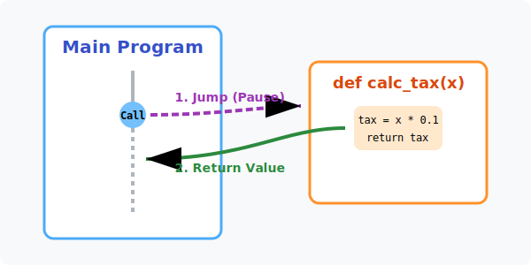

# 3.3.4 함수 호출과 제어 흐름의 도약 (Jump & Return)

## 학습목표
본 장에서는 초보자들이 파이썬 함수를 배울 때 가장 크게 당황하는 **'제어 흐름의 널뛰기(Control Flow Jump)'** 현상을 파헤칩니다. 함수가 호출(Call)될 때 메인 프로그램의 메모리 흐름이 어떻게 잠시 정지(Pause)하고 완전히 다른 성벽(Scope) 안으로 워프(Jump)했다가 다시 계산 결과만 들고 귀환(Return)해오는지 그 역동적인 궤적을 완벽히 정복합니다. 

---

## 1. 제어 흐름의 도약 (Control Flow Jump)

일반적인 파이썬 코드는 위에서 아래로 정직하게 폭포수처럼 1줄씩 흐릅니다. 하지만 함수를 호출(Call)하는 순간, 여러분의 관찰 시점은 이 폭포수를 벗어나 완전히 다른 차원으로 널뛰기를 하게 됩니다. 


*(다이어그램: 메인 프로그램(Main Program)을 일직선으로 차례차례 읽고 내려오던 초록색 실행 불빛이, `calc_tax(100)`이라는 함수 호출 코드를 만납니다. 그러자 불빛이 보라색 포탈 안으로 쑥 빨려 들어가, 전혀 다른 메모리 공간에 둥둥 떠있는 `calc_tax()` 함수의 방으로 떨어집니다. 거기서 세금 계산 지시사항을 모두 마친 불빛은, 계산 결과(Return)를 보따리에 싸들고 뚫린 황금색 귀환 포탈을 타서, 아까 본인이 떠났던 바로 그 메인 프로그램의 호출 위치로 기가 막히게 정확히 되돌아옵니다.)*

### 호출(Call)과 복귀(Return)의 3단계 마법

1.  **점프(Jump)**: 메인 프로그램이 실행되다가 `함수이름()`을 부르는 순간, 프로그램은 하던 일을 모두 일시정지(`Pause`)하고 그 줄에 책갈피를 꽂아둡니다. 그리고 실행권(제어권)을 통째로 떼어 함수가 살고 있는 곳으로 순식간에 **순간이동**시킵니다.
2.  **격리된 공간(Scope)**: 함수는 자신만의 굳게 닫힌 밀실(Local Scope) 안에서, 메인 공간에서 배달 받은 재료(Argument)를 갖고 지지고 볶습니다. 이 방에서 일어나는 난리통은 바깥세상(메인 프로그램)에서는 전혀 알지 못합니다.
3.  **반환(Return)**: 함수 끄트머리에서 `return 결괏값` 문장을 만나면 함수의 존재 이유는 끝납니다. 함수는 임무를 완수하고 자신의 방을 깨끗이 폭파해버린 뒤, 계산된 가장 맛있는 엑기스(결과물) 하나만 딸랑 들고 아까 책갈피를 꽂아두었던 메인 프로그램의 그 자리로 다시 역(逆) 순간이동하여 돌아옵니다.

만약 개발자가 굳이 `return`을 돌려주지 않고 함수가 싱겁게 끝난다면, 파이썬은 빈털터리라는 의미로 `None`이라는 빈 껍데기를 몰래 쥐어주고 돌아옵니다.

---

## 2. 다중 반환의 쾌감 (Tuple Packing)

파이썬은 아주 호탕한 언어입니다. 다른 언어에서는 돌려주고(Return) 싶은 결괏값이 2개 이상일 땐 배열이나 클래스 객체로 귀찮게 꽁꽁 싸서 줘야만 합니다. 하지만 파이썬은 `return` 뒤에 쉼표(`,`)만 여러 번 찍어주면, **다수의 결괏값을 한 큐에 튜플(Tuple) 포장지로 쓰윽 감싸서 아주 쿨하게 던져줍니다.**

```python
def math_master(x, y):
    add = x + y
    sub = x - y
    mul = x * y
    # 값 3개를 동시에 배출! 파이썬이 알아서 (add, sub, mul) 이란 튜플로 묶어줍니다.
    return add, sub, mul  

# 튜플 언패킹(Unpacking) 마법으로 3개의 변수에 동시에 공중 캐치하여 우겨넣기
result_add, result_sub, result_mul = math_master(10, 3) 

print(f"더하기: {result_add}, 빼기: {result_sub}, 곱하기: {result_mul}") 
# 출력: 더하기 13, 빼기 7, 곱하기 30
```

---

## 🎧 Vibe Coding

> **🗣️ 학생 프롬프트 (AI에게 이렇게 명령해 보세요):**
> "파이썬에서 함수의 입력(매개변수)은 알겠는데 다시 돌아오는 반환(return)의 개념이 잘 이해가 안 가. 숫자 2개를 던져주면 그 함수 안에서 더하기, 빼기, 곱하기, 나누기를 전부 혼자서 한 다음, 그 결괏값 4개를 동시에 튜플 매핑으로 몽땅 배출해내는 '만능 사칙연산 기계' 코드를 작성해 줘. 그리고 코드가 어떻게 메모리를 건너뛰고 위아래로 점프하는지 콘솔창에 print 가 찍히는 순서를 조작해서 아주 실감 나게 주석으로 달아줘."

---

## 코딩 영단어 학습 📝

*   **Call/Invoke**: 호출하다, 깨우다. (잠자고 있던 함수의 이름표를 쿡 찔러 메모리 상으로 소환해 내는 구동 시발점을 뜻합니다.)
*   **Return**: 돌려주다, 방 빼고 돌아가다. (함수가 호출자의 미션을 모두 완수한 뒤, 액기스 결과물 하나만 들고 자기가 있던 메모리 공간을 파괴하며 원래 불렸던 곳으로 제어 흐름을 점프시키는 명령어입니다.)
