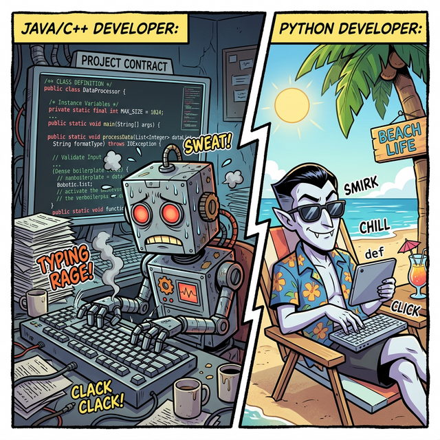
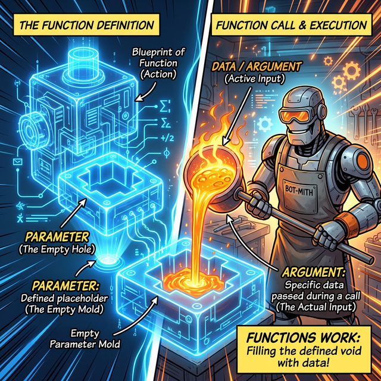

# 3.3.4 함수 선언 문법 (def)과 호출(Call)

## 학습목표
본 장에서는 학생들이 파이썬 프로그래밍을 배울 때 가장 큰 벽으로 느끼는 **'함수의 흐름(Control Flow)'**을 파헤칩니다. `def` 키워드로 함수를 만드는 기법부터, 호출(Call)될 때 프로그램 메모리의 흐름이 어떻게 다른 공간으로 워프(Jump)했다가 되돌아오는지(Return) 그 복잡한 궤적을 완벽히 이해합니다. 더 나아가, 함수가 자기 자신을 끝없이 호출하는 마법 같은 **재귀(Recursion)**의 원리까지 상세히 정복합니다.

---

## 1. 함수 선언하기 (Why `def`?)

파이썬에서 함수를 새롭게 창조하는 행위를 가리켜 **'정의한다(Define)'**고 표현합니다. 다른 많은 언어들이 함수를 만들 때 `function`이라는 길고 번거로운 단어를 쓰지만, 파이썬은 왜 단 세 글자인 `def`를 사용할까요?


*(웹툰 비유: 자바나 C++ 로봇이 땀을 뻘뻘 흘리며 `public static void function...` 이라는 수십 자의 계약서를 쓰고 있는 동안, 해변 의자에 누워 선글라스를 낀 파이썬 뱀파이어는 여유롭게 단 세 글자 `def`만 틱 치고 미소를 짓고 있습니다. 파이썬의 궁극적인 철학인 "단순함과 우아함"을 보여줍니다.)*

파이썬의 철학은 **"실용적이고 읽기 쉬워야 하며, 불필요한 타이핑은 지양한다"**입니다. 8글자나 되는 `function`을 매번 치는 것은 프로그래머의 손가락을 피곤하게 만듭니다. 그래서 **"새로운 명령어를 정의(Define)한다"**라는 뜻의 앞 세 글자 **`def`**만을 따와서 가장 직관적이고 쿨한 예약어를 탄생시켰습니다.

### 기본 선언 문법

```python
# 'def' 키워드로 함수명과 입력받을 통로(매개변수)를 정의합니다.
def make_greeting(name):
    """이곳은 함수가 무슨 일을 하는지 적어두는 독스트링(설명서) 공간입니다."""
    message = f"안녕하세요, {name}님! 환영합니다."
    
    # 작업이 다 끝나면 그 결과를 호출한 쪽으로 탁 던져줍니다.
    return message
```

---

## 2. 매개변수(Parameter) vs 인수(Argument)

함수에서 가장 헷갈리는 용어가 바로 **파라미터(Parameter)**와 **아규먼트(Argument)**입니다. 둘 다 "함수에 넣어주는 값"이라고 뭉뚱그려 알고 있으면 나중에 객체지향을 배울 때 뼈아픈 타격을 입습니다. 이 둘의 차이는 하늘과 땅 차이입니다!


*(웹툰 비유: 왼쪽의 텅 빈 검 푸른 '홀로그램 도면(틀)'이 바로 파라미터(Parameter)입니다. "이 틀에는 무언가 들어올 거다~" 하고 선언만 해둔 빈 공간입니다. 반대로 오른쪽의 대장장이 로봇이 펄펄 끓는 진짜 마그마(실제 데이터)를 그 틀 안에 들이붓고 있는데, 이 들이붓는 진짜 알맹이 데이터가 바로 아규먼트(Argument)입니다.)*

*   **매개변수(Parameter)**: 함수를 처음 **설계(def)할 때 뚫어놓은 구멍(이름표)**입니다. 아직 값이 없습니다. 
    *   `def make_cookie(flavor):` 여기서 `flavor`는 파라미터입니다.
*   **인수/인자 (Argument)**: 함수를 실제로 **실행(Call)할 때 그 구멍에 쑤셔 넣는 진짜 데이터 값**입니다.
    *   `make_cookie("초코")` 여기서 `"초코"`라는 텍스트 덩어리가 실제 작동하는 아규먼트입니다.

---

## ☕ Java vs 🐍 Python 스나이퍼 비교

### 1. 극단적으로 간결한 정의 방식 (def 키워드)
*   **Java**: 자바에서 함수(메서드)를 하나 만들려면 험난한 관문을 거쳐야 합니다. 접근 제어자(`public`), 정적 여부(`static`), 가장 중요한 **반환 데이터 타입(`int`, `String` 등)**을 가장 먼저 선언해야 합니다.
    *   `public static int add(int a, int b) { return a + b; }`
*   **Python**: 파이썬은 이 모든 선언의 압박을 단 세 글자 **`def` (Define)** 로 퉁칩니다. 파이썬은 동적 타입 언어이므로 들어오는 입력값도, 뱉어내는 반환값도 미리 깐깐하게 귀띔해 줄 필요가 없습니다.

---

## 🎧 Vibe Coding

> **🗣️ 학생 프롬프트 (AI에게 이렇게 명령해 보세요):**
> "파이썬에서 매개변수(Parameter)와 인수(Argument)의 차이가 너무 헷갈려. 내가 '붕어빵 틀'을 만드는 `def` 함수 설계 과정과, 그 틀에 팥이나 슈크림 같은 진짜 데이터 재료(Argument)를 집어넣어서 빵을 찍어내는 함수 호출 과정을 주석으로 재밌게 비유해서 파이썬 코드로 짜줘."

---

## 코딩 영단어 학습 📝

*   **Define (`def`)**: 규정하다, 정의하다. (파이썬에서 새로운 명령어 블랙박스를 창조하고 메모리에 선포할 때 쓰는 마법 지팡이 같은 키워드입니다.)
*   **Parameter**: 매개변수. (설계 단계: 블랙박스 기계에 미리 뚫어놓은 공갈 껍데기 구멍의 이름표(틀)입니다.)
*   **Argument**: 인수, 인자. (작동 단계: 블랙박스 구멍 안으로 실제로 콸콸 들이붓는 현장의 진짜 데이터 재료 값입니다.)
