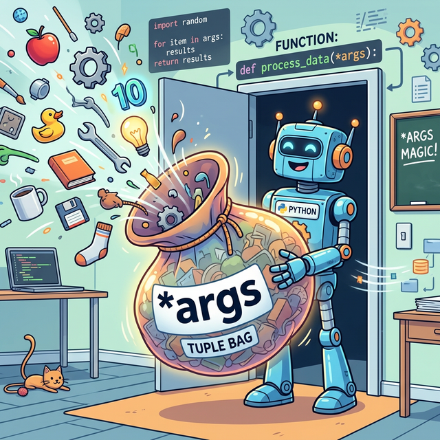
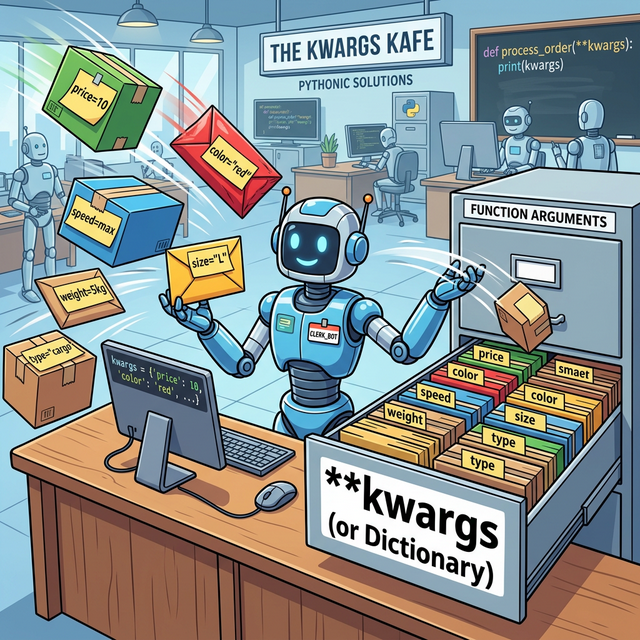

# 3.3.6 함수의 다양한 매개변수 통로 (\*args, \*\*kwargs)

## 학습목표
본 장에서는 타 언어 대비 파이썬이 가지는 가장 강력하고 유연한 무기인 **가변 인자(Variable Arguments)**와 **키워드 인자(Keyword Arguments)** 매핑 시스템을 배웁니다. 몇 개가 들어올지 모르는 미지의 데이터를 파이썬이 어떻게 `*args`와 `**kwargs`라는 마법의 주머니로 싹쓸이하여 담아내는지, 그 극강의 유연성을 정복합니다.

---

## 1. 극단적으로 유연한 파라미터 전달 (Keyword Arguments)

대부분의 전통적인 프로그래밍 언어(Java, C 등)에서는 매개변수(Parameter)를 정의해 둔 순서대로, 기계처럼 철저하게 위치를 지켜서 데이터(Argument)를 밀어 넣어야만 합니다. (이를 **위치 인자, Positional Argument**라고 부릅니다.)

하지만 파이썬은 파라미터 이름을 직접 지목해서 꽂아버리는 **키워드 인자(Keyword Argument)**를 지원합니다. 순서를 내 마음대로 뒤집어엎어서 던져줘도, 파이썬 인터프리터가 알아서 이름표를 찾아 원래 구멍에 정확히 데이터를 매핑해 줍니다.


> 💡 **다이어그램:** 첫 번째 줄은 값이 순서대로 기계처럼 자기 자리를 찾아가지만, 두 번째 줄은 값의 입력 순서가 거꾸로여도 각 값에 붙은 이름표(`name=`, `age=`)를 따라 파이썬이 해당 빈칸을 정확하게 역추적해 꽂아 넣는 시각적 흐름을 보여줍니다.

```python
def make_profile(name, age, job):
    print(f"이름: {name}, 나이: {age}, 직업: {job}")

# 1. 위치 인자 (순서대로 꽂힘 - 일반적 방식)
make_profile("앨리스", 25, "해커")

# 2. 키워드 인자 (순서를 무시하고 이름표로 저격하여 꽂음)
make_profile(job="해커", name="앨리스", age=25) 
# 결과는 완전히 똑같습니다!
```

---

## 2. 디폴트 파라미터 (Default Parameter)

함수 제작자가 구멍(Parameter)을 뚫어놓긴 했지만, 혹시나 사용자가 귀찮아서 값을 안 넣고 돌릴(Call) 때를 대비하여 **"아무 값도 안 들어오면 이거라도 써라"** 하고 기본값을 세팅해 둘 수 있습니다.


> 💡 **다이어그램:** `country="한국"`이라는 무거운 디폴트 블록이 자리를 지키고 있다가, 사용자가 빈손으로 호출하면 그 블록이 그대로 채택되고, 사용자가 명시적으로 `"미국"`이라는 새로운 값을 힘껏 던지면 기존의 `"한국"` 블록을 튕겨내 버리고 새 값이 그 자리를 꿰차는 대체(Override) 원리를 보여줍니다.

```python
# country="한국" 이라는 디폴트(기본) 방어막을 쳐두었습니다.
def make_passport(name, country="한국"):
    print(f"{name}님의 여권 발행 국가는 [{country}] 입니다.")

make_passport("김철수")               # 아무것도 안 넣으면 '한국' 무혈 입성
make_passport("James", "미국")       # 명시적으로 '미국'을 던지면 한국을 밀어내고 덮어씀
```
**🚨 주의사항:** 디폴트 파라미터는 반드시 일반 파라미터보다 **뒤에(오른쪽에)** 위치해야 합니다. (`def make_passport(country="한국", name):` 이따위로 쓰면 파이썬이 순서를 헷갈려 에러를 뿜습니다.)

---

## 3. 별표 하나(\*): 무한의 `튜플` 주머니 (\*args)

만약 덧셈 함수를 만들 건데, 사용자가 숫자를 2개 적을지, 10개 적을지, 100개 적을지 죽었다 깨어나도 알 수 없다면 구멍(Parameter)을 몇 개나 파두어야 할까요?
파이썬에서는 매개변수 이름 앞에 **별표 한 개(`*`)**만 딱 달아주면 해결됩니다. 이 별표는 **"들어오는 모든 위치 인자(Position Arguments)들을 싹 다 긁어모아 커다란 튜플(Tuple) 보따리에 담아라"**는 블랙홀 같은 마법의 기호입니다. (관례상 `arguments`의 약자인 `*args`로 씁니다.)


> 💡 **웹툰 비유:** 자신만만한 파이썬 로봇이 함수 문 앞에 서서 `*args`라고 적힌 마법의 거대한 탄성 주머니(튜플)를 벌리고 있습니다. 허공에서 사과, 톱니바퀴, 숫자 10, 스패너 등 온갖 잡동사니 인자(Arguments)들이 날아오는데, 개수나 종류에 상관없이 주머니 하나 속으로 쏙쏙 다 빨려 들어가는 통쾌한 모습입니다.


> 💡 **다이어그램:** `10`, `"Hello"`, `True` 처럼 개수나 모양이 제각각인 인자들이 순서대로 날아와, 함수 머릿단에 선언된 거대한 `*args` 주머니 안에서 하나의 튜플 `(10, "Hello", True)` 형태로 깔끔하게 압축 포장(Packing)되는 메모리 흐름 애니메이션입니다.

위 애니메이션의 과정을 코드로 확인해 보겠습니다. `super_add` 함수는 숫자가 몇 개 들어오든 `*args`라는 튜플 주머니를 열고 전부 받아냅니다.
```python
def super_add(*args):
    # args는 이제 (1, 2, 3, 4, 5) 라는 거대한 하나의 튜플 주머니가 되었습니다!
    total = 0
    for num in args:  # 주머니 안의 숫자를 for문으로 하나씩 꺼내 씁니다.
        total += num
    return total

print(super_add(10, 20))           # 30 출력
print(super_add(1, 2, 3, 4, 5, 6)) # 21 출력 (몇 개든 끄떡없습니다)
```

### 심화 예제: 동적 출석부 만들기
숫자뿐만 아니라, 다양한 길이의 문자열 데이터를 받을 때도 유연하게 대처합니다.
```python
def call_attendance(teacher, *students):
    print(f"\\n[{teacher} 선생님의 반 출석부]")
    if len(students) == 0:
        print(" -> 오늘 출석한 학생이 없습니다.")
    else:
        # enumerate()를 써서 1번부터 인덱스와 함께 추출
        for idx, name in enumerate(students, 1):
            print(f" {idx}번: {name}")

# 학생이 2명일 때
call_attendance("김교사", "철수", "영희")
# 학생이 4명일 때 (에러 없이 가변적으로 주머니에 쏙 들어갑니다!)
call_attendance("박교사", "제시카", "알리", "톰", "세라")
```

---

## 4. 별표 두 개(\*\*): 무한의 `딕셔너리` 주머니 (\*\*kwargs)

위치 인자를 싹쓸이하는 게 `*args`였다면, **키워드 인자(`특정이름=값`)들만 싹 다 긁어모아 거대한 딕셔너리(Dictionary) 포대자루에 담아버리는 녀석**이 바로 **별표 두 개(`**`)**입니다. (관례상 `keyword arguments`의 약자인 `**kwargs`로 씁니다.)


> 💡 **웹툰 비유:** 스마트한 로봇 안내원이 데스크에 서 있습니다. 공중에서 `price=10`, `color=red`, `speed=max`처럼 고유한 이름표(Sticky Note)가 붙은 다양한 택배 상자들이 날아오는데, 안내원은 당황하지 않고 `**kwargs`라고 적힌 대형 캐비닛 서랍장(딕셔너리)을 열어 각 이름표에 맞게 척척 알아서 분류해 넣는 능수능란한 모습입니다.


> 💡 **다이어그램:** 메인 프로그램에서 `color="red"`, `width=100` 처럼 스스로 명찰을 달고 날아오는 키워드 인자들이, 함수의 `**kwargs` 서랍장에 도달하자마자 정확히 `{'color': 'red', 'width': 100}` 형태의 딕셔너리로 차곡차곡 자동 정렬되어 매핑(Packing)되는 시각적 쾌감을 보여주는 애니메이션입니다.

애니메이션에서 보신 것처럼, 아무리 많은 키워드 옵션을 던져도 딕셔너리(`{}`) 형태로 완벽하게 정리됩니다. 이를 코드로 구현해 보겠습니다.
```python
def create_hero(name, **kwargs):
    print(f"\\n--- 영웅 {name} 탄생 ---")
    # kwargs는 이제 {'hp': 100, 'mp': 50, 'weapon': 'Sword'} 라는 딕셔너리가 되었습니다!
    for key, value in kwargs.items():
        print(f" [{key}] 능력치: {value}")

# hp, mp, weapon 등 내가 원하는 스탯을 무한대로 이름 붙여서 마음껏 던질 수 있습니다!
create_hero("아서", hp=1000, mp=50, weapon="엑스칼리버")
```

### 심화 예제: HTML 태그 자동 생성기
속성(Attribute)이 몇 개나 들어올지 모르는 웹 컴포넌트(UI) 코드를 짤 때 `**kwargs`는 최고의 유연성을 뽐냅니다. 파이썬 딕셔너리의 `.get()` 메서드를 써서, 사용자가 값을 안 넘겼을 때는 기본값을 세팅하며 에러 없이 안전하게 핸들링할 수 있습니다.
```python
def make_button(text, **options):
    # **options 딕셔너리에서 값을 꺼내되, 안 들어왔으면 우측의 기본값을 씁니다.
    bg_color = options.get("bg_color", "transparent")
    font_size = options.get("font_size", "14px")
    border = options.get("border", "none")
    
    print(f"\\n<button style='background:{bg_color}; font-size:{font_size}; border:{border};'>")
    print(f"  {text}")
    print("</button>")

# 1. 색상과 폰트 크기만 지정 (테두리는 기본값 none 적용)
make_button("전송하기", bg_color="blue", font_size="16px")

# 2. 테두리 옵션까지 추가 지정 (개발자가 원하는 속성을 끝없이 추가 파라미터로 던집니다!)
make_button("취소", border="1px solid red", font_size="12px", bg_color="white")
```

이렇게 `*args`와 `**kwargs`를 조합하면 전 세계 그 어떤 형태의 미친 입력값이 들어와도 파이썬 함수 하나로 모조리 흡수해 버릴 수 있는 '무적의 블랙박스'를 설계할 수 있게 됩니다.

---

## 🎧 Vibe Coding

> **🗣️ 학생 프롬프트 (AI에게 이렇게 명령해 보세요):**
> "파이썬 가변 매개변수인 `*args`와 `**kwargs`를 둘 다 동시에 하나의 함수에서 사용하는 '영수증 출력기' 함수 코드를 짜줘. `*args`로는 내가 산 물건들의 가격들을 무한대로 받아서 총합을 구하고, `**kwargs`로는 '할인율', '캐시백' 같은 추가 옵션들을 맘대로 받아서 최종 결제 금액을 출력하도록 만들어 줘."

---

## 코딩 영단어 학습 📝

*   **Default**: 기본의, 태만, 채무 불이행. (사용자가 인자를 던져주지 않고 '태만'하게 굴 때를 대비해, 시스템이 대신 깔아주는 기본 방어막 수치입니다.)
*   **Asterisk (`*`)**: 별표, 방사상. (파이썬에서 단순 곱하기 기호를 넘어, 메모리나 인자 덩어리를 팍팍 '방사상' 폭발시키거나(Unpacking) 빨아들이는(Packing) 만능 마법 기호로 쓰입니다.)
*   **Args**: Arguments의 줄임말. (위치에 기반해 들어붙는 흔한 데이터 파편들입니다.)
*   **Kwargs**: Keyword Arguments의 줄임말. (`나이=20` 처럼 스스로 명찰표(Key)를 달고 들어와 딕셔너리($\{Key: Value\}$)로 돌변하는 고급 데이터 묶음입니다.)
