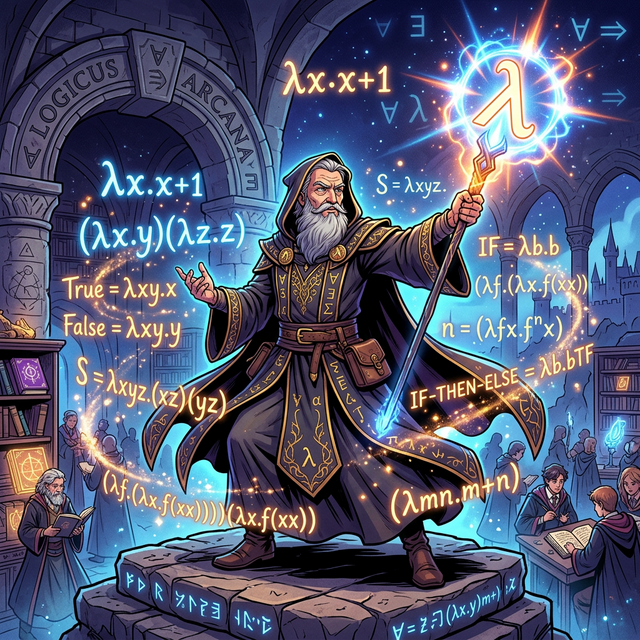
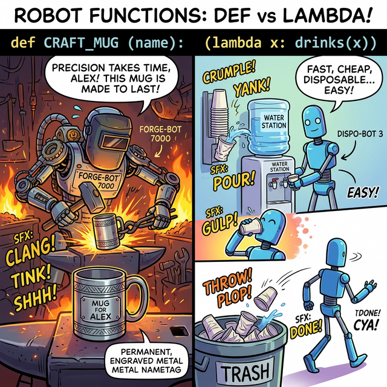
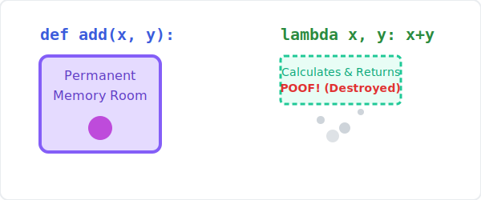

# 3.3.8 람다(Lambda) 익명 함수

## 학습목표
본 장에서는 초급자를 벗어나 중급자로 도약하는 산맥 중 하나인 **람다(Lambda)** 함수의 극강의 활용도를 해부합니다. 이름조차 붙이지 않고 쓰고 버리는 강력한 일회용 함수의 원리와, 컴퓨터 과학에 람다 대수(Lambda Calculus)를 창시한 알론조 처치(Alonzo Church)의 수학적 배경도 함께 알아봅니다.

---

## 1. 이름 없는 마법의 한 줄 문장, 람다 (Lambda)

함수(`def`)가 너무 거창하고 무겁게 느껴질 때가 있습니다. 코드가 단 1줄에 그치는 매우 시시한 계산식인데 굳이 `def` 키워드를 쓰고, 들여쓰기를 하고, 함수 이름을 작명하느라 골머리를 앓는 대신 **이름표조차 붙이지 않고 쓰고 버리는 강력한 일회용 함수**가 바로 람다(Lambda)입니다. 

### 왜 '익명 함수'라고 안 부르고 '람다'라고 부를까요?

"이름 없는 함수(Anonymous Function)와 똑같은 말인데, 왜 하필 람다(Lambda)라는 외계어 같은 이름을 고집하나요?" 코딩을 갓 배운 학생들이 가장 많이 던지는 질문입니다.


> 💡 **웹툰 비유:** 고대의 위대한 천재 마법사 수학자 '알론조 처치(Alonzo Church)' 형상의 RPG 마법사가 번쩍이는 그리스 문자 람다(λ) 지팡이를 들고 있습니다. 그의 주변에는 무거운 기계어가 아닌, 순수한 논리 그 자체인 수학 공식 `λx.x+1`이 허공에 떠 있습니다.

이 독특한 이름은 1930년대, 컴퓨터가 존재하기도 전에 활동했던 미국의 천재 수학자 **알론조 처치(Alonzo Church)**의 구상에서 유래했습니다. 그는 모든 가능한 계산을 오직 **'이름 없는 수학적 함수 매핑'**만으로 논리적으로 증명하기 위해 **람다-대수(Lambda Calculus)**라는 무시무시한 논리 체계를 창시했습니다. 이때 그는 함수 매개변수를 묶어주는 기호로 그리스 문자 람다(λ)를 썼습니다.

현대 컴퓨터 과학자들은 이 위대한 선구자의 수학적 업적에 대한 오마주(존경)를 바치기 위해, 파이썬을 포함한 수많은 언어에서 '익명 함수'를 만들 때 `lambda` 키워드를 고유 명사처럼 사용합니다.

### 일반 함수(def) vs 람다 익명 함수(lambda)의 생명주기 차이


> 💡 **웹툰 비유:** 왼쪽 로봇은 철심을 깎아 평생 쓸 무겁고 고급스러운 커스텀 스텐 머그잔(def 함수)을 이름표까지 붙여 정성스레 만들고 있습니다. 반면 오른쪽 로봇은 정수기 옆에 쌓인 싸구려 일회용 종이컵(lambda 익명 함수)을 툭 뽑아 물을 단숨에 마신 뒤, 미련 없이 쓰레기통에 쿨하게 버려버립니다.

1.  **일반 함수(`def`)**: 메모리 상에 자기 이름표를 달고 **영구적인 방**을 얻어 거주합니다. 부르면 튀어나와서 일을 합니다. 
2.  **람다 함수(`lambda`)**: 이름표가 없어 메모리 주소록에 등록되지 않습니다. 결괏값을 뱉자마자 **흔적도 없이 소멸(Garbage Collected)**해 버립니다. 


> 💡 **다이어그램:** 위쪽의 `def add(x,y)`는 보라색 영구 메모리 방을 만들어 대기하다 결과를 주는 과정입니다. 아래쪽의 `lambda x, y: x+y`는 함수 상자가 메모리에 둥지를 틀기도 전에 점선으로 허공에 순식간에 나타났다가 `7`을 뱉는 순간 파스슥 하고 연기처럼 증발해버리는 경쾌한 흐름입니다.

---

## 2. 람다 함수 선언과 극강의 활용법

### 기본 문법 (단 1줄 규칙)
람다 함수는 오직 한 줄(One-liner)로만 작성해야 하며, 그 자체가 자동으로 반환값(`return`)이 되기 때문에 `return`이라는 글자조차 적을 수 없습니다.

```python
# 람다 방식 (1줄, 익명)
# lambda 매개변수: 뱉어낼 수식
lambda_add = lambda x: x + 10
print(lambda_add(5)) # 15
```

### 진정한 람다의 무대: 일급 객체로서의 인자 전달
사실 람다에 `lambda_add` 변수 이름을 붙일 거면 `def`를 쓰는 게 낫습니다. 람다 함수가 진짜 미친 듯한 위력을 발휘할 때는, **함수의 인자(Argument)로 또 다른 함수 몸통을 통째로 쑤셔 넣어야 할 때**입니다. (파이썬이 함수를 변수 취급하는 일급 객체 시스템이기에 가능합니다.)

```python
students = [('Alice', 85), ('Bob', 95), ('Charlie', 70)]

# "튜플의 1번째 원소(점수 x[1])를 기준으로 정렬해줄래?" 
# 아주 작고 귀찮은 기준 함수를 1회용 람다로 휙 던져줍니다.
students.sort(key=lambda x: x[1], reverse=True)

print(students)
# [('Bob', 95), ('Alice', 85), ('Charlie', 70)] 점수순 정렬 완벽 성공!
```

---

## ☕ Java vs 🐍 Python 스나이퍼 비교

### 1. 람다 표현식의 직관성 (익명 클래스 제거)
*   **Java**: 7버전까진 이름 없는 함수를 만들려면 `new Runnable() { public void run() { ... } }` 이라는 끔찍한 코드를 주절주절 읊어야 했습니다. (8버전부터 `(x) -> x + 10` 같은 람다식 표기법이 부랴부랴 도입되었습니다.)
*   **Python**: 태생부터 함수를 일급 객체(First-class citizen)로 다뤄왔기에, 단어 하나 `lambda`로 코드의 극강 다이어트를 실현시켜 줍니다.

---

## 코딩 영단어 학습 📝

*   **Anonymous**: 익명의, 이름을 알 수 없는. (함수에 이름표를 주지 않고 복면을 씌워 한 번 쓰고 버리는 은밀한 파이썬의 기술입니다.)
*   **Lambda**: 람다, 그리스 알파벳 (λ). (수학자 알론조 처치가 서기 1930년대에 고안한 '이름 없는 마법의 함수 대수학'을 기리기 위해 프로그래머들이 채택한 전설적인 단어입니다.)
