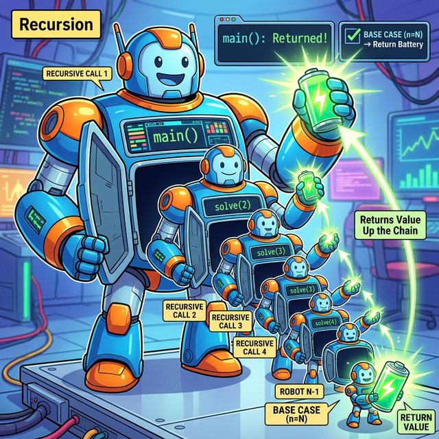

# 3.3.9 마법의 거울, 재귀(Recursion)

## 학습목표
본 장에서는 함수가 거울 속의 자신을 보듯 자기 자신을 끝없이 호출하는 마법 같은 패턴이자, 폴더 속의 폴더를 뒤지는 트리 탐색의 근간이 되는 **재귀(Recursion)**의 원리를 상세히 정복합니다. 콜 스택(Call Stack)의 동작 방식과 종료 조건(Base Case)의 중요성을 이해합니다.

---

## 1. 궁극의 마법: 재귀 함수 (Recursive Functions)

함수 챕터의 진정한 최종 보스는 **재귀(Recursion)**입니다. 재귀 함수란 **"함수 내부에서 뜬금없이 자기 자신을 또 다시 부르는 함수"**를 뜻합니다.


> 💡 **웹툰 비유:** 대장 로봇이 배를 열더니 살짝 작은 자신의 클론 로봇을 꺼냅니다. 그 클론이 다시 자기 배를 열어 더 작은 클론을 꺼내고... 무한 반복하다 구석의 콩알만 한 막내 로봇이 "어? 난 배터리(Base Case)가 있네?" 라며 거꾸로 형들에게 에너지를 넘겨주어 마침내 대장 로봇이 기동됩니다.

### 콜 스택 (Call Stack)과 종료 조건
자기 자신을 계속 부르게 되면 메모리에 함수들이 탑처럼 쌓이다 터져버립니다(`RecursionError`). 따라서 재귀 함수를 만들 때는 **"이 조건이 되면 그만 파고들고 돌아가자!"**라는 철저한 제동 장치, 즉 **종료 조건(Base Case)**을 반드시 만들어 두어야 합니다.

수학의 '팩토리얼(Factorial, 5! = 5 * 4 * 3 * 2 * 1)' 연산이 가장 완벽한 예시입니다.


> 💡 **다이어그램:** `fact(3)`이 완료되려면 `fact(2)`를 부르고, `fact(2)`는 `fact(1)`을 부르며 스택을 파고들어 갑니다(Push). 마침내 `fact(0)`이 종료 조건(Base Case)을 만나 숫자 `1`을 확정 짓고 위로 돌려주면, 멈춰있던 형들이 거꾸로 올라가며 연쇄 곱셈을 터뜨리며(Pop) 최종 답을 들고 폭포수처럼 돌아옵니다.

```python
def factorial(n):
    # 1. 절대 잊어선 안되는 브레이크 (Base Case)
    if n <= 0:
        return 1 
    
    # 2. 크기(n)를 1칸씩 줄여가며 자기 자신을 향해 끝없이 다이브합니다.
    return n * factorial(n - 1) 

print("3 팩토리얼의 결과:", factorial(3))
```

처음엔 헷갈리지만, 윈도우의 '폴더 속의 폴더 속의 폴더'를 탐색(트리 탐색)할 때 이 재귀 함수의 위력은 상상을 초월하게 우아합니다.

---

## 🎧 Vibe Coding

> **🗣️ 학생 프롬프트 (AI에게 이렇게 명령해 보세요):**
> "재귀 함수(Recursion)의 개념을 이용해서 1부터 내가 입력한 숫자 N까지의 합을 차례대로 구하는 파이썬 코드를 짜줘. 단, 메인 로직이 파고들 때마다 `N이 3일 때 진입`, `N이 2일 때 진입` 같은 상태를 print 문으로 콘솔에 전부 찍어줘. 콜 스택에 함수가 겹겹이 쌓이는 걸 내 눈으로 직접 볼 수 있게 말이야."

---

## 코딩 영단어 학습 📝

*   **Recursion**: 재귀, 되풀이. (라틴어 currere(달리다)에 re(다시)가 붙어, 왔던 길을 다시 되짚어 밑바닥까지 달린다는 뜻입니다. 마트료시카 인형을 까는 행위입니다.)
*   **Base Case**: 기저 조건, 바닥 조건. (재귀 함수가 무한 루프의 늪에 빠져 터지기(Stack Overflow) 직전에, 바닥을 치고 수면 위로 솟구쳐 오르게 살려주는 유일한 생명줄 점프 조건문입니다.)
