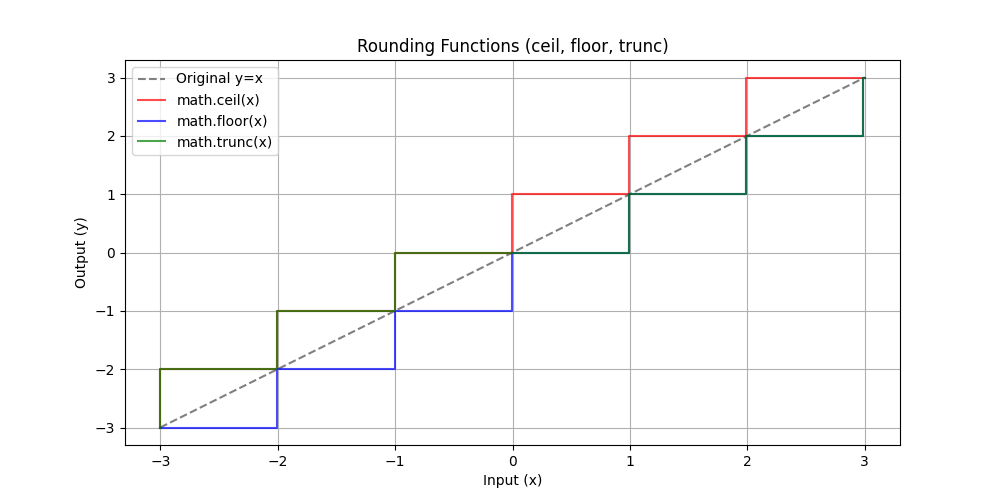

# 3.3.11.1 기본 산술, 통계 및 반올림 (math)

## 학습목표
`math` 모듈이 제공하는 기본적인 산술 연산, 절댓값, 팩토리얼 등 통계 기능과 더불어 소수점을 정밀하게 제어하는 '올림, 내림, 버림' 함수들의 정확한 메커니즘을 시각적으로 학습합니다.

---

## 1. 기본 산술 및 통계 함수 (숫자 다듬기)

통계나 확률 등을 계산할 때 기본 내장 함수만으로는 부족한 정밀한 계산들을 도와주는 핵심 함수들입니다.


> 💡 **웹툰 비유:** 파이썬 뱀 정비공이 거대한 마법 팩토리얼 기계 레버를 당기자 박스들이 기하급수적으로 복사되어 쏟아지고, 다른 한쪽에서는 두 숫자가 거의 같은지 미세한 레이저 저울(`isclose`)로 암호를 풀고 있는 공학 연구소의 역동적인 모습입니다.

### 1. 절댓값 (fabs)과 오차 없는 비교 (isclose)

*   **`math.fabs(x)`**: 절댓값을 구합니다. 기본 `abs()`와 달리 무조건 실수형(`float`)으로 반환합니다.
*   **`math.isclose(a, b)`**: 컴퓨터는 0.1+0.2를 0.3으로 정확히 인식하지 못하고 $0.30000000000000004$ 로 계산하는 치명적인 부동소수점 오차를 가집니다. 이를 안전하게 비교할 때 필수적입니다.

```python
import math

# 1. 실수 변환 절댓값
print("fabs(-5.5):", math.fabs(-5))  # 5.0 (결과가 무조건 float 5.0)

# 2. 부동소수점 오차 비교 (중요!)
print("0.1 + 0.2 == 0.3:", 0.1 + 0.2 == 0.3)  # False (부동소수점 오차 때문에 다름!)
print("isclose(0.1+0.2, 0.3):", math.isclose(0.1 + 0.2, 0.3))  # True (오차 범위를 인정하고 같다고 판별)
```

### 2. 팩토리얼 (factorial)과 연속 곱셈 (prod)

수학적 확률이나 조합의 경우의 수를 구할 때 숫자가 미친 듯이 불어나는 연산입니다.


> 💡 **다이어그램:** $5!$ 의 계산 과정을 보여줍니다. $5 \times 4 \times 3 \times 2 \times 1$ 의 상자들이 연쇄적으로 등장하여 하나로 합쳐지며 거대한 $120$ 이라는 결괏값을 폭발적으로 뿜어냅니다.

```python
import math

# 1. 팩토리얼 (1부터 N까지의 모든 정수 곱)
print("5! (Factorial):", math.factorial(5))  # 120 (5 * 4 * 3 * 2 * 1)

# 2. 리스트 내부 요소 전체 곱 (prod)
numbers = [2, 3, 4]
print("[2,3,4]의 전체 곱:", math.prod(numbers))  # 24 (2 * 3 * 4)
```

### 3. 최대공약수 (gcd)와 최소공배수 (lcm)

분수를 약분하거나, 일정 주기로 반복되는 패턴이 처음 만나는 지점을 계산할 때 씁니다.


> 💡 **다이어그램:** $12$ 와 $16$ 두 숫자의 약수와 배수가 충돌하는 모습을 시각화했습니다. 둘의 가장 큰 공통 약수인 $4$(GCD)가 추출되어 나오고, 둘이 동시에 만나는 가장 작은 배수인 $48$(LCM)로 쭉 뻗어나가는 과정입니다.

```python
import math

# 1. 최대공약수 (Greatest Common Divisor)
print("12와 16의 최대공약수:", math.gcd(12, 16))  # 4

# 2. 최소공배수 (Least Common Multiple - Python 3.9+)
print("12와 16의 최소공배수:", math.lcm(12, 16))  # 48
```

---

## 2. 천장, 바닥, 그리고 무자비한 절단 (올림/내림/버림)

수많은 소수점 데이터들을 통계적으로 단정하게 다듬기(Rounding) 위해 세 가지 함수를 사용합니다. 일반 내장 함수 `round()`가 일상적인 반올림 용도라면, 아래 함수들은 물리 엔진이나 UI 픽셀 계산 등 특정 수학 세계관에서 '단호하고 확실한 기준치'를 세울 때 쓰는 극단적인 절단 함수들입니다.


> 💡 **다이어그램(Matplotlib):** 
> *   `math.ceil()` (빨간색 계단): 회색 원래의 선보다 항상 위쪽에 그려집니다. 값을 엘리베이터 천장 층으로 강제로 끌어올립니다.
> *   `math.floor()` (파란색 계단): 회색 원래의 선보다 항상 극단적으로 아래쪽에 있습니다. 무거운 중력으로 바닥 층으로 끌어내립니다.
> *   `math.trunc()` (초록색 계단): 위/아래 방향성은 무시하고 $0$에 가까워지는 방향으로 소수점만 칼로 무자비하게 단칼에 베어 버립니다.

1. **`math.ceil(x)` (올림)**: Ceiling(천장)의 약자로, 자기 자신보다 **크거나 같은 가장 작은 정수**로 무조건 올려버립니다.
2. **`math.floor(x)` (내림)**: Floor(바닥)의 약자로, 자기 자신보다 **작거나 같은 가장 큰 정수**로 무조건 내려버립니다.
3. **`math.trunc(x)` (버림)**: Truncate(자르다)의 약자로, 양수든 음수든 무조건 소수점을 싹둑 잘라냅니다.

```python
import math as m

# 1. math.ceil (올림: 상승!)
print(f"3.1의 올림: {m.ceil(3.1)}")    # 4
print(f"-3.7의 올림: {m.ceil(-3.7)}")  # -3 

# 2. math.floor (내림: 하강!)
print(f"3.7의 내림: {m.floor(3.7)}")   # 3
print(f"-3.1의 내림: {m.floor(-3.1)}") # -4 

# 3. math.trunc (절사: 방향 무시 소수점 삭제)
print(f"3.999의 절사: {m.trunc(3.999)}")    # 3
print(f"-3.999의 절사: {m.trunc(-3.999)}")  # -3
```

---

## 📊 Matplotlib: 반올림 그래프 그리는 방법

위의 계단형 반올림 그래프를 파이썬 코드로 직접 그리는 방법입니다.

```python
import math
import matplotlib.pyplot as plt
import numpy as np

# -3부터 3까지 500개의 데이터를 촘촘하게 만듭니다
x = np.linspace(-3, 3, 500)

y_ceil = [math.ceil(v) for v in x]
y_floor = [math.floor(v) for v in x]
y_trunc = [math.trunc(v) for v in x]

plt.figure(figsize=(10, 5))
plt.plot(x, x, label='Original y=x', color='gray', linestyle='--')
plt.step(x, y_ceil, label='math.ceil(x)', color='red', alpha=0.7)
plt.step(x, y_floor, label='math.floor(x)', color='blue', alpha=0.7)
plt.step(x, y_trunc, label='math.trunc(x)', color='green', alpha=0.7)

plt.title("Rounding Functions")
plt.legend()
plt.grid(True)
plt.show()
```
