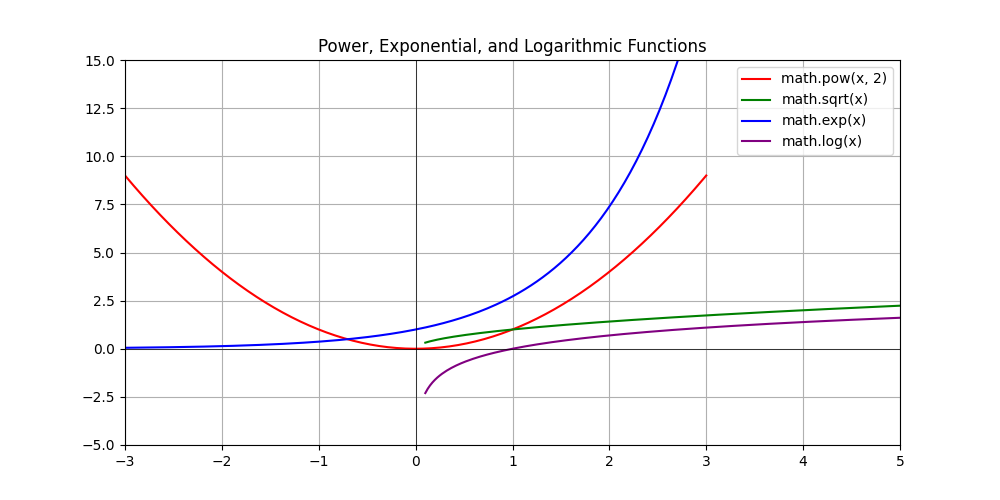

# 3.3.11.2 거듭제곱과 로그 (math)

## 학습목표
`math` 모듈을 이용하여 수치의 거대한 스케일 팽창(지수, 거듭제곱)과 압축(루트, 로그)을 계산하는 방법론을 시각적 그래프와 함께 이해합니다.

---

## 1. 거듭제곱 및 로그 함수 (스케일 조절)

주식의 복리 계산, 인구 증가율, 바이러스 확산 등 폭발적으로 증가하는 수치나 그것을 다시 보기 좋게 압축하는 과학적 연산에 쓰이는 핵심 함수들입니다.

| 함수명 | 설명 | 예시 / 활용법 |
| --- | --- | --- |
| `math.pow(x, y)` | `x`의 `y` 거듭제곱을 계산합니다. ($x^y$) | `math.pow(2, 3)` $\to$ `8.0` |
| `math.sqrt(x)` | `x`의 **제곱근(루트)**을 구합니다. ($\sqrt{x}$) | `math.sqrt(16)` $\to$ `4.0` |
| `math.exp(x)` | 자연상수 $e$의 `x` 거듭제곱을 구합니다. ($e^x$) | 자연 지수 성장 계산 |
| `math.log(x, base)`| 지정된 밑(`base`)으로 **로그** 값을 구합니다. (기본은 자연로그)| `math.log(100, 10)` $\to$ `2.0` |
| `math.log10(x)` | 밑이 10인 상용로그 값을 빠르게 구합니다. | 과학 스케일 조절, 자릿수 계산 |

---

## 2. 함수 동작의 시각화 관찰

거듭제곱과 지수 함수는 값이 위로 솟구치게 만들고, 루트와 로그는 갑갑할 정도로 수치를 바닥으로 짓눌러버리는 상반된 특징을 가집니다.


> 💡 **다이어그램(Matplotlib):** 
> *   `math.pow(x, 2)` (빨간 선)와 `math.exp(x)` (파란 선)는 값이 커질수록 저 높이 하늘로 미친 듯이 치솟아 오르는 팽창형 수식을 보여줍니다.
> *   반대로 역연산인 `math.sqrt(x)` (초록 선)와 `math.log(x)` (보라 선)는 값이 커져도 완만하게 눌려서 증가폭이 둔화되는 극도의 압축형 특성을 시각적으로 뚜렷하게 보여줍니다.

---

## 3. 실전 응용 (제곱근과 제곱)

`math.sqrt()`(Square Root) 함수는 어떤 숫자의 제곱근(√)을 무조건 실수(`float`) 형태로 정확히 반환합니다. 파이썬 문법 자체에 거듭제곱(`**`) 기호가 이미 있지만, 전체적인 계산식의 형식을 수학적으로 일관성 있게 통일하기 위해 `math.pow(x, y)` 함수도 세트로 자주 쓰입니다.

**실전 응용: 피타고라스의 정리 (Pythagorean Theorem) 계산기**
게임에서 캐릭터와 몬스터 사이의 대각선 거리를 구하거나, 통계 데이터의 유클리드 거리를 잴 때 가장 많이 쓰이는 기하학 공식입니다. 직각삼각형의 두 변의 길이(`A`, `B`)를 알고 있을 때, 빗변 대각선(`C`)의 길이를 $C = \sqrt{A^2 + B^2}$ 수식을 통해 단숨에 구할 수 있습니다. 

```python
import math as m

side_a = 3
side_b = 4

# 피타고라스 정리 적용: 빗변 C = √(a^2 + b^2)
hypotenuse_c = m.sqrt(m.pow(side_a, 2) + m.pow(side_b, 2))

print(f"가로 {side_a}, 세로 {side_b} 일 때, 대각선(빗변) 길이는 {hypotenuse_c} 입니다.")
```

---

## 📊 Matplotlib: 지수와 로그 그래프 그리는 방법

수치의 팽창과 압축 그래프 수식을 그리는 파이썬 코드입니다.

```python
import math
import matplotlib.pyplot as plt
import numpy as np

x_pos = np.linspace(0.1, 5, 200)
x_full = np.linspace(-3, 3, 200)

y_pow2 = [math.pow(v, 2) for v in x_full]
y_sqrt = [math.sqrt(v) for v in x_pos]
y_exp  = [math.exp(v) for v in x_full]
y_log  = [math.log(v) for v in x_pos]

plt.figure(figsize=(10, 5))
plt.plot(x_full, y_pow2, label='math.pow(x, 2)', color='red')
plt.plot(x_pos, y_sqrt, label='math.sqrt(x)', color='green')
plt.plot(x_full, y_exp, label='math.exp(x)', color='blue')
plt.plot(x_pos, y_log, label='math.log(x)', color='purple')

plt.ylim(-5, 15)
plt.xlim(-3, 5)
plt.axhline(0, color='black', linewidth=0.5)
plt.axvline(0, color='black', linewidth=0.5)
plt.title("Power, Exponential, and Logarithmic Functions")
plt.legend()
plt.grid(True)
plt.show()
```
