# 3.3.11.3 기하학 및 삼각함수 (math)

## 학습목표
`math` 모듈이 지원하는 수학적 상수(`pi`, `e`)들과 파동(Wave)을 그려내는 삼각함수(`sin`, `cos`)의 사용 규칙과 라디안 변환 원리를 이해합니다.

---

## 1. 기하학 상수 및 삼각함수 함수표

물리 시뮬레이션에서 캐릭터의 포물선 발사 궤적을 그리거나, 부드러운 왕복 운동, 파도, 오디오 신호 등 주기적으로 반복되는 **파동 공간 데이터**를 다룰 때 필수적입니다.

| 함수명/상수명 | 설명 | 예시 / 활용법 |
| --- | --- | --- |
| `math.pi`, `math.e` | 상수 **원주율 $\pi$(3.1415...)**, **자연상수 $e$(2.718...)** | 원의 넓이 $r^2 \pi$ 계산 |
| `math.sin`, `math.cos`| **삼각함수** (라디안 각도 체계를 기준 입력값으로 받습니다.) | 부드러운 상하 왕복 애니메이션 |
| `math.radians(x)` | 평범한 **각도(Degree 0~360)** 값을 **라디안(Radian)**으로 자동 변환 | `math.radians(180)` $\to$ `3.14159...`|
| `math.degrees(x)` | 반대로 **라디안(Radian)** 값을 평범한 360 각도로 변환 | `math.degrees(math.pi)` $\to$ `180.0`|
| `math.dist(p, q)` | 두 점(튜플 좌표) 사이의 공간 거리를 계산 (유클리드) | `math.dist((0,0), (3,4))` $\to$ `5.0` |

---

## 2. 삼각함수의 세계: 수학 파동(Wave) 파악하기


> 💡 **다이어그램(Matplotlib):** `math.sin()`과 `math.cos()` 함수가 0도에서 360도까지 진행하면서 만들어내는, 절대 끊기지 않는 부드러운 교차 파동 곡선의 시각적 형태입니다. 컴퓨터 애니메이션에서 숨쉬기 모션이나 깜빡거리는 점멸등 속도 제어에 쓰입니다.

---

## 3. 라디안(Radian)의 엄격한 법칙

초보자들이 가장 실수하는 파트가 바로 각도의 입력입니다.
`math.sin(90)` 이라고 적으면 90도 각도를 기대하시겠지만, 파이썬의 삼각함수는 인간의 눈높이에 맞춰진 360분법 각도(Degree)를 거부하고 순수 수학적인 **라디안(Radian)** 체계를 고집합니다.

따라서 90도 각도를 삼각함수에 넣기 전에는 언제나 통역기인 `math.radians()` 함수를 한 번 거쳐야만 정확한 1.0 (최고점)이 출력됩니다.


> 💡 **다이어그램:** 인간에게 친숙한 180도짜리 Degree 각도가 `math.radians()` 컨베이어 벨트에 들어가면, 파이썬 삼각함수가 이해할 수 있는 순수 수학 바이트인 `3.14 (파이)` 형태의 Radian 값으로 변환되어 출력되는 시각적 과정입니다.


```python
import math as m

# 잘못된 입력! (90 라디안으로 인식하여 엉뚱한 값 출력)
print("sin(90)의 잘못된 값:", m.sin(90))

# 안전한 정석! 통역기(radians)를 한 번 필수로 거쳐야 합니다.
rad_90 = m.radians(90)
print("sin(90도)의 정확한 값:", m.sin(rad_90))  # 1.0 출력!
```

---

## 📊 Matplotlib: 삼각함수 파동 그리는 방법

`math.sin` 부품의 출력을 Y 좌표로 삼아 곡선을 그리는 파이썬 코드입니다.

```python
import math
import matplotlib.pyplot as plt

# 0도부터 360도까지 점찍을 X 좌표 (라디안 변환)
x_angles = range(0, 360, 2)  # 2도 간격으로 촘촘히 
x_radians = [math.radians(deg) for deg in x_angles]

# Y 좌표 (sin과 cos 파동 계산)
y_sin = [math.sin(rad) for rad in x_radians]
y_cos = [math.cos(rad) for rad in x_radians]

plt.figure(figsize=(10, 4))
plt.plot(x_angles, y_sin, label='Sine Wave (sin)', color='blue', linestyle='-')
plt.plot(x_angles, y_cos, label='Cosine Wave (cos)', color='orange', linestyle='--')

plt.title("Trigonometric Waves (math.sin, math.cos)")
plt.xlabel("Angle (Degrees)")
plt.ylabel("Amplitude")
plt.axhline(0, color='black', linewidth=0.5, linestyle='--')
plt.legend()
plt.grid(True)
plt.show()
```
