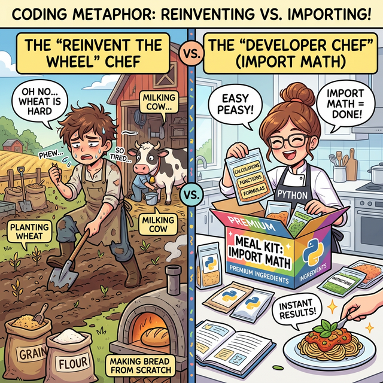

# 3.3.11 모듈과 라이브러리 (내장 모듈 math 활용)

## 학습목표
본 장에서는 남들이 피땀 흘려 만들어 놓은 코드를 재사용하는 **'모듈(Module)'**과 **'라이브러리(Library)'**의 짜릿한 개념을 비유를 통해 아주 직관적으로 확립합니다. 그리고 파이썬 기본 탑재 모듈 중 하나인 `math`를 내 코드로 당겨와(`import`), 직접 짜기 힘든 강력한 수학 공식들을 손쉽게 가져다 쓰는 방법을 세부 챕터별로 심도 있게 익힙니다.

---

## 📚 세부 학습 목차

### [3.3.11.1 기본 산술, 통계 및 반올림 (math)](./01_arithmetic_stats/)
기본 스펙트럼의 `abs`나 `round`와는 차원이 다른, `math.fabs()`와 극한의 올림/내림/버림 통제 함수(`ceil`, `floor`, `trunc`)들의 작동 원리를 Matplotlib 계단 그래프 시각화와 함께 학습합니다. 최대공약수와 팩토리얼 연산도 다룹니다.

### [3.3.11.2 거듭제곱과 로그 (math)](./02_power_log/)
수치의 폭발적인 팽창(지수, $x^2$)과 극단적인 압축(로그, $\sqrt{x}$)을 담당하는 스케일 변환의 핵심 함수들을 배웁니다. 피타고라스의 정리를 활용한 유클리드 거리 공식 실전 예제와 함수 곡선들의 시각화를 확인합니다.

### [3.3.11.3 기하학 및 삼각함수 (math)](./03_geometry_trig/)
컴퓨터 그래픽스와 물리 엔진 파동 주기 계산의 기반이 되는 원주율(`pi`), 자연상수(`e`), 그리고 `sin`, `cos` 파동의 실체와 360분법 각도(Degree)를 수학의 진짜 언어(Radian)로 호환시키는 방법을 마스터합니다.

---

## 바퀴를 다시 발명하지 마라 (Don't reinvent the wheel)

> 💡 **웹툰 비유:** 빵을 만들기 위해 밀농사부터 짓는 고생스러운 방법과, 훌륭하게 구성된 조립/요리 세트(`import math`) 밀키트 상자를 주문해서 바로 완성하는 편안함을 대비시켜 보여줍니다. 모듈은 바로 이 '조립 밀키트'입니다!

이미 전 세계의 엄청난 개발자들이 만들어 놓은 훌륭한 도구들이 있습니다. 우리는 직접 복잡한 수식이나 알고리즘을 전부 구현할 필요 없이 `import` 키워드로 불러오기만 하면 됩니다.
마치 요리사가 식재료 농사부터 소스 제조까지 전부 다 수작업 하는 대신, 잘 손질된 훌륭한 **'밀키트'**를 사 와서 조리만 하는 것과 같습니다.

---

## 정리
프로그래머의 가장 위대한 덕목은 역설적이게도 '게으름(중복되는 코딩 수고로움을 거부하는 것)'입니다. 이미 발명된 둥근 바퀴를 처음부터 다시 깎아내려 하지 말고, 단 한 줄의 `import` 주문을 통해 수만 명의 선배 천재 개발자들이 미리 검증해 놓은 훌륭한 부품(모듈/라이브러리)을 조립식 장난감처럼 합치는 거인의 어깨 위에 서는 방법을 배웠습니다. 파이썬 기본 제공 `math` 모듈은 그 무한한 외부 생태계(Pandas, Scikit-Learn 등)로 들어가는 짜릿한 첫 경험이자 발판에 불과합니다.

---

## ☕ Java vs 🐍 Python 스나이퍼 비교

### 1. 외부 기능 불러오기 (Import)
*   **Java**: `import java.util.Scanner;` 처럼 클래스나 패키지 경로를 선언해 주고 빌드 시 포함시킵니다. 수학 관련 내장 클래스인 `Math`는 `import` 없이 `Math.sqrt()` 형태로 전역적으로 기본 제공됩니다.
*   **Python**: `import math` 명령어 하나로 별도의 파이썬 파일(.py)에 있는 모든 기능을 현재 내 도화지 위로 쏟아붓습니다. 

### 2. 별명(Alias) 지정하기
*   **Java**: 파일명 중복을 피하기 위한 별명 지정 모듈 임포트 기능이 자체적으로 존재하지 않으며, 전체 경로를 명시해야 합니다.
*   **Python**: `import math as m` 처럼 `as 별명` 키워드를 써서 타이핑 길이를 획기적으로 줄일 수 있습니다. 데이터 과학의 국룰인 `import numpy as np`, `import pandas as pd`가 모두 이 문법에서 나옵니다.

---

## 🎧 Vibe Coding

이제는 라이브러리를 직접 만들고 배포하는 생산자가 되어 보세요.

> **🗣️ 학생 프롬프트 (AI에게 이렇게 명령해 보세요):**
> "파이썬에서 내가 직접 `my_calculator.py`라는 모듈(파일)을 만들고, 거기에 덧셈/뺄셈 함수를 넣은 뒤, 메인 실행 파일에서 `import`해서 사용하는 방법을 중학생 수준에서 스텝바이스텝으로 그림 그리듯 자세히 알려줘."

---

## 코딩 영단어 학습 📝

*   **`Module`**: 모듈, 교체 가능한 독립적인 부품. (레고 블록 하나하나를 뜻합니다. 파이썬에서는 남이 만들어 놓은 `.py` 텍스트 코드 파일 한 장을 의미합니다.)
*   **`Library`**: 도서관. (파이썬에서는 쓸만한 모듈(책)들을 용도별로 잘 모아놓은 상자(도서관)를 뜻합니다.)
*   **`Import`**: 수입하다, 밖에서 안으로 가져오다. (외부에 있는 모듈이나 라이브러리의 기능들을 현재 내 코드 화면 안으로 끌어당겨 오는 역할을 하는 필수 마법 주문입니다.)