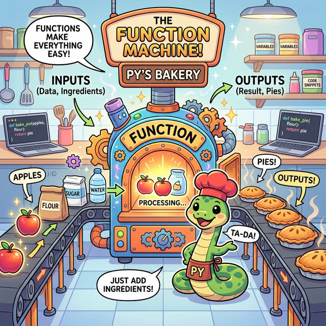

# 3.3 함수 (Functions)

## 학습목표
내가 짠 파이썬 코드가 수십 줄, 수백 줄 길어지기 시작하면 코드의 중복과 복잡함에 압도당하게 됩니다. 코드를 재사용 가능한 단위로 묶어서 블록화하는 핵심 개념인 **'함수(Function)'**에 대해 학습합니다. 본 장에서는 함수라는 단어가 가진 어원적/수학적 기원부터 시작하여, 나만의 커스텀 논리 기계를 설계하는 방법(`def`), 다양하고 유동적인 매개변수(`*args`) 통로 설계, 변수가 살아 숨 쉬는 생태계 규격(Scope)까지, 프로그래머들의 제1 핵심 무기를 완벽하게 장착합니다.

---

## 📚 세부 학습 목차

### [3.3.1 함수의 어원과 수학적 기원](./01_function_origin/)
Function 이라는 영어 단어의 사전적 의미("동작, 역할")에서 출발하여, 수학의 $y = ax + b$ 가 만들어낸 **대응(Mapping)** 시스템이 어떻게 현대 프로그래밍의 '독립적이고 통제된 논리 처리 단위'로 진화했는지 거대한 철학의 첫 단추를 꿰맞춥니다.

### [3.3.2 함수 블랙박스와 매핑 시스템](./02_function_concepts/)
수학의 함수에서 가장 중요한 **정의역(Input Domain)**과 **공역(Output Codomain)**의 엄격한 통제 이론을 파이썬 함수의 뼈대 구조로 이식합니다. 내용물을 몰라도 버튼만 누르면 튀어나오는 공학적 블랙박스(Information Hiding) 비유를 통해 함수의 존재 이유 3가지를 깨우칩니다.

### [3.3.3 함수 선언 문법 (def)과 호출(Call)](./03_function_usage/)
남이 만든 함수(print, type 등)를 쓰는 소비자 입장에서 벗어나, 파이썬에서 `def` 키워드를 활용해 나만의 커스텀 함수(명령어)를 직접 창조하는 설계자가 되어봅니다. 특히 함수가 호출(Call)될 때 프로그램의 제어권(메모리 불빛)이 위아래로 널뛰기 점프를 뛰는 역동적인 실행 궤적을 심층적으로 추적합니다.

### [3.3.4 함수 호출과 제어 흐름의 도약](./04_function_call_flow/)
초보자들이 가장 당황하는 지점인 '제어 흐름의 널뛰기'를 심층 분석합니다. 함수 호출 시 메인 프로그램이 잠시 멈추고 제어권이 워프(Jump)하는 현상, 그리고 임무 완수 후 결괏값만 들고 귀환(Return)하는 흐름을 포탈 애니메이션과 함께 직관적으로 추적합니다.

### [3.3.5 함수의 다양한 매개변수 통로 (*args, **kwargs)](./05_advanced_parameters/)
설계 구조(Parameter)와 실제 재료(Argument)의 개념 차이를 명확히 구분하고, 파이썬만이 가진 변칙적이고 무한한 데이터 흡수 그물망인 별표 인스펙터(`*args`, `**kwargs`)들의 작동 메커니즘을 배웁니다.

### [3.3.6 변수의 유효 범위 (Scope와 Global)](./06_variable_scope/)
왜 함수 안에서 만든 변수는 밖에서 쓸 수 없을까요? 함수라는 밀폐된 방 안에서 잠시 부풀었다 사라지는 '지역 변수'와, 파일 전체 세계관을 호령하는 '전역 변수' 데이터가 살아 숨 쉬는 공간(Scope)의 범위를 파악하고, 열쇠(`global`)를 조심히 다루는 법을 배웁니다.

### [3.3.7 람다(Lambda)와 재귀(Recursion)](./07_lambda_and_recursion/)
이름조차 짓기 귀찮은 일회용 함수인 `lambda`의 수학적 탄생 역사(알론조 처치)를 엿보고 코드를 극단적으로 얇게 썰어내는 방법을 익힙니다. 이어서 거울 속의 자신을 보듯 자기가 자기를 꼬리 물며 끝없이 호출하는 트리 탐색의 원조, **재귀 함수**의 마법을 훈련합니다.

### [3.3.8 (참고) 파이썬 내장 함수와 메서드](./08_built_in_functions/)
파이썬 생태계에 입장하자마자 언제든 뽑아 쓸 수 있도록 든든하게 제공되는 핵심 내장 함수(`len()`, `max()`, `sum()`, `enumerate()` 등)들의 활용법을 살펴봅니다. 코드의 길이를 드라마틱하게 줄여줄 치트키 창고입니다.

### [3.3.9 (심화) Python 파이썬과 수학](./09_math_module/)
기본 문법을 넘어, 파이썬이 미리 제작해 둔 거대한 공학용 계산기 라이브러리인 `math` 모듈을 불러와(import) 수많은 수학 공식과 상수들을 함수 형태로 활용하는 방법을 실습합니다. 외부 함수의 막강한 조립 능력을 경험할 수 있습니다.

---

## 🎉 정리
축하합니다! 함수를 속속들이 다루는 법을 깨우쳤다는 것은, 드디어 코드를 무작정 일직선 스파게티로 짜내려가는 초보 티를 완벽히 벗고 '나만의 요리법과 도구 상자'를 블록화 할 줄 아는 **아키텍트(Architect, 설계자)**의 영역에 들어섰다는 뜻입니다. 앞으로 작성될 모든 대규모 AI 코드나 웹 시스템은 전부 이 함수 단위로 예쁘게 조각나고 조립되어 거대한 사이버 세상의 톱니바퀴로 작용할 것입니다.
