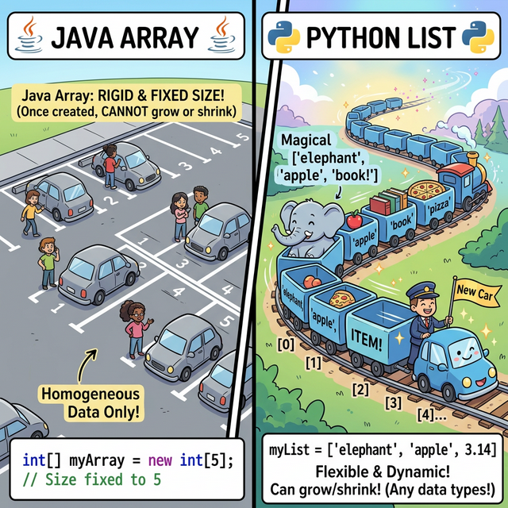

# 3.4.1.1 파이썬 리스트(List)의 탄생과 특징

## 학습목표
본 장에서는 순차적인 데이터들을 하나로 묶어 관리하는 **'리스트(List)'**의 본질을 파헤칩니다. 타 프로그래밍 언어의 '배열(Array)'이 가진 한계점을 파이썬이 어떻게 극복하여 유연하고 마법 같은 자료구조로 재탄생시켰는지, 시각적인 애니메이션과 명확한 코드 예제로 체감합니다.

---

## 1. 다른 언어는 배열(Array)인데, 왜 파이썬은 리스트(List)일까?

자바(Java)나 C언어를 배우다 온 학생들은 파이썬에 '배열(Array)'이라는 기본 자료형이 없다는 사실에 종종 당황합니다. 파이썬은 왜 배열 대신 **리스트(List)**라는 이름을 고집할까요?


> 💡 **웹툰 비유:** 왼쪽 흑백의 'Java Array' 구역은 네모 반듯하고 딱딱한 시멘트 주차장입니다. "차량 5대 제한!"이라고 입구에 박혀있고 크기를 절대 늘릴 수 없으며, 화물차만 모이도록 강제됩니다. 반면 오른쪽의 'Python List' 구역은 마법의 무한 고무 기차입니다. 칸이 모자라면 기차가 쭈욱 늘어나서 새로운 칸을 무한히 만들어내고, 한 칸에는 무거운 정수를, 다음 칸에는 가벼운 글자를, 다른 칸에는 강아지를 욱여넣어도 기차는 활짝 웃으며 달립니다.

---

## 2. 시멘트 배달부와 고무 기차의 동작 원리

컴퓨터 메모리 관점에서 배열과 리스트의 시각적인 작동 방식을 비교해 보겠습니다.


> 💡 **다이어그램 해석:** 
> *   **왼쪽(Array)**: 처음에 방을 3개만 예약했기 때문에, 4번째 데이터를 넣으려 하면 메모리 한계선(Wall)에 머리를 부딪혀 `ERROR!`를 뿜어냅니다. 또한 색깔이 모두 파란색(순수 int)으로 고정되어 있습니다.
> *   **오른쪽(List)**: 숫자(`10`), 글자(`"Hi"`), 불리언(`True`) 등 형태와 크기가 전혀 다른 데이터들이 줄줄이 연결(화살표)되어 기차를 이룹니다. 새로운 값이 들어올 때마다 파이썬 엔진이 알아서 새로운 칸을 뒤에 자동(`Auto`)으로 생성하여 연결해 줍니다. 

### 🧱 타 언어 배열 (Array)의 한계점
1. **크기 고정선언**: `int[] arr = new int[5];` 처럼 처음에 5개의 방을 파겠다고 선언하면, 나중에 6번째 손님을 모시지 못합니다. (아예 이사해서 집을 새로 부수고 지어야 합니다.)
2. **단일 타입 강제**: 숫자 전용 주차장에는 숫자가 아닌 문자나 객체가 절대 들어올 수 없습니다.

### 🚂 파이썬 리스트 (List)만의 혁신
1. **무한한 신축성(Dynamic Array)**: 동적 배열. 요소를 빼면 알아서 줄어들고, 계속 집어넣으면 운영체제 메모리가 허락하는 한 무한히 팽창합니다. 개발자가 메모리 관리를 신경 쓸 필요가 없습니다.
2. **타입의 해방**: 파이썬 리스트 안에는 숫자, 글자, 함수, 심지어 **또 다른 리스트까지 모두 짬뽕으로 욱여넣을 수 있습니다.** 파이썬에게 리스트는 단순한 값 덩어리가 아니라 **'객체 메모리 주소(Reference)들의 모음집'**이기 때문입니다.

---

## 3. 리스트 실전 생성법과 확인

파이썬에서 리스트를 세상 밖으로 꺼내는 기초적인 두 가지 방법과, 내장 함수 `range()`를 이용한 초고속 대량 생산 기법을 알아봅니다.

```python
# 1. 대괄호 [ ] 를 사용하는 가장 흔하고 직관적인 방법
empty_list = []                  # 아무것도 없는 텅 빈 리스트 (방만 파놓음)
numbers = [1, 2, 3, 4, 5]        # 정수만 깔끔하게 들어있는 리스트
mixed = [1, "Apple", 3.14, True] # 짬뽕 리스트 (숫자, 글자, 소수, 논리형 혼합)
nested = [1, 2, ["A", "B"]]      # 리스트 안에 품어진 또 다른 리스트 (중첩)

print(mixed)
# 출력: [1, 'Apple', 3.14, True]
```

`list()` 껍데기 변환 기계를 사용하면, 글자 배열 뭉치나 범위를 강제로 잘게 찢어 리스트 방 안에 하나씩 배정해 줍니다.

```python
# 2. list() 변환 함수 사용 (문자열 폭파)
word = list("Python") 
print(word)
# 출력: ['P', 'y', 't', 'h', 'o', 'n'] (알파벳 한 글자씩 분해되어 리스트에 조립됨)

# 3. range()를 활용한 초고속 순차 번호 리스트 공장
zero_to_four = list(range(5))       # 5 튕기기 전까지 (0, 1, 2, 3, 4)
odd_numbers = list(range(1, 10, 2)) # 1부터 9까지 2칸씩(보폭) 건너뛰어!

print("0~4:", zero_to_four)
print("홀수:", odd_numbers)
```

위의 예제들에서 보듯 파이썬 리스트는 생성의 제약이 거의 없습니다. 마음만 먹으면 어떠한 형태의 데이터 덩어리든 `[ ]` 괄호 하나로 가둬서 연속된 순서를 부여할 수 있습니다. 이것이 파이썬 데이터 전처리와 빅데이터의 가장 근본적인 뼈대가 되는 이유입니다.
