# 3.4.1.2 파이썬 리스트: 타겟 조준과 마법의 슬라이싱

## 학습목표
파이썬 리스트의 가장 큰 무기인 '단일 원소 저격(Indexing)'과 '원하는 범위 도려내기(Slicing)' 기술을 마스터합니다. 음수 인덱스를 활용하여 파이썬 특유의 직관적인 코딩 스타일을 익히고, 보폭(Step)을 조절하여 리스트를 자유자재로 다루는 패턴을 학습합니다.

---

## 1. 타겟 조준 타격! 인덱싱 (Indexing)

수조 안에 나란히 들어있는 물고기들 중 특정한 위치에 있는 녀석만을 정확히 집어내는 기술입니다.
가장 중요한 규칙은 방 번호가 1이 아니라 **무조건 0번**부터 시작한다는 점입니다.

```python
inventory = ["물약", "단검", "방패", "투구", "지도"]

print(inventory[0])   # 앞에서 첫 번째 방: 물약
print(inventory[1])   # 앞에서 두 번째 방: 단검
print(inventory[2])   # 앞에서 세 번째 방: 방패
```

### 🔥 파이썬만의 사기 기술: 음수 인덱스
C나 자바에서는 전체 길이값을 알아내서 `length - 1` 과 같은 복잡한 수식을 거쳐야 맨 뒤의 아이템을 꺼낼 수 있습니다. 하지만 파이썬은 **음수 인덱스(-1, -2)**를 지원하여 뒤에서부터 거꾸로 매우 직관적으로 셀 수 있습니다.

```python
# 전체 길이를 몰라도 맨 뒤, 그 앞의 아이템을 척척 꺼냅니다.
print(inventory[-1])  # 맨 뒤에서 1번째 녀석: 지도
print(inventory[-2])  # 맨 뒤에서 2번째 녀석: 투구
print(inventory[-5])  # 맨 뒤에서 5번째 (맨 앞): 물약
```

---

## 2. 무자비한 칼날! 슬라이싱 (Slicing)

원소 하나만 꺼내는 것을 넘어, 거대한 리스트의 허리를 잘라 **내가 원하는 덩어리(Sub-list)만 새로운 접시에 담아내는 기술**입니다.


> 💡 **웹툰 비유:** 멋진 파이썬 로고를 단 닌자 로봇이 길다란 샌드위치(리스트)를 레이저 카타나(검)로 `[1:4]` 정확히 분할하여 토막 냅니다. 앞부분에는 양수 번호표(0, 1, 2...), 꼬리 부분에는 음수 번호표(-1, -2...)가 붙어있어 닌자가 앞뒤 가리지 않고 칼질을 하는 유쾌한 장면입니다.

슬라이싱의 기본 문법은 `[시작:끝:보폭]` 입니다.
시작점은 포함(Include)되지만, 끝점은 반드시 1칸 이전에 멈춥니다(Exclude). 


> 💡 **다이어그램 해석:** `numbers[1:4]` 명령을 내렸을 때, 레이저가 1번 방(20) 앞에서 시작하여 4번 방 앞에서 정확히 멈추며 `[20, 30, 40]` 3개의 엘리먼트만 쏙 뽑아 복사해 내는 시각적 과정입니다. (원본 데이터는 절대 손상되지 않고, 잘린 덩어리의 **복사본**을 반환합니다.)

```python
numbers = [10, 20, 30, 40, 50, 60]

print(numbers[1:4])   # 1번칸 시작 ~ 3번칸 끝 (4번칸 직전 컷!): [20, 30, 40]
print(numbers[:3])    # 처음부터 2번칸 끝(3번 앞): [10, 20, 30]
print(numbers[3:])    # 3번칸부터 끝까지: [40, 50, 60]
print(numbers[:])     # 처음부터 끝까지 통째로 (원본 복제본 생성 시 가장 많이 씀): [10, 20, 30, 40, 50, 60]
```

### 3. 보폭(Step) 점프와 리스트 뒤집기의 예술
슬라이싱의 숨겨진 세 번째 파라미터 `보폭`을 조절하면, 징검다리를 건너뛰듯 아이템을 뽑아내거나 기차 방향을 통째로 돌려버릴 수 있습니다.

```python
# 1. 징검다리 건너뛰기
print(numbers[::2])   # 처음부터 끝까지 2칸씩 점프: [10, 30, 50]
print(numbers[1::2])  # 1번칸부터 끝까지 2칸씩 점프 (짝수 번째 녀석들): [20, 40, 60]

# 2. 세상에서 가장 우아하고 역동적인 리스트 뒤집기 스킬
# 보폭으로 -1을 주는 순간, 파이썬 엔진은 거꾸로 달려가며 데이터를 뒤집어 담습니다.
print(numbers[::-1])  # 역순 배열: [60, 50, 40, 30, 20, 10]
```

---

## 4. 슬라이싱의 특수 능력: 통째로 갈아치우기

슬라이싱 방식을 `=` (대입 연산자) 장비와 결합하면, 리스트 안락사의 일부분을 들어내고 완전히 다른 덩어리로 **치환(Replace)**해 버리는 고급 기법이 가능합니다.

```python
colors = ["빨강", "주황", "초록", "파랑", "보라"]

# 1번 ~ 2번(초록) 자리를 칼로 도려내고, 그 빈 자리에 거대한 덩어리를 우겨 넣습니다.
colors[1:3] = ["노랑", "황금", "은색"]

print(colors) 
# 출력: ['빨강', '노랑', '황금', '은색', '파랑', '보라'] (길이가 자동으로 늘어나는 기적!)

# 🚨 주의: 인덱싱 하나로 대입하면 리스트 전체가 통으로 구겨져 하나로 들어갑니다.
colors[0] = ["블랙", "화이트"]
print(colors) 
# 출력: [['블랙', '화이트'], '노랑', '황금', '은색', '파랑', '보라']
```
