# 3.4.1.3 리스트 내부 개조: 조작 메서드와 도우미 함수

## 학습목표
한 번 만들어진 리스트 안에 값을 자유롭게 밀어 넣고, 중간에 새치기를 하며, 값을 색출해 파괴하거나 끄집어내는 **리스트 고유 생존 메서드(`append`, `insert`, `remove`, `pop`)**를 마스터합니다. 또한 데이터를 분석할 때 포장과 해체를 돕는 강력한 도우미 함수 `zip`과 `enumerate`의 동작을 이해합니다.

---

## 1. 값을 욱여넣고 뽑아내는 메서드 4대장

리스트 데이터를 뒤쪽으로 밀어 넣거(`append`)나 중간에 새치기(`insert`)하는 원리, 그리고 지목해서 삭제(`remove`)하거나 맨 뒷사람 멱살을 잡고 꺼내는(`pop`) 원리를 그림과 함께 살펴봅니다.


> 💡 **다이어그램 해석:** 
> *   `append("물병")`: 기차 맨 뒤쪽 꼬리에 얌전하게 새로운 칸이 하나 추가됩니다.
> *   `insert(0, "횃불")`: 0번이라는 선두 자리에 무자비하게 비집고 들어갑니다. 기존에 있던 사람들은 모두 뒤쪽으로 한 칸씩 강제로 밀려납니다. 

```python
pack = [] # 텅 빈 인벤토리 가방

# 1. 꼬리에 밀어넣기 (가장 빠르고 대중적인 방법)
pack.append("지도")
pack.append("물병")  # ['지도', '물병']

# 2. 중간에 새치기 삽입 (0번 자리에 횃불을 쑤셔 넣습니다)
pack.insert(0, "횃불") # ['횃불', '지도', '물병']

# 3. 데이터 자체를 지명 수배하여 삭제
# 만약 "지도"가 여러 개면 가장 앞에 있는 하나만 삭제합니다.
pack.remove("지도")    # ['횃불', '물병']

# 4. 맨 뒷사람 목덜미를 잡고 밖으로 끄집어내기 (pop)
# 데이터를 리스트에서 지우는 동시에, 그 지워진 값을 돌려받아 다른 변수에 저장할 수 있습니다!
dropped_item = pack.pop()
print("떨군 아이템:", dropped_item) # 물병
print("남은 가방:", pack)         # ['횃불']
```

---

## 2. 유용한 리스트 도우미 내장 함수 (zip, enumerate)

리스트를 썰어서 분석판 위에 올릴 때 압도적으로 코드를 줄여주는 파이썬 전용 마법사들입니다.

### 2.1 zip() 지퍼 채우기 (데이터 조합)
서로 다른 출석부의 이름 리스트와 점수 리스트를 양쪽 지퍼 톱니바퀴 맞물리듯 위에서부터 착착 쌍으로 짝지어(Tuple 묶음) 줍니다.

```python
names = ['철수', '영희', '민수']
scores = [90, 85, 100]

# 자바처럼 굳이 0부터 i를 돌리지 않고 리스트 2개를 통째로 물려버립니다.
for name, score in zip(names, scores):
    print(f"학생 이름: {name}, 점수: {score}")

# 결과:
# 학생 이름: 철수, 점수: 90
# 학생 이름: 영희, 점수: 85
# 학생 이름: 민수, 점수: 100
```

### 2.2 enumerate() 번호표 발급기
단순히 값만 꺼내는 게 아니라, 은행 창구 번호표 기계처럼 **"현재 몇 번째 티켓표를 끊으며 값을 꺼내는 중인지"** 번호표 숫자 인덱스(`index`)를 매번 자동으로 덧붙여 줍니다.

```python
movies = ['인셉션', '기생충', '인터스텔라']

# i 에는 자동 0, 1, 2 번호가, movie 에는 영화 이름이 동시에 들어옵니다.
for i, movie in enumerate(movies):
    print(f"{i}번 랭킹 영화: {movie}")

# 결과:
# 0번 랭킹 영화: 인셉션
# 1번 랭킹 영화: 기생충
# 2번 랭킹 영화: 인터스텔라
```
