# 3.4.1.5 지상 최강의 마법: 리스트 컴프리헨션 (List Comprehension)

## 학습목표
파이썬이 오늘날 빅데이터와 인공지능 분야의 표준 언어로 군림할 수 있었던 가장 강력한 문법적 특징 중 하나인 '리스트 컴프리헨션'을 배웁니다. 지루한 4~5줄의 반복/조건 로직을 단 1줄의 우아한 예술적인 구문으로 압축하는 마법을 체감합니다.

---

## 1. 컴프리헨션(Comprehension)이란?

컴프리헨션(Comprehension)의 원래 사전적 의미는 '이해력, 함축'입니다. 프로그래머 사이에서는 방대한 `for` 반복문과 `if` 조건문의 덩어리를 고압축 기계에 밀어 넣어, **단 1줄짜리 대괄호 `[ ]` 문장으로 '함축/내포'시켜 새로운 리스트를 동적으로 창조했다는 뜻**으로 통합니다.


> 💡 **다이어그램 해석:** 파이썬 뱀 마법사가 `for`와 `if`가 세로로 뚱뚱하게 늘어선 4줄짜리 지루한 코드를 강력한 프레스 압축 기계에 집어넣어, 순식간에 `[결과 for 변수 in 박스 if 조건]` 이라는 얇고 날렵한 1줄짜리 황금빛 띠(리스트)로 찌그러뜨리는 시각적 과정입니다.

---

## 2. 기본 문법의 해부 구조

문법을 읽을 때는 제일 왼쪽 수식이 가장 마지막에 실행되며, 오른쪽 방향(`for` -> `if`) 순서로 문장이 해석된다고 생각하면 편합니다.

> `[ (1.여기에 모을 결괏값) (2.값을 계속 뽑아낼 for문) (3.필터링할 if 조건문) ]`

```python
# 문법 기본 원형
# list_name = [ <expression> for <item> in <iterable> if <condition> ]
```

---

## 3. 예제 1: 구식 코드와 파이썬 장인의 1줄 비교

`0부터 9까지의 숫자 중, '짝수'들만 골라서 각각 '제곱'을 한 리스트를 만들어라!` 라는 지시사항을 프로그래밍 해봅시다.

### ❌ 자바(Java)/C언어 관성의 지루한 코드 (총 5줄 차지)
```python
result = []
for x in range(10):          # 1. 0~9 번 반복하면서 
    if x % 2 == 0:           # 2. 짝수인지 검사하고
        result.append(x ** 2) # 3. 제곱해서 빈 리스트 꼬리에 차곡차곡 넣는다.

print("구식 방법:", result) # [0, 4, 16, 36, 64]
```
수행 시간도 상대적으로 느리고, 코드가 너무 길고 뚱뚱합니다.

### 🐍 파이썬 장인의 리스트 컴프리헨션 (단 1줄!)
```python
# 읽는 순서: (2번: x를 0~9 돌리면서) -> (3번: 짝수이면) -> (1번: x**2만 결과로 모아라!)
magical_result = [x ** 2 for x in range(10) if x % 2 == 0]

print("마법의 1줄:", magical_result) # [0, 4, 16, 36, 64]
```
코드가 짧아져 보기 좋을 뿐만 아니라, C 기반의 최적화된 내부 C루틴을 타기 때문에 직접 `.append()`를 연타하는 것보다 실행 속도도 훨씬 빠릅니다.

---

## 4. 예제 2: 조건에 따라 글씨 다르게 찍기 (if-else 분기)

컴프리헨션 안에서 조건을 걸어 필터링(삭제)만 하는 게 아니라, `if-else` 삼항 연산자를 활용하여 데이터의 모습을 180도 뒤집어 박아 넣을 수도 있습니다. `else`가 등장하면 문법 순서가 앞쪽으로 당겨지니 주의하세요!

> `[ (<조건참이면_출력> if <조건> else <거짓이면_출력>) for <변수> in <박스> ]`

```python
# 1부터 5까지 숫자를 꺼내면서, 짝수면 'Even', 홀수면 'Odd'라는 글씨표를 붙입니다.
binary_labels = ['Even' if i % 2 == 0 else 'Odd' for i in range(1, 6)]

print(binary_labels) 
# 출력 결과: ['Odd', 'Even', 'Odd', 'Even', 'Odd']
```

이런 우아한 1줄짜리 기법 덕분에 파이썬은 데이터 과학자들이 가장 사랑하는 파트너 언어가 되었습니다. 세상에 존재하는 모든 수치 데이터 행렬(Matrix) 구조를 단 1줄 만에 갈아 마셔버릴 수 있기 때문입니다.
