# 3.4.1.7 면(Plane)의 탄생: 2차원 중첩 리스트와 수학교과서 행렬(Matrix)

## 학습목표
1차원 선(Vector) 여러 개를 차곡차곡 쌓아 올려 2차원 평면(Plane)을 만드는 파이썬 **중첩 리스트** 기술을 습득합니다. 이는 수학 교과서에서 배우는 **행렬(Matrix)** 개념과 완벽히 일치하며, 엑셀 표의 행/열 데이터를 처리하거나 고전 보드게임을 개발하는 핵심 좌표계(X, Y) 지식입니다.

---

## 1. 리스트를 품은 리스트 (Nested Lists)

이전 챕터에서 1차원 선(Vector)을 다루었다면, 이제 그 선들을 통째로 배열 안에 갈무리하여 2차원 표(Grid)를 구성해 봅니다. 파이썬 리스트는 요소 자체에 '어떤 자료형이든 들어갈 수 있는 유연함'을 가지므로, 단순 변수가 아닌 **또 다른 리스트의 기억상자(주소표)**를 품는 구조가 가능합니다.

가장 대표적인 2차원 형태가 바로 여러분이 익숙하게 다루는 **엑셀(Excel) 스프레드시트** 혹은 게임의 **바둑판 맵**입니다.

```python
# 1. 벡터(선)들 선언
row_0 = [1, 2, 3]  # 0번 행 아파트
row_1 = [4, 5, 6]  # 1번 행 아파트
row_2 = [7, 8, 9]  # 2번 행 아파트

# 2. 선들을 차곡차곡 모아 '면(Matrix)' 행렬을 결성
matrix = [
    row_0,  
    row_1,  
    row_2   
]

# 아래와 같이 한 번의 거대한 2D 배치를 통해 바로 선언하는 것이 일반적입니다.
matrix_shortcut = [
    [1, 2, 3],  # [0번 동]
    [4, 5, 6],  # [1번 동]
    [7, 8, 9]   # [2번 동]
]
```

---

## 2. 레이저 십자 저격: 2D 행렬 타겟팅 (다차원 인덱싱)

1개의 축(`x`축) 기찻길만 있던 1차원 세상에서는 숫자 번호 1개만 있으면 위치 특정이 가능했습니다.
하지만 2차원 엑셀 표에서는, **"몇 번째 줄(Row, 행)에 있는, 몇 번째 칸(Column, 열)"** 인가? 즉, **2개의 연속된 숫자(좌표)** 가 필요해졌습니다.

파이썬에서는 대괄호를 두 번 연속 `[][]` 붙여 좌표 십자 저격 레이저를 구현합니다.


> 💡 **다이어그램 해석:** 파이썬 마법사가 `matrix[2][1]` 이라는 주문을 외냅니다.
> 1) 파란색 레이저가 세로축(행, `y`축)에서 아파트 **2번째 동**(`[7, 8, 9]`)을 먼저 찾습니다. 
> 2) 이어진 초록색 레이저가 가로축(열, `x`축)에서 **1번째 호수**(정중앙 바로 아래칸)를 스캔합니다.
> 두 레이저가 십자선으로 정확하게 교차하는 지점의 데이터 **8**이 추출됩니다.

### 예시: 엑셀 좌표에서 데이터 뽑기
```python
grid = [
    [10, 20, 30], # 0행
    [40, 50, 60], # 1행
    [70, 80, 90]  # 2행
]

# 1단계 추출: 덩어리(행) 전체를 뜯어내기 (2D -> 1D 로 차원 강등)
print(grid[1])  # 출력: [40, 50, 60]

# 2단계 십자 저격: 뜯어낸 덩어리 안에서 원소 하나만 도려내기 (1D -> 0D 스칼라 추출)
print(grid[0][0])  # 제일 앞 가장 윗칸 (0행 0열): 10
print(grid[2][2])  # 오른쪽 맨 하단 (2행 2열): 90
print(grid[1][2])  # 1행의 맨 오른쪽 (1행 2열): 60
```

---

## 3. 심화: 수학적 행렬 연산의 모태

수학교과서에 나오는 행렬(Matrix)의 연산이나 픽셀 이미지의 선형 변환은 결국 파이썬의 이 2차원 배열과 알고리즘 궤도가 수학적으로 완벽하게 맞닿아 있습니다.

### 💻 2차원 리스트 좌표계 이중 순회 탐색법
보드판 전체의 안개(Fog)를 거둬내며 스캔하려면, **이중 for문(Nested Loop)**이라는 문을 통과해야 합니다.
바깥쪽 톱니바퀴가 층(Row)을 서서히 하나씩 내릴 때, 안쪽 톱니바퀴가 오른쪽으로 미친듯이 훑고(Col) 지나가는 스캐닝 방식입니다.

```python
# 틱택토, 픽셀 맵 등을 스캔하는 기본 원형 패턴
for r, row in enumerate(grid):        # 1. 층 단위로 내려가며
    for c, cell in enumerate(row):    # 2. 한 층을 오른쪽으로 탐색하며
        print(f"좌표 ({r}, {c})의 값은 {cell} 입니다.")

# 실행 결과:
# 좌표 (0, 0)의 값은 10 입니다.
# 좌표 (0, 1)의 값은 20 입니다. ...
```

단순한 리스트가 2번 겹쳐 2차원 면이 되었다면, 이것을 세로축(z계)으로 한 번 더 감싸게 된다면 어떤 세상이 펼쳐질까요? 
다음 챕터에서 3차원 **텐서(Tensor)** 공간과 현실 세계의 시뮬레이션을 위한 데이터 구조를 배워보겠습니다.
