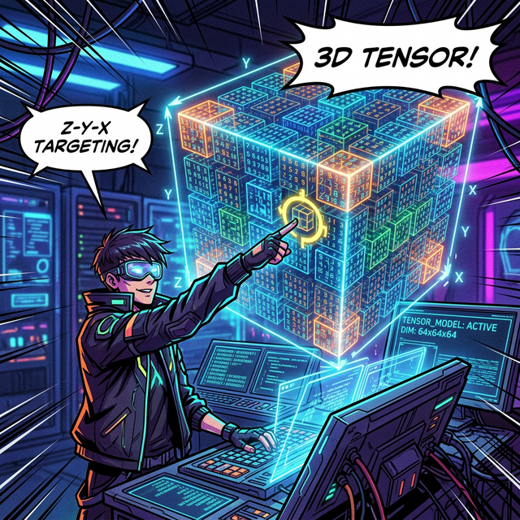

# 3.4.1.8 3D 입체 공간의 구현: 3차원 리스트와 텐서(Tensor)

## 학습목표
`math_story`에서 다뤘던 x, y, z 를 파괴하는 **차원의 확장** 개념을 파이썬 리스트의 대괄호 중첩 극한 `[[[ ]]]` 모델로 이해합니다. 3차원 배열 구조가 현실 세계의 동영상, 3D 모델 게임(마인크래프트 등), 의료 CT 스캔 데이터를 어떻게 완벽히 컴퓨터 메모리에 시뮬레이션 해내는지 학습합니다.

---

## 1. 3차원(3D Dimension) 세계와 데이터 덩어리

이전 장에서 확인한 2차원 행렬(Matrix)은 엑셀이나 평면 사진을 다루기에 충분하지만, '높이'나 '시간'이라는 축이 개입하면 결국 3차원으로 진화해야 합니다.

*   1차원 (선): `[1, 2, 3]`
*   2차원 (면): `[ [1, 2], [3, 4] ]`
*   **3차원 (공간): 면을 겹겹이 포개어 입체 큐브(Cube)로 만듭니다. `[ [ [1], [2] ] ]`** 

수학과 머신러닝의 인공지능 연구소에서 이러한 거대한 다차원의 데이터 보따리를 **텐서(Tensor)**라고 칭합니다. Гугл(Google)의 그 유명한 인공지능 프레임워크인 `TensorFlow`의 이름 또한 이 데이터가 흘러가는(Flow) 구조라는 뜻에서 유래했습니다.


> 💡 **웹툰 비유:** 해커가 공중에 떠 있는 빛나는 입체 데이터를 향해 `[Z][Y][X]` 타겟팅을 시도하는 모습입니다. 2차원의 평면이 시간, 깊이 등 새로운 변수(축)를 만나 겹겹이 쌓아 올려지면 이처럼 거대한 3D 정보의 빌딩(Tensor)이 완성됩니다.

---

## 2. 3중 중첩 리스트: 대괄호 속의 대괄호 속의 리스트

이 구조는 마인크래프트(Minecraft)처럼 3차원 좌표계(가로X, 세로Y, 높이Z)로 이루어진 우주 공간을 완벽히 모방해 냅니다.

```python
# 1개의 2차원 매트릭스 (면 1장)
plane_1 = [
    [1, 2], 
    [3, 4]
]

# 또 하나의 2차원 매트릭스 (면 1장)
plane_2 = [
    [5, 6], 
    [7, 8]
]

# 2D 면(Plane) 2장을 높이/깊이 축으로 겹쳐서 '3D 큐브/텐서' 창조!
tensor_3d = [
    plane_1,  # Z축의 0번 깊이에 있는 평판
    plane_2   # Z축의 1번 깊이에 있는 평판
]

# 한 덩어리로 시각화한 거대한 3D 리스트 아키텍처
cube = [
    [ # Z = 0 층
        [1, 2], # Y=0 (X=0, X=1)
        [3, 4]  # Y=1 (X=0, X=1)
    ],
    [ # Z = 1 층
        [5, 6],
        [7, 8]
    ]
]
```

---

## 3. 좌표 파괴: 3차원 레이저 공간 타겟팅 (Z-Y-X)

3개의 독립된 화살표(차원)가 생겼으므로, 원하는 상자 안의 물건을 끄집어내려면 3개의 주소가 연달아 필요합니다. 파이썬 순수 리스트 계층에서는 **높이(깊이 Z) -> 행(Y) -> 열(X)** 순으로 바깥 대괄호부터 안쪽으로 껍질을 벗기며 접근합니다.


> 💡 **다이어그램 해석:** `cube[1][1][1]` 명령 프롬프트에 맞춰 해커의 프로그램이 입체 큐브를 해체합니다.
> 1) 🔴 **Z 레이저 (`[1]`)**: 앞/뒤 두 장의 평면(Plane) 중 **뒤쪽(Z=1층)** 판넬을 선택.
> 2) 🟢 **Y 레이저 (`[1]`)**: 선택된 판넬의 2줄 중 **아래쪽 행(Y=1)** 을 스캔.
> 3) 🔵 **X 레이저 (`[1]`)**: 해당 행의 두 칸 중 **오른쪽 열(X=1)** 에 정확히 십자선을 꽂아 넣어 최종 타겟 숫자 `8`을 황금빛으로 빼냄.

```python
# cube[깊이_Z층][세로_Y열][가로_X열] 로 3번의 타겟팅 도약이 필요합니다.

# 1. 0층(Z) 블록 더미 통째로 분리 (3D -> 2D 뜯어내기)
print(cube[0]) # 출력: [[1, 2], [3, 4]]

# 2. 0층의 가장 앞(Y=0) 줄기 분리 (2D -> 1D 로 뜯어내기)
print(cube[0][0]) # 출력: [1, 2]

# 3. 마침내 값 추출! (가장 깊숙한 내부 알맹이 1D -> 0D 스칼라 도출)
print(cube[0][0][0]) # 출력: 1

# [실전 연습]
# 1층(Z=1) 뒤편(Y=1) 가장 우측(X=1)의 데이터를 찍어보세요!
print(cube[1][1][1]) # 출력: 8
```

---

## 4. 인공지능이 세계를 인식하는 관점 (N-차원)

3차원 배열을 초과하는 아인슈타인의 시공간이나 초끈 이론의 11차원 같은 수학적 개념들도 컴퓨터에게는 전혀 무섭지 않습니다. 사람 머리로는 4차원 우주의 시계(Hypercube, 튜서랙트)를 그림으로 상상하기 불가능하지만, 파이썬에게는 단순히 **대괄호 껍질 `[` 문자를 하나 더 바깥으로 감싸는 것**으로 **4차원**, **5차원**, **11차원 텐서**를 0.001초 만에 창조해 내기 때문입니다.

```python
# 4차원 텐서 (스칼라 값 0의 세계를 표현)
# 사람: 이건 3D 정육면체를 감싸고 있는 4차원의 시간 축인가?! 너무 복잡하다!
# 파이썬: 훗, 그냥 대괄호가 4번 열렸네 ([[[[0]]]]) 쉽네.

tensor_4d = [[[[0]]]]
print(tensor_4d[0][0][0][0]) # 0 출력
```

**[정리]**
컴퓨터 과학 관점의 데이터 전처리(Data Structure)에서:
*   **1D 리스트:** 고객의 장바구니 품목들 (Vector)
*   **2D 리스트:** 엑셀 표와 같은 데이터 행/열의 집계 시트 (Matrix)
*   **3D 리스트:** 동영상(시간의 흐름에 따른 2D 사진 뭉치), 3D 스캔 (Tensor)
*   **4D~11D 텐서:** 복잡한 기계학습 모델 내부에 숨겨진 다양한 특징 벡터의 가중치 행렬들.

이처럼 파이썬 `[ ]` 배열의 무한한 중첩 포용력은 인공지능과 수학이 복잡하고 기괴한 N차원의 세계를 컴퓨터 메모리 안에서 가지고 놀게 해주는 절대적인 힘의 원천입니다.
