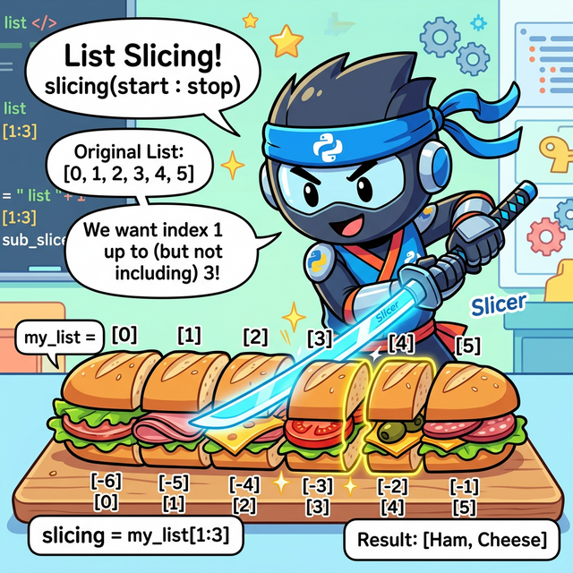

# 3.4.1 파이썬 리스트 (List) 완벽 가이드

## 학습목표
본 장에서는 순차적인 기차 칸처럼 데이터를 마음대로 담고 빼는 **'리스트(List)'**의 본질과, 타 언어의 '배열(Array)'과의 결정적인 차이점을 완벽하게 이해합니다. 더 나아가 슬라이싱, 메모리 참조(Reference)의 위험성, 그리고 파이썬 특유의 우아한 고급 배열 생성 기법인 **리스트 컴프리헨션(Comprehension)**까지 10가지 이상의 실전 예제를 통해 마스터합니다.

---

## 1. 다른 언어는 배열(Array)인데, 왜 파이썬은 리스트(List)일까?

자바(Java)나 C언어를 배우다 온 학생들은 파이썬에 '배열(Array)'이라는 기본 자료형이 없다는 사실에 충격을 받습니다. 파이썬은 왜 배열 대신 **리스트(List)**라는 이름을 고집할까요?


*(웹툰 비유: 왼쪽 흑백의 'Java Array' 구역은 네모 반듯하고 딱딱한 콘크리트 주차장입니다. "차량 5대 제한!"이라고 시멘트로 박혀있고 크기를 절대 늘릴 수 없습니다. 반면 오른쪽의 'Python List' 구역은 마법의 고무 기차입니다. 칸이 모자라면 기차가 쭈욱 늘어나서 새로운 칸을 무한히 만들어내고, 어떤 칸에는 거대한 코끼리를, 바로 다음 칸에는 작은 사과 한 알을 마음대로 섞어서 구겨 넣어도 여유롭게 웃으면서 달립니다.)*

### 🧱 자바 배열 (Array)의 특징 (딱딱한 주차장)
1. **크기 고정**: 처음에 방을 5개 만들겠다고 선언하면, 나중에 방을 6개로 늘리거나 3개로 줄일 수 없습니다. (불변의 시멘트 벽)
2. **단일 타입**: `int[]` 라고 선언하면 그 주차장에는 무조건 '순수 정수'만 들어와야 합니다. 문자나 객체가 섞여 들어오면 즉시 에러가 폭발합니다.

### 🚂 파이썬 리스트 (List)의 특징 (마법의 고무 기차)
1. **무한한 신축성(Dynamic Array)**: 요소를 빼면 알아서 줄어들고, 계속 집어넣으면 운영체제 메모리가 허락하는 한 무한히 길이가 팽창합니다.
2. **타입의 해방**: 파이썬 리스트 안에는 숫자, 글자, 함수, 심지어 **또 다른 리스트까지 짬뽕으로 욱여넣을 수 있습니다.** 파이썬에게 리스트는 단순한 값의 나열이 아니라 **'객체 주소(Reference)들의 묶음'**이기 때문입니다.

---

## 2. 리스트의 기본 형태와 특징

파이썬 리스트는 쉼표로 구분된 항목(요소들)을 대괄호 `[ ]`로 묶어서 표현합니다.

- **기본 형태**: `[item1, item2, item3, ...]`
- 대괄호 안에 들어가는 내용물에는 제한이 없습니다. (숫자, 문자열, 심지어 다른 리스트 객체까지 모두 허용)
- 비어있는 리스트는 단순히 `[]` 로 선언하거나 `list()` 내장 함수를 호출합니다.

```python
empty_list = []                  # 아무것도 없는 텅 빈 리스트
numbers = [1, 2, 3, 4, 5]        # 숫자만 들어있는 리스트
mixed = [1, "Apple", 3.14, True] # 여러 자료형이 마구잡이로 섞여 있는 리스트 (파이썬만의 특권!)
nested = [1, 2, ["A", "B"]]      # 리스트 안에 품어진 또 다른 리스트 (다중/중첩 리스트)
```

**파이썬 리스트의 3대 핵심 특성:**
1. **순서가 보장된다 (Ordered)**: 기차 칸처럼 내가 밀어 넣은 순서대로 0번, 1번... 방이 차례로 배정됩니다.
2. **수정이 자유롭다 (Mutable)**: 한 번 만들어진 리스트라도 문을 열쇠로 따고 들어가 내용물(사과 -> 바나나)을 언제든지 갈아치울 수 있습니다.
3. **중복을 허용한다 (Duplicates Allowed)**: 똑같은 "사과"라는 데이터가 1번 방, 2번 방에 연속으로 여러 번 들어가도 컴퓨터는 전혀 불평하지 않습니다.

---

## 3. 리스트 실전 조작법 (10선 예제)

### 예제 1: 리스트 생성하기 (대괄호와 `list()` 함수)
```python
# 1. 대괄호를 사용하는 가장 보편적인 방법
fruits = ["사과", "바나나", "체리"]

# 2. list() 내장 함수를 사용하는 방법 (주로 다른 타입을 리스트로 형 변환할 때 씁니다)
letters = list("Python") # 문자열을 넣으면 한 글자씩 산산조각 내서 리스트로 만듭니다.

print(fruits)  # ['사과', '바나나', '체리']
print(letters) # ['P', 'y', 't', 'h', 'o', 'n']
```

### 예제 2: range()를 활용한 초고속 리스트 생성
일일이 숫자를 치기 귀찮을 때, 연속된 숫자 기차를 순식간에 뽑아내는 기법입니다.
```python
# 0부터 시작해서 4까지 (5번 튕기기 전)
print(list(range(5)))         # [0, 1, 2, 3, 4]

# 1부터 9까지 2칸씩(홀수) 뛰기
print(list(range(1, 10, 2)))  # [1, 3, 5, 7, 9]
```

### 예제 3: 타겟 조준 타격! 인덱싱 (Indexing)
리스트는 첫 번째 원소를 **무조건 0번 방**부터 세기 시작합니다.
```python
inventory = ["물약", "단검", "방패", "투구"]

print(inventory[0])   # 앞에서 첫 번째 방: 물약
print(inventory[1])   # 앞에서 두 번째 방: 단검

# 🔥 파이썬만의 사기 기술: 음수 인덱스 (뒤에서부터 세기)
print(inventory[-1])  # 맨 뒤에서 첫 번째 방: 투구
print(inventory[-2])  # 맨 뒤에서 두 번째 방: 방패
```

### 예제 4: 무자비한 칼날! 슬라이싱 (Slicing)


*(웹툰 비유: 멋진 닌자 로봇이 파이썬 로고가 박힌 길다란 샌드위치(리스트)를 레이저 카타나(검)로 `[1:4]` 정확히 분할하여 토막을 냅니다. 앞부분에는 양수 번호표(0,1,2..), 꼬리 부분에는 음수 번호표(-1,-2..)가 붙어있어 닌자가 앞뒤 가리지 않고 칼질을 하는 유쾌한 장면입니다.)*

슬라이싱은 원본 샌드위치는 놔두고, 내가 원하는 토막만 잘라서 **새로운 샌드위치 접시(복사본)**에 담아 반환하는 기술입니다. `[시작:끝:보폭]` 규칙을 따릅니다.
```python
numbers = [10, 20, 30, 40, 50, 60]

print(numbers[1:4])   # 1번칸부터 3번칸까지 (4번칸 직전에서 컷!): [20, 30, 40]
print(numbers[:3])    # 처음부터 2번칸까지: [10, 20, 30]
print(numbers[3:])    # 3번칸부터 끝까지: [40, 50, 60]

# 보폭(Step) 점프 스킬
print(numbers[::2])   # 처음부터 끝까지 2칸씩 징검다리 뛰기: [10, 30, 50]
print(numbers[::-1])  # 음수 보폭은 즉시 전체 리스트를 완전 '뒤집어(Reverse)' 버립니다!: [60, 50, 40, 30, 20, 10]
```

### 예제 5: 요소를 마음대로 조작하는 메서드 (`append`, `insert`, `remove`, `pop`)
```python
pack = [] # 텅 빈 인벤토리 가방

# 1. 꼬리에 밀어넣기
pack.append("지도")
pack.append("물병")  # ['지도', '물병']

# 2. 중간에 새치기 삽입 (0번 자리에 횃불을 쑤셔 넣습니다)
pack.insert(0, "횃불") # ['횃불', '지도', '물병']

# 3. 데이터 자체를 이름으로 지명 수배하여 삭제
pack.remove("지도")    # ['횃불', '물병']

# 4. 맨 뒷사람 목덜미를 잡고 밖으로 끄집어내기 (반환)
dropped_item = pack.pop()
print("떨군 아이템:", dropped_item) # 물병
print("남은 가방:", pack)         # ['횃불']
```

---

## 4. 리스트 메모리 주의보 (Shallow Copy Bug)

자바나 C언어에서 파이썬으로 넘어온 개발자들이 단체로 피를 토하는 가장 유명한 파이썬의 **메모리 함정**입니다. 
파이썬의 리스트 요소들은 상자 속에 들어있는 진짜 데이터가 아니라, **저 멀리 있는 진짜 데이터를 가리키는 빨간 레이저 포인터(메모리 참조, Reference)** 일 뿐입니다.


*(다이어그램: `b = a`라는 명령어를 치는 순간, `b` 변수는 a의 도화지를 새롭게 복사해 오지 않습니다. 대신 a의 도화지를 함께 노려보는 레이저 포인터가 됩니다 (Shallow Copy). 이 상태에서 누군가 `b[0] = 99` 라고 바꾸면, 똑같은 도화지를 보고 있던 `a`도 자기 모르게 갑자기 `a[0]`이 `99`로 폭발해버리며 붉게 위험등이 점멸하는 메모리 공유의 공포를 묘사합니다.)*

### 예제 6: 원본이 파괴되는 얕은 복사 함정
```python
a = [1, 2, 3]
b = a          # 🚨 위험! 데이터 복사가 아니라, 뇌파(주소)를 동기화한 것입니다.

b[0] = 99      # B가 자기 방 1번을 바꿨다고 생각했지만...

print("b 리스트:", b) # [99, 2, 3]
print("a 리스트:", a) # [99, 2, 3] -> 😱 충격! 건드리지도 않은 원본 a까지 같이 변질되었습니다!
```

### 예제 7: 원본을 지키는 슬라이싱 분리 방어 (Deep Copy 기초)
해결책은, a의 내용물만 똑같이 베껴서 **물리적으로 완전히 분리된 다른 방(도화지)**을 새로 파서 b에게 주는 것입니다.
```python
a = [1, 2, 3]

# 슬라이싱 [:] 을 쓰거나 .copy() 메서드를 쓰면 방이 완벽히 분리됩니다.
b = a[:]       
c = a.copy() 

b[0] = 99
c[1] = 88

print("원본 a:", a) # [1, 2, 3] -> 복사본들이 난리를 쳐도 원본은 평화롭고 무사합니다!
```

---

## 5. 유용한 리스트 도우미 내장 함수 (zip, enumerate)

리스트를 썰어서 분석판 위에 올릴 때 압도적으로 코드를 줄여주는 파이썬 전용 마법사들입니다.

### 예제 8: zip() 지퍼 채우기 (데이터 조합)
서로 다른 출석부의 이름 리스트와 점수 리스트를 양쪽 지퍼 톱니바퀴 맞물리듯 위에서부터 착착 쌍으로 짝지어(Tuple) 줍니다.
```python
names = ['철수', '영희', '민수']
scores = [90, 85, 100]

# 자바처럼 굳이 0부터 i를 돌리지 않고 리스트 2개를 통째로 물려버립니다.
for name, score in zip(names, scores):
    print(f"학생 이름: {name}, 점수: {score}")
```

### 예제 9: enumerate() 번호표 발급기
단순히 값만 꺼내는 게 아니라, 은행 창구 번호표 기계처럼 **"현재 몇 번째 티켓표를 끊으며 꺼내는 중인지"** 번호표 숫자 인덱스(`index`)를 자동으로 첨부해 줍니다.
```python
movies = ['인셉션', '기생충', '인터스텔라']

# i 에는 번호가, movie 에는 영화 이름이 동시에 들어옵니다.
for i, movie in enumerate(movies):
    print(f"{i}번 랭킹 영화: {movie}")
```

---

## 6. 지상 최강의 마법: 리스트 컴프리헨션 (List Comprehension)

파이썬이 오늘날 빅데이터와 인공지능을 평정할 수 있었던 이유 중 하나입니다. 지루하게 4~5줄씩 쓰던 반복문(`for`)과 조건문(`if`)을 강제로 압축하여, **단 1줄 만에 새로운 리스트를 탄생시키는 예술적인 구문**입니다.

### 문법 구조
`[ 뽑아낼_결괏값 for 변수 in 박스 if 조건문 ]`

### 예제 10: 컴프리헨션의 압도적인 단축 비교
```python
# [과제] 0부터 9까지의 숫자 중, '짝수'만 찾아서 각각 '제곱'을 한 리스트를 만들어라!

# ❌ 구식 언어(자바/C) 관성으로 짠 지루한 코드 (총 5줄 차지, 느리고 못생김)
result = []
for x in range(10):
    if x % 2 == 0:
        result.append(x ** 2)

print("구식 방법:", result) # [0, 4, 16, 36, 64]

# 🐍 파이썬 장인의 리스트 컴프리헨션 코드 (단 1줄, 속도도 훨씬 빠름!)
# x**2 를 뽑을 거야! <- for x 방을 하나씩 열면서 <- if x가 짝수일 때만!
magical_result = [x ** 2 for x in range(10) if x % 2 == 0]

print("마법의 1줄:", magical_result) # [0, 4, 16, 36, 64]
```

### 예제 11: 이중 `if-else` 구조 때려 넣기
컴프리헨션 안에서 조건에 따라 아예 출력되는 값을 "홀", "짝" 글씨로 다르게 분기할 수도 있습니다.
```python
# 1부터 5까지 숫자를 꺼내면서, 짝수면 'Even', 홀수면 'Odd'라는 글씨를 강제로 박아 넣습니다.
binary_labels = ['Even' if i % 2 == 0 else 'Odd' for i in range(1, 6)]

print(binary_labels) # ['Odd', 'Even', 'Odd', 'Even', 'Odd']
```

---

## ☕ Java vs 🐍 Python 스나이퍼 비교

### 1. 배열 선언의 족쇄 풀기
*   **Java**: `int[] arr = new int[5];` 처럼 최초 선언 시 타입과 크기의 무덤을 파야 합니다. 데이터를 추가하려면 무겁기 짝이 없는 `ArrayList` 객체를 따로 수입(`import java.util...`)해서 써야 합니다.
*   **Python**: 그냥 `arr = []` 이거면 끝입니다. 알아서 메모리 끝까지 늘어나고, 숫자와 글자를 짬뽕으로 넣어도 운영체제가 평온하게 받아줍니다.

### 2. 컴프리헨션이라는 무기의 차이
*   **Java**: 1부터 100까지 홀수의 3배수를 구하려면 `Stream API`를 써서 `.filter()`, `.map()`, `.collect()` 체이닝으로 화면을 꽉 채워야 합니다.
*   **Python**: `[x*3 for x in range(1, 101) if x % 2 == 1]` 깔끔하게 한 줄로 압살해 버립니다.

---

## 🎧 Vibe Coding

> **🗣️ 학생 프롬프트 (AI에게 이렇게 명령해 보세요):**
> "파이썬 리스트 컴프리헨션을 써서 구구단 3단의 결과(3, 6, 9... 27)를 단 한 줄 코드로 리스트 안에 쓸어 담아 출력해 봐. 그리고 방금 배운 `enumerate`를 사용해서 그 리스트를 `1번째 타격: 3`, `2번째 타격: 6` 하는 식으로 콘솔에 주르륵 출력해 주는 코드를 작성해 줘."

---

## 코딩 영단어 학습 📝

*   **List**: 목록, 명단. (단순히 데이터들이 한지붕 아래 순서대로 옹기종기 모여 있는 가방입니다. 고정된 크기(Array)가 아니라는 점이 가장 중요합니다.)
*   **Comprehension**: 이해력, 포괄, 함축. (원래 뜻은 머리에 쏙 집어넣어 이해한다는 뜻이지만, 코딩에서는 방대한 for문과 if문의 로직을 압축기계에 넣어 1줄짜리 문장으로 '함축/내포'시켜버렸다는 우아한 뜻입니다.)
*   **Slice (Slicing)**: 얇게 베다, 조각내다. (샌드위치를 칼로 단면을 얇게 썰어내듯(Slice), 기나긴 리스트 데이터의 허리를 싹둑 잘라 원하는 인덱스 덩어리만 도려내는 섬세한 칼질 기술입니다.)
*   **Append**: 끝에 덧붙이다, 부록. (책 맨 뒷장에 부록(Appendix)을 끼워 넣듯, 리스트의 기존 내용물을 다치게 하지 않고 맨 뒷줄에 조용히 슬쩍 추가하는 행위입니다.)
*   **Pop**: 뻥 하고 터지다, 튀어나오다. (풍선이 톡 터지듯(Pop), 리스트 맨 뒤에 있는 요소를 끄집어내어 내 손으로 튕겨 넘겨주고 리스트 안에서는 흔적을 지워버리는 경쾌한 메서드입니다.)

