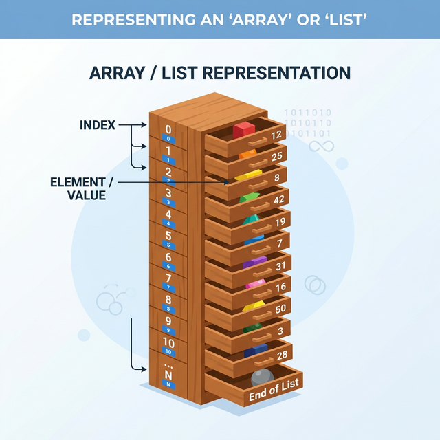

# 3.4.1 표준 파이썬 기본 자료 구조

## 3.4.1 리스트

## 학습목표
본 장에서는 순차적인 기차 칸처럼 데이터를 담는 **'리스트(List)'**의 개요와 데이터가 메모리 공간을 공유하는 **참조 주소(Reference)** 개념을 파악합니다. 또한 인덱싱, 추가(`append`), 삭제 연산 등 핵심 메서드 기능과 파이썬 특유의 우아한 배열 생성 기법인 **컴프리헨션(Comprehension)**을 완벽히 마스터합니다.

### 리스트 개요와 생성



파이썬에서 리스트(list)는 여러 요소(elements)를 담을 수 있는 가변(mutable)한 데이터 구조이다. 리스트는 목록이라고도 부르며 리스트의 구성 요소는 항목 또는 원소라 한다. 리스트는 대괄호 `[ ]`로 표현되며, 요소들은 쉼표 `,` 로 구분해 기술하고 순서를 가지고 있다.

가장 기본적인 방법으로, 대괄호를 사용하여 리스트를 생성할 수 있다. 다음 코드로 변수 `lst`에 10, 20, 30을 항목으로 하는 리스트를 생성해 저장한다. 리스트의 자료형은 `class 'list'`이다.

*첫 코드에서 변수 이름 `lst`를 `list`로 잘못 입력하지 않도록 주의하자.*

```python
lst = [10, 20, 30]
print(lst, type(lst))
```
**출력:**
```
[10, 20, 30] <class 'list'>
```

다음처럼 `list()` 함수를 사용해 리스트를 생성할 수도 있다. 인자로 리스트나 튜플을 사용한다.

```python
list(['java', 'python', 'R'])
```
**출력:**
```
['java', 'python', 'R']
```

함수 `range()`를 인자로 사용해서 정수의 나열을 갖는 리스트를 만들 수 있다.

```python
print(list(range(5)))
print(list(range(1, 10, 2)))
```
**출력:**
```
[0, 1, 2, 3, 4]
[1, 3, 5, 7, 9]
```

### [실전 예제] 게임 인벤토리 만들기 (리스트 기초)

리스트는 **순서(Order)**를 가지고 데이터를 나열하여 저장하는 '가방'과 같습니다. 게임 캐릭터의 인벤토리(아이템 목록)를 상상해 보세요.

```python
# 3.4.1 가방(리스트) 생성
items = ["포션", "장검", "방패"]

# 3.4.1 아이템 확인 (인덱싱: 0부터 시작)
print(items[0])   # 첫 번째 아이템: 포션
print(items[-1])  # 마지막 아이템: 방패

# 3.4.1 새로운 아이템 획득 (추가)
items.append("지도") 
print(items) # ['포션', '장검', '방패', '지도']

# 3.4.1 아이템 사용 (삭제)
items.remove("포션") 
print(items) # ['장검', '방패', '지도']

# 3.4.1 아이템 개수 세기 (길이)
print(len(items)) # 3.4.1 ```

### 리스트의 본질: 참조주소의 배열 (Array of References)
```

파이썬 리스트는 단순히 값을 박스 안에 직접 담는 것이 아니라, 값들이 저장된 **메모리 주소(Reference)**를 담고 있는 주소록과 같습니다.

```python
a = [1, 2, 3]
b = a        # 변수 b에 a의 '메모리 주소'만 복사됨 (같은 객체를 공유함)
b[0] = 99

print(a) # [99, 2, 3] -> 복사본을 수정했는데 원본도 같이 바뀝니다! 😱
```

리스트를 다른 변수에 할당(`=`)할 때 이 주소 복사(얕은 할당) 성질을 이해해야 데이터가 의도치 않게 변조되는 버그를 막을 수 있습니다. 원본을 유지한 채 별개의 복사본을 만들려면 슬라이싱 `[:]`이나 `copy()` 메서드를 통한 얕은 복사(Shallow Copy), 깊은 복사(Deep Copy)를 써야 합니다.

```python
b = a[:]     # 새로운 리스트로 내용물만 복제하여 완전히 다른 방을 씀
# 3.4.1 또는
b = a.copy()
```

### 첨자 인덱싱과 슬라이싱

리스트에는 어떠한 자료형도 삽입될 수 있으며 순서가 있다. 리스트는 첨자로 원소를 참조하며 부분 리스트를 슬라이싱으로 참조할 수 있다.

```python
lst = [10, 3.92, 3 > 4, 'list']

print(lst[0], lst[2])
```
**출력:**
```
10 False
```

리스트 슬라이싱 결과는 리스트이다. 다음은 첨자 2와 3으로 구성된 리스트를 반환한다.

```python
lst[2:4]
```
**출력:**
```
[False, 'list']
```

인덱싱과 슬라이싱에 사용되는 첨자는 음수도 가능하다.

```python
print(lst[2:])
print(lst[:4])
print(lst[-1:-4:-1])
```
**출력:**
```
[False, 'list']
[10, 3.92, False, 'list']
['list', False, 3.92]
```

### 메소드 append() insert()

리스트는 어떠한 자료형도 항목으로 구성될 수 있다. 리스트의 메소드 `append()`는 리스트에 새로운 항목을 마지막에 추가한다. 다음 리스트 `a`는 람다 함수 등 다양한 자료형을 담는다. 코드 `a.append('py')`로 마지막에 `'py'`를 추가한다.

```python
import math as m
a = [m.pi, 30, 10 > 4, 'list', lambda x: x**3]

a.append('py')
a
```
**출력:**
```
[3.141592653589793, 30, True, 'list', <function __main__.<lambda>(x)>, 'py']
```

메소드 `insert(i, item)`은 리스트의 특정 위치 `i`에 요소 `item`을 삽입한다. 다음 코드로 함수 `add2`를 리스트 `a`에 두 번째 항목으로 삽입한 후, 바로 `a[1](10, 20)`으로 함수 `add2(10, 20)`를 호출한다. `a[1]`이 함수 `add2`의 객체이므로 가능하다.

```python
def add2(x, y):
    return x + y

a.insert(1, add2)
a[1](10, 20)
```
**출력:**
```
30
```

이제 리스트 `a`는 7개 다양한 자료형의 항목이 존재한다.

```python
a
```
**출력 (예시):**
```
[3.141592653589793,
 <function __main__.add2(x, y)>,
 30,
 True,
 'list',
 <function __main__.<lambda>(x)>,
 'py']
```

메소드 `a.remove(item)`으로 리스트 `a`에서 특정 `item`을 찾아 삭제한다. 다음 코드 `a.remove(30)`으로 항목 30을 삭제한다.

```python
a.remove(30)
a
```
**출력 (예시):**
```
[3.141592653589793,
 <function __main__.add2(x, y)>,
 True,
 'list',
 <function __main__.<lambda>(x)>,
 'py']
```

메소드 `a.pop()`은 리스트에서 마지막 항목을 제거하고 반환한다.

```python
a.pop()
```
**출력:**
```
'py'
```

이제 리스트 `a`는 5개의 항목이 남아있다.

```python
a
```

### 리스트 컴프리헨션(List Comprehension)

리스트 컴프리헨션은 파이썬에서 리스트를 간결하게 생성하는 방법 중 하나이다. 즉, 반복문과 조건문을 사용하여 리스트를 생성하는 표현식이다. 리스트 컴프리헨션은 일반적으로 다음과 같은 형식을 가진다.

- `[expression for item in iterable if condition]`
    - `expression`: 각 요소를 생성하는 표현식
    - `item`: iterable에서 가져온 요소
    - `iterable`: 반복 가능한 객체 (예: 리스트, 튜플, 범위 등)
    - `condition` (선택사항): 요소를 선택하는 조건

복잡한 리스트 컴프리헨션을 사용하지 않는다면 리스트 컴프리헨션은 다음과 같은 장점이 있다.
- **간결함**: 리스트 컴프리헨션을 사용하면 반복문을 사용하는 일반적인 방법보다 훨씬 간결하고 가독성이 좋다.
- **속도**: 리스트 컴프리헨션은 내부적으로 최적화되어 있어, 일반적으로 반복문보다 더 빠르게 실행된다.

한 줄에 표현되기 때문에 코드를 작성하고 이해하기가 훨씬 쉽다. 또한 한 줄에 모든 로직을 포함하기 때문에 변수의 스코프와 관련된 오류를 줄일 수 있다.

다음의 리스트 컴프리헨션을 사용하여 손쉽게 리스트를 생성할 수 있다.

```python
my_list = [x for x in range(10)]
my_list
```
**출력:**
```
[0, 1, 2, 3, 4, 5, 6, 7, 8, 9]
```

```python
[x for x in range(10) if x % 2 == 1]
```
**출력:**
```
[1, 3, 5, 7, 9]
```

다음 코드처럼 `if else` 조건 구문을 앞에 삽입해 항목에 조건에 따라 다른 값을 항목으로 만들 수 있다. 다음 코드로 짝수는 `even`으로, 홀수는 `odd`를 삽입하도록 한다.

```python
['even' if i % 2 == 0 else 'odd' for i in range(1, 11)]
```
**출력:**
```
['odd', 'even', 'odd', 'even', 'odd', 'even', 'odd', 'even', 'odd', 'even']
```

다음 코드로 바깥쪽과 안쪽의 두 반복문을 결합하여 2차원 리스트를 생성한다. 변수 `i`의 반복문이 실행되는 각 반복마다 안쪽 리스트에서 `i`를 5회 삽입하는 반복을 실행한다. 결과적으로 바깥쪽 리스트에는 세 개의 안쪽 리스트가 포함되어 있다. 각 안쪽 리스트는 0부터 2까지의 숫자를 5개 갖게 된다.

```python
[[i for j in range(5)] for i in range(3)]
```
**출력:**
```
[[0, 0, 0, 0, 0], [1, 1, 1, 1, 1], [2, 2, 2, 2, 2]]
```

다음 코드로는 내부의 리스트가 외부 반복의 `i`에 따라 변하도록 한다. 따라서 다음과 같은 2차원 리스트를 생성한다.

```python
[[i for j in range(i, i+6)] for i in range(3)]
```
**출력:**
```
[[0, 1, 2, 3, 4, 5], [1, 2, 3, 4, 5, 6], [2, 3, 4, 5, 6, 7]]
```

### 유용한 내장 반복 함수: zip()과 enumerate()

데이터 전처리 파이프라인이나 반복문을 짤 때 매우 직관적이고 유용한 내장 함수들이 있습니다.

**1. `zip()`: 지퍼처럼 잠그기**

여러 개의 리스트를 순서대로 하나씩 짝지어서 묶어주는 역할을 합니다. 두 개의 리스트가 지퍼처럼 맞물려 하나의 쌍(Tuple)이 됩니다.

```python
names = ['철수', '영희']
scores = [90, 80]

for name, score in zip(names, scores):
    print(f"{name}: {score}")
# 3.4.1 철수: 90
# 3.4.1 영희: 80
```

**2. `enumerate()`: 번호표 붙이기**

반복문에서 리스트의 값만 꺼내는 것이 아니라, 그 값이 **몇 번째인지(인덱스 번호)**도 같이 튜플 형태로 알려줍니다.

```python
fruits = ['사과', '바나나', '포도']

for i, fruit in enumerate(fruits):
    print(f"{i}번 과일: {fruit}")
# 3.4.1 번 과일: 사과
# 3.4.1 번 과일: 바나나
# 3.4.1 번 과일: 포도
```

## 정리
지금 당장 여러분이 엑셀에서 다루던 흔한 데이터 열(Column) 하나가 파이썬 안에서는 바로 이 무한히 늘어나는 리스트 형태로 고스란히 옮겨져 처리됩니다. 특히 조건에 맞춰 데이터를 즉석에서 걸러내 만드는 리스트 컴프리헨션 기술과 조력자 스킬인 `zip()`, `enumerate()` 함수는 여러분이 작성할 실무 처리 스ค립트 코드의 길이를 대폭 줄이고 가독성을 미친 듯이 향상해 줄 필수 마법들입니다.
