# 3.4.2.2 딕셔너리 사물함 사용법: 생성 규칙과 조작 수술

## 학습목표
`f(x)=y` 해시 매핑의 논리를 실제 파이썬 코드상에서 어떻게 만들어내고 부수는지 `C.R.U.D`(생성, 탐색, 수정, 삭제) 4단계 동작을 통해 배웁니다. 더불어 자물쇠(Key)가 되기 위한 절대적인 파이썬 문법의 자격 요건(불변성 Immutable)을 심도 있게 파헤칩니다.

---

## 1. 사물함의 열쇠(Key)에 박힌 절대 마법 규칙 

딕셔너리의 열쇠(Key) 자물쇠에는 아무 단어나 들어갈 수 없습니다. 파이썬 사물함 금고는 **"절대 모양이 변하지 않는 단단한(불변, Immutable) 재질의 열쇠만"** 금고키로 꽂도록 허락합니다.

만약 고무찰흙처럼 크기가 쭉쭉 변하는 '리스트(List)' 같은 걸 열쇠로 박아두면, 나중에 파이썬 해시(Hash) 스캐너가 열쇠의 해시 암호를 계산할 때 값이 이리저리 뒤틀려 영영 금고를 못 열게 되기 때문입니다.

> **✅ 허락되는 단단한 열쇠 후보군:**
> `문자열("Apple")`, `정수(42)`, `실수(3.14)`, `튜플((1, 2))` 등은 안의 내용물이 변하지 않아 통과됩니다.
> 
> **🚨 절대 불가능한 금지 열쇠 후보군:**
> `리스트([1, 2])`, `딕셔너리({'a':1})`, `집합({1})` 등은 크기가 변하므로 자리에 꽂자마자 `TypeError`를 토해냅니다.

*(물론 열쇠가 아닌 내용물 **Value** 자리에는 크기가 변하는 코끼리든 리스트든 또 다른 딕셔너리든 전부 다 때려 넣을 수 있습니다. 무한한 포용력을 자랑합니다.)*

---

## 2. 딕셔너리의 C.R.U.D (Create, Read, Update, Delete)

프론트엔드와 백엔드 등 모든 프로그램의 기본은 정보를 **만들고(C), 읽고(R), 고치고(U), 지우는(D)** 4단계뿐입니다.
딕셔너리의 기본 사물함 역시 이 체계적인 4동작을 직관적으로 수행합니다.


> 💡 **다이어그램 해석:** 단 하나의 문법 체계(`dict["Key"]`)만으로 이 4가지 조작 수술을 전부 다 처리하는 경이로운 파이썬 다용도 칼날의 시각적 형태입니다. 새로운 값을 넣고, 빼고, 덮어쓰고, 문을 날려버리는 과정을 관찰하세요.

### ① 생성 (Create): 빈 금고를 짓고 물건 넣기
중괄호 `{ }`가 딕셔너리의 영혼입니다. 리스트는 대괄호 `[ ]` 였죠. 
반드시 `열쇠 : 값`의 콜론 짝꿍 형태로 방을 설계해야 합니다.

```python
# 1. 텅 빈 사물함 계약하기
inventory = {} 

# 2. 계약하자마자 사물함에 데이터 쓸어 담기! (콤마로 구분)
character = {
    "name": "홍길동",  # 문자열 키
    "level": 1,      # 동일하게 문자열 키
    99: "max_hp"     # 숫자도 키로 꽂을 수 있습니다.
}
```

### ② 추가 및 수정 (Update / Insert 똑같음)
딕셔너리의 세계에서는 방 번호(0번 방)의 개념이 없기 때문에 방을 '추가'하는 명령어나 '수정'하는 명령어가 **동일합니다.** 
> "해당 열쇠가 이미 있다면 값을 덮어써 수정하고, 처음 보는 열쇠라면 즉시 새로운 사물함을 건설하라!" 

```python
profile = {"job": "전사", "hp": 100}

# [수정] 이미 hp 마크가 박힌 방이 있으므로, 안의 내용물만 50으로 교체(Update)
profile["hp"] = 50 

# [추가] mp 마크가 달린 방은 없으므로, 즉시 새로 벽을 허물어 방을 만듦(Insert)
profile["mp"] = 300 

print(profile) # {'job': '전사', 'hp': 50, 'mp': 300}
```

### ③ 읽기 탐색 (Read)
가장 많이 쓰이는 작업입니다. 원하는 값을 보기 위해 오직 `Key`라는 네임택 만을 스캐너에 밀어 넣습니다.

```python
print(profile["job"])  # 출력: 전사
# print(profile[0])    # 🚨 리스트 버릇대로 0번 방을 찾으면 즉시 KeyError 사망!
```

### ④ 무자비한 철거: 폭파 (Delete)
해당 사물함 정보가 아예 쓸모없어졌을 때 `del` 키워드의 C4 폭탄을 달아 사물함을 메모리에서 통째로 소멸시킵니다.
```python
del profile["hp"]

print(profile) # {'job': '전사', 'mp': 300} -> hp 방이 아예 흔적 없이 날아감
```

단순한 이 4가지의 무빙만으로도 딕셔너리는 거의 모든 형태의 게임 프로필, 앱 데이터, 주소록을 완벽하게 관장할 수 있는 지배력을 손에 쥐게 됩니다. 다음 장에서는 서버를 안정적으로 지켜내는 실무 방어막 기술들을 배워보겠습니다.
