# 3.4.2.3 딕셔너리 방어선 구축: 생명 연장을 위한 핵심 메서드

## 학습목표
에러(KeyError)가 한 번 터지면 전체 서버가 마비되는 상용 서비스에서 개발자들의 생명줄이 되어주는 절대 방어막 **`.get()` 탐색 기술**을 체화합니다. 또한 다가오는 JSON 데이터 파싱과 API 교류에 특화된 두 딕셔너리의 합병 **`.update()`** 와, 리스트처럼 덩어리를 잘라내는 **`.items()`** 분석 도구를 마스터합니다.

---

## 1. 🛡️ 딕셔너리 최대 무기: `.get()` 생명 보호막

초보 개발자와 프로 개발자를 구분하는 가장 강력한 잣대 하나를 꼽으라면 바로 `dict["없는키"]` 를 쓰느냐, `dict.get("없는키")` 를 쓰느냐입니다. 우리가 무지성으로 일반 대괄호를 사용해 없는 단어를 사물함에서 꺼내려 하면, 파이썬은 자비 없이 `KeyError`를 화면에 토해내며 **서버의 심장을 즉시 멈춰(다운) 버립니다.**


> 💡 **다이어그램 해석:** 일반 인덱싱(대괄호 폭탄)이 없는 키를 찾으려 들이박으면, 내부에서 감당하지 못하고 `KeyError` 대폭발을 일으켜 서버가 정지합니다. 반면, 우측의 초록색 `.get()` 방어막은 잘못된 키가 들어와도 부드럽게 튕겨내며 시스템 폭발을 흡수하고 **지정한 안전모(기본값)**를 돌려보내 줍니다.

### [실전 예제] 백엔드 유저 프로필 조회 시스템 방어

```python
user_login_info = {
    "id": "jinydev",
    "email": "jiny@test.com"
} # 🚨 이 유저는 phone 번호가 없습니다!

# ❌ 초보자의 실수: 프로그램 사망 트리거
# print(user_login_info["phone"]) -> KeyError 발생! 뒤 라인부터 코드 아예 실행 불가능!

# O 프로의 방패 전개: "phone이라는 열쇠로 열되, 없으면 쿨하게 '010-0000-0000'이라고 쳐 줘!"
safe_phone = user_login_info.get("phone", "010-0000-0000")

print(f"가입자 전화번호: {safe_phone}") 
# 결과: "가입자 전화번호: 010-0000-0000" (자연스럽게 에러 없이 대처 완료)

# 만약 기본값을 안 주면 파이썬은 조용히 None (빈 껍데기)을 쥐여줍니다.
empty_check = user_login_info.get("address")
print(empty_check) # 결과: None
```

`.get()`은 특히 공공 API에서 데이터를 긁어와(JSON) 내 데이터베이스에 저장할 때, **데이터가 구멍 났을까 봐 조마조마하며 수십 개의 if 문을 도배하는 대신** 단 1줄의 우아한 방어 코드로 끝낼 수 있어 백엔드 서버 개발 시 숨 쉬듯 코딩하게 되는 절대 마법입니다.

---

## 2. 융합과 병합: `.update()` 스킬

여러 경로에서 수집된 두 개의 거대한 딕셔너리 정보판(예: 사용자 기본 정보 + 결제 정보)을 하나로 융합하고 싶을 때가 있습니다. 파이썬에서는 `.update()` 함수를 써서, A 금고 위에 B 금고 내용물을 통째로 시원하게 들이부을 수 있습니다.

> **⚠️ 병합 충돌 규칙:**
> "먼저 온 놈이 왕이 아니다. 가장 **나중에 들어온(Update된) 데이터**가 중복된 키(Key)의 왕좌를 무자비하게 덮어써서 차지한다!"

```python
# A 데이터베이스 (기존 시스템)
old_system = {'x': 1, 'y': 2}

# B 데이터베이스 (방금 도착한 새로운 업데이트 패치 요약본)
new_patch = {'y': 99, 'z': 4}  # y가 중복된다!

# 낡은 시스템에 새로운 패치 금고를 들이붓기
old_system.update(new_patch)

# y의 값이 2에서 가장 최신인 99로 자연스럽게 덮어 씌워졌습니다!
print(old_system) 
# 결과: {'x': 1, 'y': 99, 'z': 4}
```

---

## 3. 부검 해체기: `.keys()`, `.values()`, `.items()`

우리가 리스트(배열)를 좋아하던 이유는 `for` 반복문을 썼을 때 순서대로 차례차례 이빨을 뽑듯 데이터를 열람하기 좋았기 때문입니다. 파이썬 딕셔너리도 이 세 가지 부검 칼날을 쓰면 자신을 분해해 순차적인 리스트 묶음처럼 동작하게 만들어 줍니다.

```python
mart = {'라면': 1200, '과자': 800, '물': 500}

# 1. 뼈 날대(열쇠)들만 수집하기
print(mart.keys())    
# 결과: dict_keys(['라면', '과자', '물']) -> 장바구니 품목명만 검사할 때

# 2. 내장(값)들만 수집하기
print(mart.values())  
# 결과: dict_values([1200, 800, 500]) -> 쇼핑 총 가격 합산할 때 ( sum(mart.values()) )

# 3. 뼈와 살을 묶어서(Tuple) 통째로 꺼내기 (🌟 가장 많이 씀)
print(mart.items())   
# 결과: dict_items([('라면', 1200), ('과자', 800), ('물', 500)])
```

### 💡 `.items()` 와 `for` 문의 궁극의 콤보
실무에서 딕셔너리의 내용물을 화면에 출력할 때 90% 이상은 무조건 이 공식 구문을 사용합니다. `items()`가 뱉어내는 튜플 덩어리를 2개의 변수(`item`, `price`)가 찢어 받습니다.

```python
# 영수증 출력 기계
for item, price in mart.items():
    print(f"상품명: {item} / 계산하실 금액: {price}원")

# 출력결과:
# 상품명: 라면 / 계산하실 금액: 1200원
# 상품명: 과자 / 계산하실 금액: 800원
```

다음 장에서는 우리가 `01_list` 편에서 보았던 궁극의 1줄짜리 요약 압축기능인 **딕셔너리 컴프리헨션(Dictionary Comprehension)**을 통해 초고속으로 사물함을 조립하는 마법을 살펴보겠습니다.
