# 3.4.2.4 단 한 줄의 미학: 딕셔너리 컴프리헨션(Comprehension)

## 학습목표
`for`문 여러 줄을 사용해 딕셔너리 금고를 하나씩 채우던 원시적이고 장황한 코드를 버리고, 파이썬 특유의 압축 기술인 **컴프리헨션(Comprehension)** 과 여러 리스트의 짝을 찾아 지퍼(Zip)를 채우는 **`zip()` 함수**를 결합하여 단 한 줄 만에 대형 딕셔너리를 생산하는 고급 테크닉을 익힙니다. 

---

## 1. 두 쌍의 리스트를 뭉쳐서 사전으로 만들기 (`zip()`)

실무를 하다 보면, 데이터베이스 테이블이나 외부 파일에서 키(Key) 묶음과 형태가 다른 값(Value) 묶음을 각각 분리된 리스트 조각으로 전달받을 때가 많습니다. 이것들을 짝꿍끼리 묶어 하나의 거대한 딕셔너리로 결합해야 비로소 데이터 처리가 편해집니다.

이때 옷의 양쪽 지퍼를 서로 엇갈리게 맞물려 하나로 잠그는 **`zip()` 내장 함수**가 환상적인 활약을 합니다.


> 💡 **다이어그램 해석:** 파란색 열쇠(문자열 그룹)와 초록색 값(가격 숫자 그룹)이 컴프리헨션과 `zip()` 결합 기계를 통과하면, 위아래로 한 쌍씩 찰싹 달라붙으며 노란색의 단단한 통짜 딕셔너리 블록 `{Key: Value}` 으로 재탄생합니다.

### 🐛 `for`루프를 쓴 고전적인(비효율적인) 융합 방식
```python
names = ['Apple', 'Banana', 'Cherry']
prices = [1.2, 0.5, 2.5]

# 고전 시대의 4줄짜리 노가다 방식
mart_dict = {}                          # 1. 일단 빈껍데기를 만들고
for n, p in zip(names, prices):         # 2. 두 리스트를 zip으로 묶어 하나씩 뽑으면서
    mart_dict[n] = p                    # 3. 빈껍데기에 수동으로 계속 밀어 넣는다

print(mart_dict)
# {'Apple': 1.2, 'Banana': 0.5, 'Cherry': 2.5}
```

### 🦋 딕셔너리 컴프리헨션 (1라인 단축 마법)
위 4줄짜리 코드를 파이썬의 꽃, 컴프리헨션(Comprehension)을 쓰면 그저 중괄호 `{ }` 안에 공장 조립 라인을 구겨 넣는 것만으로 한 번에(1줄) 처리가 끝납니다!

```python
names = ['Apple', 'Banana', 'Cherry']
prices = [1.2, 0.5, 2.5]

# "n(이름)을 키로 삼고, p(가격)를 값으로 삼아라! 단, names와 prices를 zip으로 순환하면서!"
fast_mart = { n : p for n, p in zip(names, prices) }

print(fast_mart)
# {'Apple': 1.2, 'Banana': 0.5, 'Cherry': 2.5}
```

---

## 2. 조건부 딕셔너리 컴프리헨션 (필터링)

컴프리헨션 기계 안에 단순히 루프만 돌리는 게 아니라, `if` 문의 거름망(필터)을 한 겹 더 끼워 넣어서 **특정 조건을 만족하는 쓸모 있는 데이터만 통과시켜** 딕셔너리를 압축 건조할 수도 있습니다.

### [실전 예제] 적자 매출 매장만 솎아내어 사전 리스트 만들기

```python
branches = ['Seoul', 'Busan', 'Jeju', 'Daegu']
profits = [5000, -1200, 300, -50] # 마이너스는 적자

# "지점명을 키(b)로, 수익을 값(p)으로 뽑아라. 단, 수익(p)이 0보다 작은(적자) 녀석들만 골라서 넣어라!"
deficit_branches = { b : p for b, p in zip(branches, profits) if p < 0 }

print(deficit_branches)
# 결과: {'Busan': -1200, 'Daegu': -50} -> 적자 매장 2곳만 깔끔하게 추려짐!
```

---

## 🎧 Vibe Coding (프롬프트 활용법)

딕셔너리와 컴프리헨션을 배웠다면 이제 AI에게 복잡한 데이터를 던져주고 한 줄 압축 스나이퍼 코드를 뽑아달라고 지시할 수 있습니다.

> **🗣️ 학생 프롬프트 (AI에게 이렇게 명령해 보세요):**
> "파이썬 `zip()`과 딕셔너리 컴프리헨션을 활용해서 코드 1줄짜리 요약본을 만들어줘.
> 1. `employees = ['John', 'Jane', 'Tom', 'Alice']`
> 2. `sales = [300, 500, 150, 600]`
> 3. 이 두 개의 리스트를 융합화대, 판매량(sales)이 400개 이상인 우수 직원만 걸러낸 `{이름: 판매량}` 형태의 우수 실적자 딕셔너리를 단 **1줄의 코드**만 써서 추출하고 결과를 `print()` 시켜줘."

**[정리]**
딕셔너리는 속도 지연(O(N))을 허용하지 않는 **천재적인 O(1) 해시(Hash) 스캐너**이자, 수학의 $f(x)=y$ 사상(Mapping)을 실현하는 파이썬 최고의 무기입니다. 앞서 배운 생명줄 `.get()`과 오늘 다룬 `Comprehension` 1라인 병합기를 마스터한다면 어떤 데이터 전처리 작업에서도 코드가 뻗어버리는 일 없이 우아하게 살아남으실 수 있습니다!
