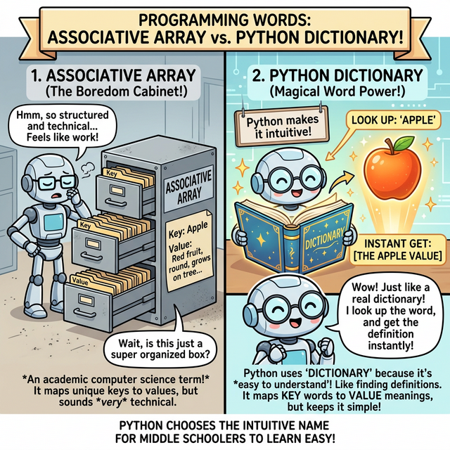

# 3.4.2 파이썬 딕셔너리 (Dictionary) 완벽 가이드

## 학습목표
본 장에서는 맹목적인 기차 칸 순서표(인덱스) 대신, 고유한 이름표(Key)를 달아 데이터를 쌍으로 보관하는 **'딕셔너리(Dictionary)'**의 내부 작동 원리와 극대화된 검색 속도를 배웁니다. 10개 이상의 실전 예제를 통해 데이터를 조작하는 기본기부터 시작해, 죽지 않는 단단하고 방어적인 코드를 작성하게 해주는 `get()` 탐색 메서드, 배열을 합병하는 `update()` 스킬과 마법의 딕셔너리 컴프리헨션(Comprehension)까지 체득합니다.

---

## 1. 다른 언어는 '연관 배열(Associative Array)'인데 왜 파이썬은 '딕셔너리(사전)'인가요?

자바(Java)나 PHP 등 다른 언어를 배우다 오신 분들은 파이썬에 '연관 배열(Associative Array)'이나 '해시맵(HashMap)'이라는 이름 대신 **'딕셔너리(Dictionary)'**라는 용어가 표준이라는 점에 의문을 품습니다. 


*(웹툰 비유: 왼쪽은 딱딱하고 지루해 보이는 철제 회색 사물함입니다. 'Associative Array'라는 어려운 학술적 이름표가 붙어있어 학생들이 거리감을 느낍니다. 오른쪽은 빛이 나는 마법의 국어사전(Dictionary) 책입니다. 꼬마 마법사가 사전을 펼쳐 'Apple(열쇠)'이라는 단어를 찾자마자 홀로그램으로 빨갛고 먹음직스러운 진짜 '사과(값)' 데이터가 튀어나옵니다. 직관적이고 친숙한 비유입니다.)*

*   **학술적 용어 (연관 배열)**: 기존 언어들은 '열쇠(Key)와 데이터(Value)가 서로 연관(Associate)되어 묶여있는 배열 공간'이라는 컴퓨터 공학의 딱딱한 작동 원리를 그대로 이름에 붙였습니다.
*   **파이썬의 철학 (딕셔너리)**: 파이썬은 **"사람이 이해하기 쉬운 코드가 최고다"**라는 철학을 가집니다. 우리가 모르는 영단어(Key)를 국어사전에서 찾으면 그 뜻과 예문(Value)이 바로 튀어나오듯이, 코드의 동작 자체가 현실의 **'사전(Dictionary) 찾기'**와 완전히 똑같기 때문에 가장 직관적이고 친숙한 단어인 '딕셔너리'를 정식 명칭으로 채택한 것입니다.

---

## 2. 딕셔너리의 기본 형태와 매핑 규칙

파이썬 딕셔너리는 항목을 쉼표로 구분하되, 반드시 **열쇠(Key)와 값(Value)이 콜론(`:`)으로 짝지어진 쌍** 구조로 중괄호 `{ }` 안에 들어가야 합니다.

- **기본 형태**: `{key1: value1, key2: value2, ...}`
- 빈 딕셔너리를 만들 때는 비어있는 중괄호 `{}`를 쓰거나 `dict()` 내장 함수를 씁니다. (주의: `[]`는 빈 리스트입니다.)

```python
empty_dict = {}                             # 아무것도 든 게 없는 빈 금고
user_info = {"id": "jiny", "age": 20}       # id, age 라는 이름표(Key)가 달린 금고
mixed_dict = {1: "일", "two": 2, 3.14: 3}   # 숫자, 글자 마음대로 Key와 Value를 섞을 수 있습니다.
```

**파이썬 딕셔너리의 3대 절대 규칙:**
1. **열쇠(Key)는 절대 중복될 수 없다**: 사물함 이름표가 똑같으면 컴퓨터가 헷갈립니다. 똑같은 열쇠를 또 넣으면, 기존 값을 무자비하게 덮어써 버립니다.
2. **열쇠(Key)는 변하지 않는 단단한 자료형만 가능**: 수정이 가능한 `리스트([])`나 또 다른 `딕셔너리({})`는 열쇠 모양이 수시로 변할 수 있으므로 자물쇠의 Key 자리에 억지로 꽂으려 하면 에러(`TypeError`)가 나면서 터집니다. (단, 변하지 않는 `문자열("")`, `숫자`, `튜플(())`은 가능합니다.)
3. **값(Value)은 무엇이든 다 들어간다**: 자물쇠 안의 보관함 내용물은 사과든, 코끼리든, 다른 딕셔너리 객체든 일절 따지지 않고 전부 보관해 줍니다. 중복된 값이 들어가도 아무 상관 없습니다.

---

## 3. 딕셔너리 기초 문법과 활용 10선 (실전 훈련)

### 예제 1: 딕셔너리 생성하기 (`{Key: Value}`)
리스트가 대괄호 `[]`를 쓴다면, 딕셔너리는 중괄호 `{}`를 사용하며 반드시 `키: 값` 쌍으로 존재해야 합니다.


```python
# 캐릭터 정보 금고(Dictionary) 생성
profile = {
    "name": "Antigravity",
    "level": 10,
    "hp": 100
}

print(profile) # {'name': 'Antigravity', 'level': 10, 'hp': 100}
```

### 예제 2: 인덱싱으로 방 안의 데이터 꺼내기
리스트처럼 `profile[0]` 이라고 쓰면 에러가 납니다. 딕셔너리에는 0번, 1번 방이라는 순서 개념이 없습니다. 무조건 **열쇠(Key)의 이름**으로 문을 열어야 합니다.


```python
# "name" 이라는 열쇠명으로 사물함을 열고 내용물을 꺼냅니다.
hero_name = profile["name"]
print("용사의 이름:", hero_name)  # 출력: Antigravity

# print(profile[0]) # 🚨 KeyError 폭발! 딕셔너리에는 순번표가 없습니다!
```

### 예제 3: 새로운 데이터 추가하기 (새 사물함 뚝딱 생성)
원래 없던 열쇠(Key) 이름을 지정해서 데이터를 집어넣으면, 금고 옆에 새로운 공간이 마법처럼 즉시 생성됩니다.


```python
# 프로필에 이전에 없던 "job" (직업) 칸을 새로 만들고 "Wizard" 값을 넣기
profile["job"] = "Wizard"

print(profile) # {'name': 'Antigravity', 'level': 10, 'hp': 100, 'job': 'Wizard'}
```

### 예제 4: 무자비한 철거 (`del` 키워드)
특정 데이터를 완전히 삭제하고 싶다면 `del` 키워드를 사용해 열쇠와 사물함을 통째로 폭파해 버립니다.


```python
# 치명적 부상을 입어 "level" 정보를 삭제
del profile["level"]

print(profile) # {'name': 'Antigravity', 'hp': 100, 'job': 'Wizard'} (level 삭제됨)
```

### 예제 5: 기존 데이터 수정 (수리하기)
위 예제 3번과 문법이 완전히 똑같습니다. **이미 존재하는 열쇠(Key)라면 새 값을 덮어쓰고, 없는 열쇠라면 새로 만듭니다.**

```python
# 체력이 100 -> 50 으로 감소
profile["hp"] = 50

print(profile) # {'name': 'Antigravity', 'hp': 50, 'job': 'Wizard'}
```

---

## 4. 현업에서 쓰이는 핵심 방어 메서드 (Method)

초보자와 프로를 가르는 딕셔너리 고급 기술들입니다.

### 예제 6: 생명 보험 `.get()` 탐색 메서드 🌟🌟🌟
실무에서 가장 많이 쓰이는 방어 기술입니다. 없는 열쇠를 그냥 열어버리면 `KeyError`가 뜨며 서버가 다운됩니다. 하지만 `.get()`을 쓰면 에러 대신 `None`이나 지정한 기본값을 반환하여 안전합니다.


```python
user_info = {"id": "jiny", "email": "jiny@test.com"}

# print(user_info["age"]) # 🚨 프로그램 즉시 중단! (KeyError: 'age')

# 🛡️ 방어막 전개: "age" 키를 찾되, 없으면 에러 내지 말고 숫자 20을 줘라!
safe_age = user_info.get("age", 20)
print(safe_age) # 출력: 20 (서버가 살았습니다)

# 만약 기본값을 안 정해주면 에러 대신 None을 줍니다.
safe_phone = user_info.get("phone")
print(safe_phone) # 출력: None
```

### 예제 7: 딕셔너리 합치기 `.update()` 병합
서로 다른 두 개의 딕셔너리를 하나로 뭉쳐버립니다. 만약 두 곳에 똑같은 이름의 열쇠(Key)가 있다면 **나중에 들어온 녀석이 기준 값을 덮어씁니다.**


```python
a = {'x': 1, 'y': 2}
b = {'y': 3, 'z': 4}  # y 키가 중복됨!

a.update(b) # a 금고에 b 금고를 쏟아 붓기

print(a) # {'x': 1, 'y': 3, 'z': 4} (y값이 b의 3으로 덮어씌워짐!)
```

### 예제 8: 열쇠 뭉치, 값 뭉치만 따로 빼기 (`keys()`, `values()`, `items()`)
딕셔너리의 데이터를 덩어리로 분석할 때 쓰는 기술입니다.

```python
mart = {'라면': 1200, '과자': 800, '물': 500}

print(mart.keys())    # dict_keys(['라면', '과자', '물']) -> 품목(열쇠)만!
print(mart.values())  # dict_values([1200, 800, 500]) -> 가격(값)만!

# 튜플(Tuple) 쌍으로 전부 꺼내오기 (가장 흔함)
print(mart.items())   # dict_items([('라면', 1200), ('과자', 800), ('물', 500)])
```

### 예제 9: for 반복문과의 환상적인 조합
예제 8번의 `.items()`를 이용하면 리스트처럼 멋드러지게 빙글빙글 반복시킬 수 있습니다.

```python
mart = {'라면': 1200, '과자': 800, '물': 500}

# 마치 zip() 함수를 쓴 것처럼 key와 value를 편안하게 분리해서 꺼냅니다.
for item, price in mart.items():
    print(f"상품명: {item} / 가격: {price}원")
```

### 예제 10: 딕셔너리 컴프리헨션 (Dict Comprehension) 단축 마법
리스트 컴프리헨션처럼 딕셔너리도 1줄 만에 폭풍 생성할 수 있습니다. 예를 들어, 리스트 이름들과 번호표를 묶어서 딕셔너리로 만드는 예술적인 방법입니다.

```python
names = ['Alice', 'Bob', 'Charlie']
ids = [101, 102, 103]

# 두 리스트를 zip으로 합친 다음, "name : id_num" 구조의 딕셔너리로 1줄 만에 변환!
student_dict = {name: id_num for name, id_num in zip(names, ids)}

print(student_dict)
# {'Alice': 101, 'Bob': 102, 'Charlie': 103}
```

---

## ☕ Java vs 🐍 Python 스나이퍼 비교

### 1. 해시맵(HashMap)의 지루한 선언식
*   **Java**: 딕셔너리 하나 쓰려면 무시무시한 장문 타이핑이 필요합니다. 
    `Map<String, Integer> map = new HashMap<>(); map.put("라면", 1200);` 
    키와 값이 무슨 타입인지(`String, Integer`)까지 구구절절 제네릭으로 감싸서 설명해야 합니다.
*   **Python**: `mart = {'라면': 1200}` 단 하나로 끝. 키는 문자열, 값은 숫자 등 내 마음대로 짬뽕 제네릭(?)이 가능합니다.

### 2. 값 꺼내기와 수정의 우아함
*   **Java**: 꺼낼 때는 무조건 `map.get("라면")`, 넣을 때는 무조건 `map.put("과자", 800)` 이라는 메서드 함수를 써야만 합니다.
*   **Python**: 마치 배열 인덱스처럼 `mart["라면"]` 으로 우아하게 꺼내고, `mart["과자"] = 800` 으로 직관적으로 수정합니다. 눈으로 볼 땐 리스트 배열 코딩과 차이가 없지만 내부적으로는 초고속 해시(Hash) 연산을 수행하는 천재적인 구조입니다.

---

## 🎧 Vibe Coding

> **🗣️ 학생 프롬프트 (AI에게 이렇게 명령해 보세요):**
> "파이썬 딕셔너리를 활용해서 카페 메뉴판 예약 시스템을 만들어줘. `menus = {'아메리카노': 3000, '라떼': 4000}` 사전을 만들고, 새로운 메뉴 '딸기스무디'를 5000원에 추가해 줘. 
> 그 다음에 사용자가 콘솔 `input()` 에 메뉴 이름을 입력했을 때 그 메뉴가 딕셔너리에 있으면 가격을 출력해 주고, 만약 없는 메뉴를 쳤다면 프로그램이 에러(`KeyError`)로 뻗지 않도록 `.get()` 메서드를 써서 '그런 메뉴는 없어요' 라는 친절한 안내 문구를 반환하도록 방어 코드를 짜줘."

---

## 코딩 영단어 학습 📝

*   **Dictionary**: 사전. (원래 뜻은 A~Z까지 정렬된 단어장입니다. 프로그래밍에선 우리가 어떤 영문의 '뜻'을 찾기 위해 알파벳 색인을 찾아 헤매지 않고 알파벳 첫 단어만 알면 해당 페이지를 한방에 펼쳐서(Hash) 답(Value)을 얻는 행위와 동일하여 붙은 이름입니다.)
*   **Key / Value**: 열쇠 / 값. (사물함의 열쇠 자물쇠와 그 안의 귀중품을 뜻합니다. 열쇠(Key)는 세상에 단 하나만 존재해야 하며(중복 금지), 내용물(Value)은 똑같은 돈 1만 원을 여러 사물함에 넣어도(중복 허용) 상관없는 것과 이치가 같습니다.)
*   **Hash (Hashing)**: 다지다, 잘게 썰다. (해시브라운 포테이토할 때의 그 해시입니다. 파이썬이 딕셔너리의 열쇠(Key)를 찾을 때 데이터를 컴퓨터만의 숫자로 잘게 다져 비밀 암호로 변환한 뒤, 1초 만에 메모리 위치를 역추적하는 마법의 탐색 알고리즘 이름입니다.)
*   **Update**: 갱신하다, 최신화하다. (이미 가진 노트에 새로운 패치 노트(새로운 딕셔너리 데이터)를 덧씌워 최신 버전을 유지하는 병합 작업입니다.)
