# 3.4.3.1 리스트의 쌍둥이 동생, 다이아몬드 튜플(Tuple)

## 학습목표
리스트와 거의 똑같이 생겼지만 **'절대 변하지 않는(Immutable)'** 성질 하나로 존재 가치를 입증하는 튜플의 생성 규칙과 본질을 파악합니다. 또한 1개짜리 튜플을 만들 때 발생하는 함정(Trailing Comma)을 완벽하게 피하는 방법을 배웁니다.

---

## 1. 튜플(Tuple) = 수정이 불가능한 강철 리스트

기차 칸처럼 데이터를 일렬로 세우는 '리스트(List)' 가 있는데, 왜 굳이 '튜플(Tuple)' 이라는 또 다른 배열 구조체가 파이썬에 존재할까요? 

리스트가 요소를 자유롭게 뺐다 꼈다 할 수 있는 '고무 기차'라면, 튜플은 한 번 내용물이 들어가면 완전히 용접되어 절대 모양이 뒤틀리지 않는 **'강철 다이아몬드 금고'** 이기 때문입니다. 이 성질을 전문 용어로 **불변성(Immutability)** 이라고 부릅니다.


> 💡 **웹툰 비유:** 왼쪽의 '리스트' 소년은 젤리처럼 말랑말랑해서 "사과" 옷을 입었다가 1초 만에 "바나나" 옷으로 휙휙 갈아입으며 즐거워합니다. 반면 오른쪽의 '튜플' 기사는 다이아몬드로 된 철벽 갑옷을 입고 있습니다. 악당 해커(버그 몬스터)가 기사의 검(데이터)을 훔쳐서 억지로 바꾸려(수정 시도) 공격하지만, 다이아몬드 방패에 튕겨 나가며 "TypeError!"를 외치며 쓰러집니다. 튜플의 완벽한 읽기 전용(Read-Only) 보안을 상징합니다.

### 🛡️ 왜 귀찮게 튜플을 써야 할까?
*   **보안 방패 (Read-Only)**: 시스템 설정값, 서버의 IP 주소 좌표, 색깔의 RGB 치수 등 **'절대 중간에 프로그램이 해킹당하거나 버그가 나서 변하면 안 되는 핵심 상수들'**을 지킬 때 반드시 튜플을 씁니다.
*   **메모리 다이어트**: 수정 기능(`append`, `del` 등)이 지원되지 않으므로, 파이썬 입장에선 미래의 확장을 대비한 넉넉한 예비 메모리 공간을 남겨둘 필요 없이 변수 크기를 타이트하게 압축할 수 있습니다. 즉 리스트보다 더 빠르고 가볍습니다.

---

## 2. 시각적 구조 확인: 리스트 vs 튜플


> 💡 **다이어그램 해석:** 좌측의 리스트(`[10, 20]`)는 점선으로 된 느슨한 주머니라서 외부에서 데이터(99)를 집어넣으면 내부가 뚫리며 원본이 변질됩니다. 그러나 우측의 튜플(`(10, 20)`)은 견고한 **다이아몬드 에너지 쉴드**가 씌워져 있어, 외부 조작 공격을 완벽히 튕겨내며 `TypeError` 보호막을 전개합니다.

### 🚨 파괴 행위의 결과 (TypeError 폭발)
인덱스 번호로 읽어오기(`print(tp[0])`)는 가능하지만, 내용을 무력으로 고치려 들면 치명적 에러가 터집니다.

```python
tp = (10, 20, 30)

print(tp[0]) # 10 (꺼내 읽어보는 건 전혀 문제 없음)

# tp[0] = 99  # 🚨 주석 해제 시 TypeError: 'tuple' object does not support item assignment 터짐!
# tp.append(40)  # 🚨 AttributeError 폭발 (추가 불가)
# del tp[0]      # 🚨 TypeError 폭발 (삭제 불가)
```

---

## 3. 튜플의 기본 문법과 생성 규칙

리스트가 뾰족한 대괄호 `[ ]`였다면, 튜플은 동그란 **소괄호 `( )`**를 사용합니다. 때로는 괄호조차 벗어 던질 수 있습니다.

*   빈 튜플 생성: `()` 또는 `tuple()`
*   기본 형태: `(item1, item2, item3)`

```python
empty_tp = ()           # 텅 빈 튜플
tp_normal = (10, 20, 30) # 평범한 튜플
```

### 💣 [치명적 함정] 1개짜리 튜플 생성의 배신
파이썬 내장 수학 계산기 때문에 빈번하게 터지는 버그입니다. 데이터가 딱 1개만 있을 때, 소괄호 감싸기를 시전하면 파이썬은 이를 튜플로 인식하지 않고 **단순한 산수 묶음용 괄호**로 오해해 버립니다.

```python
trap = (5) 
print(type(trap)) # 🚨 <class 'int'> 출력!! 파이썬: "음, 이건 그냥 정수 숫자 5군."
```

이 오해를 피하려면 데이터가 1개일 지라도 **무조건 뒤에 꼬리 쉼표(Trailing Comma)**를 붙여서 "나열된 튜플 데이터의 형태"임을 명확히 증명해야 합니다.

```python
safe_tp = (5,) # 뒤에 빈 쉼표를 달아줌!
print(type(safe_tp)) # ✅ <class 'tuple'> 정상 확인!!
```

다음 장에서는 튜플 특유의 느슨하고 유연한 성질을 이용해 데이터를 아주 우아하게 뭉치고 찢는 마법, **패킹(Packing)과 언패킹(Unpacking)**을 배워보겠습니다.
