# 3.4.3.2 파이썬 코드를 예술로 만드는 마법: 패킹과 언패킹

## 학습목표
튜플의 소괄호가 생략 가능하다는 유연한 규칙을 이용해, 여러 개의 변수를 한 보따리에 싸고(Packing) 다시 여러 변수에게 한 번에 1:1로 찢어 담는(Unpacking) 파이썬 특유의 우아한 문법을 마스터합니다. 별표(`*`)를 기용해 남은 데이터를 유연하게 담는 고급 테크닉까지 학습합니다.

---

## 1. 괄호가 없어도 우리는 하나다 (패킹, Packing)

파이썬에서 튜플은 리스트와 다르게 굳이 소괄호 `()` 로 감싸지 않아도, 값들이 **쉼표(`,`)**로 연결되기만 하면 자동으로 하나의 튜플 보따리로 묶입니다. 이를 **'패킹(Packing)'** 이라고 부릅니다. 여러 개의 짐을 가방 하나에 쑤셔 넣는 것과 같습니다.


> 💡 **다이어그램 해석:** 
> *   **좌측 (Packing):** 흩어져 있던 10, 20, 30 이라는 3개의 숫자가 `bag` 이라는 단 하나의 변수(튜플 보따리) 안으로 압축되어 들어갑니다.
> *   **우측 (Unpacking):** 튜플 보따리(`bag`) 안에 들어있던 3개의 숫자가 폭발하듯 찢어져서 `a`, `b`, `c` 라는 3개의 독립된 빈 상자(변수)에 정확히 1:1로 분주되어 담깁니다.

```python
# 괄호 없이 쉼표만으로 던졌지만, 파이썬이 알아서 튜플로 '패킹' 해줍니다.
my_bag = 10, 20, 30 

print(my_bag)       # (10, 20, 30) (출력될 땐 소괄호가 보임)
print(type(my_bag)) # <class 'tuple'>
```

---

## 2. 보따리 1:1 해체 작업 (언패킹, Unpacking)

이번에는 거꾸로, 튜플 안에 들어있는 데이터들을 여러 개의 변수에 한방에 쏟아부어 나누어주는 **'언패킹(Unpacking)'** 입니다. 타 언어 개발자들이 가장 충격과 부러움을 느끼는 파이썬 최고의 문법입니다.

```python
# 3개의 물건이 든 튜플 가방
my_bag = (10, 20, 30)

# 가방 안의 물건들을 한 번에 좌변의 새 변수들에게 1:1로 찢어서 줍니다 (Unpacking)
a, b, c = my_bag

print(a) # 10
print(b) # 20
print(c) # 30
```

### 🔀 궁극의 스킬: 변수 값 맞바꾸기 (Swap)
C 언어나 Java에서 `a`와 `b` 두 컵의 내용물을 바꾸려면, 반드시 내용물을 잠시 덜어둘 세 번째 임시 컵(`temp`)이 필요했습니다. 파이썬에서는 패킹과 언패킹의 동시 발동 메커니즘을 통해 마법처럼 1줄로 크로스 체인지를 시전합니다.

```python
a = 10
b = 99

# 우변에서 (99, 10) 으로 튜플 패킹된 뒤, 좌변 a, b에게 순서대로 언패킹됨!
a, b = b, a 

print(f"a: {a}, b: {b}") # a: 99, b: 10 (완벽하게 교체됨)
```

---

## 3. 별표(`*`) 마법: 데이터 개수가 부족할 때의 대처법

언패킹을 할 때 가장 짜증 나는 에러는 **'보따리 안의 물건 개수(5개)'**와 **'받아낼 변수의 개수(3개)'**가 맞지 않을 때 발생하는 `ValueError` 입니다.

```python
tp = (1, 2, 3, 4, 5)

# 🚨 ValueError: too many values to unpack (물건이 너무 많아 변수가 다 못 받아요!) 폭발.
# a, b, c = tp 
```

이럴 때 덜 중요한 나머지 데이터 변수 앞에 **`*` (별표, 애스터리스크)**를 달아주면, "나머지 떨이들은 싹 다 모아서 리스트(`[]`) 보따리로 감싸서 나한테 병합해라!" 라는 마법의 블랙홀 지시어가 됩니다.

```python
tp = (1, 2, 3, 4, 5)

# 앞에 2개만 각각 a, b에 담고, 남은 찌꺼기는 다 모아서 others 리스트로 만들어라!
a, b, *others = tp

print(a)       # 1
print(b)       # 2
print(others)  # [3, 4, 5] (튜플 출신이지만 떨이 병합 시 '리스트'로 반환됨에 주의)

# 응용: 양 끝단만 살리고 가운데 떨이 처리도 가능합니다!
first, *middle, last = tp

print(first)   # 1
print(middle)  # [2, 3, 4] (가운데 3개를 포진)
print(last)    # 5
```

이 압도적인 언패킹 기술 덕분에 파이썬은 여러 개의 결과를 동시에 `return` 반환해야 하는 복잡한 수학 연산계산 함수나, 데이터베이스 파싱 작업에서 타 언어 대비 코드를 절반 이상 극단적으로 소거할 수 있습니다. 다음 장에서는 불변의 튜플과 젤리 같은 리스트가 만났을 때 생기는 메모리 함정과 변환 함수들을 다루겠습니다.
