# 3.4.3.3 튜플 메서드, 형 변환, 그리고 치명적 함정 🚨

## 학습목표
내부 요소를 수정할 수 없는 튜플의 한계를 극복하기 위해 `list()` 와 `tuple()` 형태를 자유롭게 넘나드는 형 변환(Casting) 기술을 익힙니다. 또한, 초보자들이 가장 많이 당하는 "다이아몬드 금고 안의 말랑말랑한 젤리(List)" 함정을 시각적으로 명확히 이해하여 버그를 완벽히 차단합니다.

---

## 1. 튜플의 자유로운 도마술 (조회 및 융합)

튜플 자체의 알맹이는 바꿀 수 없지만, 내용물을 구경하거나, 복사본을 떠내거나, 다른 튜플과 합쳐 **'아예 새로운 거대한 튜플'**을 창조하는 방식의 조작은 얼마든지 허용됩니다. 리스트와 완전히 동일한 문법을 공유합니다.

### ① 타겟팅(Indexing)과 도려내기(Slicing)
```python
colors = ("Red", "Green", "Blue", "Black")

# 구경(Reading)은 리스트와 똑같습니다.
print(colors[0])    # Red
print(colors[1:3])  # ('Green', 'Blue') 
print(colors[::-1]) # ('Black', 'Blue', 'Green', 'Red') -> 원본은 다치지 않은 '복사본' 탄생
```

### ② 튜플 덧셈과 곱셈 (새로운 세계 창조)
```python
t1 = (1, 2)
t2 = (3, 4)

t3 = t1 + t2 
print(t3) # (1, 2, 3, 4) -> 기존 t1, t2를 건드리지 않고 새로운 t3 세계가 열렸습니다.

t4 = t1 * 3 # 3번 반복 복제 (메모리를 새로 할당받음)
print(t4) # (1, 2, 1, 2, 1, 2)
```

---

## 2. 자유로운 형 변환 (Casting): 얼음과 물의 관계

데이터를 보존해야 할 땐 단단한 얼음(Tuple)으로 굳혀두고, 데이터를 추가하거나 믹스해야 할 빈번한 수정 작업이 생기면 잠시 물(List)로 녹였다가, 작업이 끝나면 다시 얼음으로 돌려놓는 **형 변환 스위칭**이 실무에서 애용됩니다.

```python
tp = (1, 2, 3)

# 1. 앗! 숫자 4를 급하게 추가해야 한다! -> 물(List)로 녹입니다.
ls = list(tp) 
ls.append(4)  # 젤리 상태이므로 정상적으로 4 추가 성공! [1, 2, 3, 4]

# 2. 수정이 끝났으니 다시 버그 방지를 위해 얼음(Tuple)으로 굳혀버립니다.
tp_secured = tuple(ls) 

print(tp_secured) # (1, 2, 3, 4) 완벽한 작전 성공.
```

---

## 3. 🚨 치명적 함정: 다이아몬드 금고 안의 젤리 (Inner List)

이 개념은 파이썬뿐만 아니라 자바스크립트의 `const` 배열에서도 똑같이 발생하는 프로그래밍 언어의 공통적인 함정 객체(Reference) 원리입니다. 면접 질문으로도 단골 출제됩니다.

**"튜플은 겉이 다이아몬드 상자라서 형태를 부술 수 없지만, 그 상자 안에 말랑말랑한 젤리(리스트) 봉지가 들어있다면, 젤리 봉지 자체를 찢어버릴 순 없어도 그 안의 '젤리 알맹이'는 교묘하게 파먹거나 바꿀 수 있습니다!"**


> 💡 **다이어그램 해석:** 
> 1. `trap[0]`인 방어막(10)을 깨부수려 하면, 바깥쪽 녹색 다이아몬드 쉴드에 튕겨 에러가 납니다.
> 2. `trap[2]`는 파란색 젤리 상자(List)입니다. 이 상자를 금고 밖으로 던져버리거나 통째로 딴 걸로 바꿀 순(수정) 없지만, 상자 안에 몰래 손을 집어넣어 내용물 `[1]`을 `[99]`로 뒤틀어 버리는 건 기가 막히게 허용됩니다!

```python
# [1, 2]는 변경 가능한 리스트입니다!
trap_tuple = (10, 20, [1, 2])

# ❌ 방어 성공: "10을 99로 바꿔라!" -> 리모컨 줄이 끊어집니다.
# trap_tuple[0] = 99  --> 🚨 TypeError 폭발!

# ❌ 방어 성공: "젤리 상자 자체를 문자열 'hello'로 교체해라!" 
# trap_tuple[2] = 'hello' --> 🚨 TypeError 폭발! (튜플 인덱스 2번의 물건 자체가 바뀌면 안 됨)

# 👿 해킹 성공: "2번 젤리 상자 안으로 들어가서, 첫번째 젤리(1)를 99로 변질시켜라!"
trap_tuple[2][0] = 99 

print(trap_tuple) 
# 출력 결과: (10, 20, [99, 2]) -> 튜플 내부의 내용물이 교묘하게 해킹되었습니다!!
```

### 왜 이런 일이 벌어지는가?
튜플 입장에서 자기가 손에 쥐고 있는 것은 오로지 파란색 상자의 **'주소(리모컨)'**일 뿐입니다. 파란 상자가 찌그러지든 내용이 바뀌든 튜플 입장에서는 "나는 여전히 파란 상자를 가리키는 리모컨을 똑같이 쥐고 있으니, 내 모양은 변하지 않았어!" 라고 착각하기 때문입니다. 

이를 방지하려면 튜플 안에는 리스트 같은 가변 객체(Mutable) 대신, 완전히 쪼개지지 않는 숫자나 또 다른 튜플만을 이중으로 품게 설계해야 합니다. (예: `(10, 20, (30, 40))`)

다음 장에서는 이렇게 단단하고 변형이 불가능한 속성 덕분에, 튜플이 딕셔너리의 고급 열쇠(Key)로 취직할 수 있는 원리를 알아보겠습니다.
