# 3.4.3.4 오직 튜플만 허락되는 성소: 딕셔너리의 다중 열쇠 (Key)

## 학습목표
`[리스트]`는 절대 들어갈 수 없는 금지 구역인 딕셔너리의 열쇠(Key) 자리에, 어째서 `(튜플)`만 들어갈 수 있는지 그 **'해시 가능성(Hashable)'**의 근본적인 이유를 컴퓨터 그래픽스(X, Y 좌표계) 등 실무 사례와 함께 마스터합니다.

---

## 1. 딕셔너리 열쇠(Key)의 절대 자격 요건: 불변성(Immutable)

이전 딕셔너리(`02_dictionary`) 차트에서 우리는 마법의 변환 과정인 **해시(Hash) 알고리즘**을 배웠습니다. 
딕셔너리의 사물함 명찰(Key)은 파이썬 내부에서 분쇄 기계(Hash Function)를 거쳐 절대 바뀌지 않는 고유한 메모리 암호 숫자로 다져집니다.

따라서 딕셔너리의 열쇠 구멍에 넣을 수 있는 데이터는 **자신이 태어난 순간부터 파괴될 때까지 절대 안의 내용물이 변하지 않는 단단한 자료형**이어야만 합니다. 


*(앞서 딕셔너리 단원에서 배운 해시 매핑 동작입니다. 이 암호화 기계에 형태가 변하는 젤리(List)를 넣으면 해시에러가 터집니다.)*

*   **합격 (Hashable)**: `정수(10)`, `실수(3.14)`, `문자열("Hello")`, 그리고 바로 **`튜플((1, 2))`**
*   **탈락 (Unhashable)**: 내용물이 언제든 팽창, 수축할 수 있는 `리스트([1, 2])`, `딕셔너리({'a':1})`, `집합({1, 2})`

---

## 2. 튜플이 없었다면 발생했을 끔찍한 게임 코딩 (X, Y 좌표계)

만약 여러분이 2D 격자 맵(그리드)을 탐험하는 게임을 만들고, 맵의 특정 `X`, `Y` 좌표에 어떤 몬스터나 보물이 있는지를 딕셔너리 사물함에 기록해 두고 싶다고 가정해 봅시다.

만약 튜플이 없었다면, 우리는 좌표 2개의 숫자를 열쇠(Key)로 만들기 위해 "X좌표_Y좌표" 형태의 기괴한 문자열로 억지로 본딩(결합)하는 작업을 해야 했을 것입니다.

```python
# 튜플이 없었을 때의 고전적인 (그리고 지저분한) 코딩 방식
map_data = {}

x = 10
y = 20

# 두 숫자를 억지로 문자열 "10_20" 이라는 이름의 키로 용접해서 저장
map_data[str(x) + "_" + str(y)] = "Dragon"

# 나중에 드래곤을 찾을 때도 다시 억지로 용접해서 찾아야 함
target = str(x) + "_" + str(y)
print(map_data[target]) 
```

---

## 3. 튜플을 활용한 우아한 복합 열쇠 (Multi-Key) 체계

하지만 우리에게는 절대 깨지지 않는 다이아몬드 상자인 **튜플**이 있습니다! 앞서 배운 **패킹(Packing)**의 원리를 이용해, 숫자 2개(X, Y)를 괄호로 단숨에 튜플 묶음으로 압축하여 딕셔너리의 단단한 열쇠구멍에 부드럽게 꽂아 넣을 수 있습니다.

```python
map_data = {}

# (위도, 경도) 또는 (X, Y) 형태의 튜플은 값이 영원히 불변하므로 딕셔너리의 열쇠로 당당히 합격!
map_data[(37.5, 126.9)] = "Seoul"
map_data[(35.1, 129.0)] = "Busan"
map_data[(10, 20)] = "Dragon"       # 게임 좌표의 몬스터 데이터 저장

# ❌ 젤리(List)를 억지로 키로 넣으려 하면 즉시 사망!
# map_data[[10, 20]] = "Slime"     # 🚨 TypeError: unhashable type: 'list' 폭발!

# 찾을 때도 튜플 모양 그대로 우아하게 조회!
print(map_data[(37.5, 126.9)]) # 출력: Seoul
print(map_data[(10, 20)])      # 출력: Dragon
```

### 💡 실무 적용 팁
인공지능이나 데이터 사이언스에서 어떤 물체의 거대한 **3차원 텐서 (Z, Y, X)** 공간 좌표계를 기록해야 할 때, 이 튜플 열쇠 기법 하나만으로 딕셔너리와 완벽하게 결합하여 1초 만에 몬스터, 픽셀 RGB, 장애물 텍스처 등의 데이터를 검색하고 추출(Read)할 수 있습니다. 

---

## 🎧 Vibe Coding (프롬프트 활용법)

튜플의 궁극적 성질을 마스터했다면, 이제 AI에게 이 성질을 십분 활용한 복잡한 구조체의 코딩을 바로 지시해 볼 수 있습니다.

> **🗣️ 학생 프롬프트 (AI에게 이렇게 명령해 보세요):**
> "파이썬 튜플과 딕셔너리를 사용해서 우리 반 학생들의 2학기 체육, 수학, 영어 점수를 관리하는 코드를 짜줘. 열쇠(Key)로는 학생의 `("학년", "반", "번호")` 3개를 하나로 합친 튜플을 쓰고, 값(Value)으로는 해당 학생의 실명 문자열 `name`을 딕셔너리에 저장해. 그 후 `(1, 3, 15)` 라는 1학년 3반 15번 튜플 열쇠를 검색해서 그 학생의 이름을 찾아 콘솔창에 띄워줘."

**[최종 정리]**
**튜플(Tuple)**은 그저 리스트의 하위 호환 쌍둥이가 아닙니다. 
데이터가 훼손되지 않도록 지켜내는 **다이아몬드 방어막**, 패킹 언패킹의 유연성, 그리고 딕셔너리 깊숙한 곳의 열쇠(Key) 자리를 차지하는 **파이썬 불변성(Immutability) 철학의 심장**입니다. 리스트로 모든 걸 해결하려는 초보자를 지나, 적재적소에 튜플로 코드를 잠가내는 멋진 파이써니스타로 성장하시길 바랍니다!
