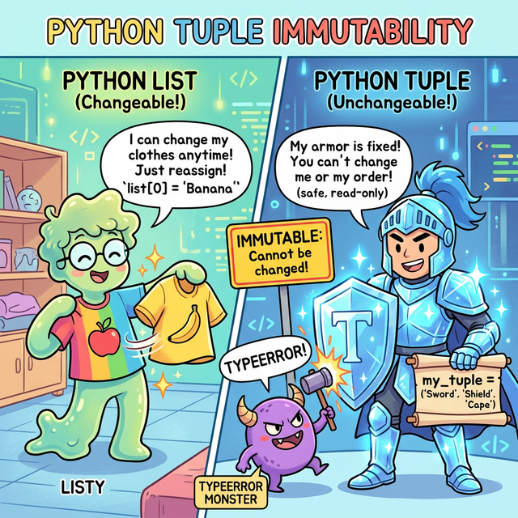

# 3.4.3 파이썬 튜플 (Tuple) 완벽 가이드

## 학습목표
본 장에서는 일단 틀이 만들어진 후 내용물이 절대 외부 조작에 의해 변형되거나 수정되지 않는 **'튜플(Tuple)'**의 보안 및 태생적 안전성의 가치를 명확히 파악합니다. 더 나아가 이 굳건한 성질을 이용해 데이터를 간편히 묶고 푸는 마법 같은 **패킹(Packing)과 언패킹(Unpacking)** 문법의 짜릿함을 실전 예제로 체득합니다.

---

## 💡 TL;DR (1분 핵심 요약): 튜플이 대체 뭔가요?

복잡한 설명에 앞서, **"튜플 = 수정이 불가능한 리스트"** 라고 딱 하나만 기억하시면 됩니다!

1. **생김새**: 리스트가 대괄호 `[1, 2, 3]`이라면, 튜플은 소괄호 `(1, 2, 3)`입니다.
2. **차이점**: 리스트는 데이터를 지우거나(`pop`), 추가할 수(`append`) 있지만, 튜플은 **한 번 만들어지면 죽을 때까지 데이터를 추가/수정/삭제할 수 없습니다.**
3. **사용 이유**: "이 데이터는 프로그램 로딩부터 끝날 때까지 절대 변하면 안 돼!"라는 **안전 금고**가 필요할 때 리스트 대신 튜플을 사용합니다. (게다가 리스트보다 용량도 적게 차지하고 속도도 더 빠릅니다!)

---

## 1. 리스트(List)가 있는데 왜 굳이 튜플(Tuple)을 쓸까? (불변성의 방패)

리스트가 데이터를 자유롭게 뺐다 꼈다 할 수 있는 '고무 기차'라면, 튜플은 한 번 내용물이 들어가면 완전히 용접되어 절대 열리지 않는 **'강철 다이아몬드 금고'**입니다.


*(웹툰 비유: 왼쪽의 '리스트' 소년은 젤리처럼 말랑말랑해서 "사과" 옷을 입었다가 1초 만에 "바나나" 옷으로 휙휙 갈아입으며 즐거워합니다. 오른쪽의 '튜플' 기사는 다이아몬드로 된 철벽 갑옷을 입고 있습니다. 악당 해커(버그 몬스터)가 기사의 검(데이터)을 훔쳐서 바꾸려고(수정 시도) 공격하지만, 다이아몬드 방패에 튕겨 나가며 "TypeError!"를 외치며 쓰러집니다. 튜플의 완벽한 읽기 전용 보안을 상징합니다.)*

*   **보안 방패 (Read-Only)**: 시스템 설정값, 서버의 IP 주소 좌표, 색깔의 RGB 치수 등 **'절대 중간에 프로그램이 해킹당하거나 버그가 나서 변하면 안 되는 숫자들'**을 지킬 때 반드시 튜플을 씁니다.
*   **메모리 다이어트**: 수정 기능(추가, 삭제)을 위한 장치들이 모두 제거되었기 때문에, 리스트보다 메모리를 훨씬 적게 먹어 앱 속도가 빨라집니다.
*   **딕셔너리의 열쇠(Key) 자격**: 내용물이 변하는 리스트는 딕셔너리의 Key로 쓸 수 없지만, 내용물이 영원히 변하지 않는 튜플은 딕셔너리의 Key로 쓸 수 있는 자격이 주어집니다.

---

## 2. 튜플의 기본 형태와 생성 규칙

리스트가 대괄호 `[ ]`였다면, 튜플은 **소괄호 `( )`**를 사용합니다. 때로는 괄호조차 생략할 수 있습니다.

- **기본 형태**: `(item1, item2, item3)`
- 빈 튜플: `()` 또는 `tuple()`
- 🚨 **[주의!] 1개짜리 튜플 생성의 함정**: `(5)`는 숫자를 감싸는 일반 괄호로 인식되어 단순 정수 `5`가 됩니다. 1개짜리 튜플을 만들 때는 반드시 뒤에 콤마(,)를 붙여서 `(5,)` 라고 써야 합니다.


---

## 3. 튜플 실전 조작법 (10선 예제)

### 예제 1: 튜플 소환하기 (다양한 생성법)
```python
empty_tp = ()           # 텅 빈 튜플
tp_normal = (10, 20, 30) # 평범한 튜플
tp_no_bracket = 10, 20  # 🌟 괄호를 빼도 콤마만 있으면 알아서 튜플로 합쳐집니다! (패킹)
tp_single = (5,)        # 데이터가 1개일 땐 반드시 뒤에 쉼표(,)를 달아야 튜플로 인정됩니다.

print(type(tp_normal))   # <class 'tuple'>
print(type(tp_single))   # <class 'tuple'>
print(type((5)))         # <class 'int'> -> 콤마가 없으면 평범한 숫자 취급!
```

### 예제 2: 타겟 조준 타격! 인덱싱 (Indexing)
데이터를 구경(읽기)하는 것은 리스트와 똑같이 `[]`를 써서 인덱스 번호로 꺼냅니다.
```python
colors = ("Red", "Green", "Blue", "Black")

print(colors[0])  # Red
print(colors[-1]) # Black (뒤에서 첫 번째)
```

### 예제 3: 튜플 슬라이싱 (Slicing) - 복사본 도려내기
원본은 절대 다치지 않으므로, 슬라이싱으로 마음껏 복사 토막을 내도 안전합니다.
```python
numbers = (0, 1, 2, 3, 4, 5)

print(numbers[1:4])  # (1, 2, 3) 
print(numbers[::-1]) # (5, 4, 3, 2, 1, 0) -> 전체를 싹 뒤집은 '새로운' 튜플 탄생 (원본은 무사함)
```

### 예제 4: 🚨 침입자 격퇴! (불변성으로 인한 에러)
튜플의 핵심입니다. 안의 내용물을 무력으로 바꾸려고 하면 즉시 파이썬 에러가 터지며 프로그램을 멈춰버립니다.


```python
tp = (10, 20, 30)

# tp[0] = 99  # 🚨 주석 해제 시 TypeError: 'tuple' object does not support item assignment (변경 불가) 폭발!
# tp.append(40)  # 🚨 AttributeError 폭발 (추가 불가)
# del tp[0]      # 🚨 TypeError 폭발 (삭제 불가)
```

### 예제 5: 마법의 문법! 패킹(Packing)과 언패킹(Unpacking) 🌟🌟🌟
파이썬 코드를 예술로 승화시키는 가장 멋진 기능입니다. 가방(튜플) 하나에 여러 물건을 때려 넣고(`패킹`), 다시 여러 변수에게 1:1로 한방에 나누어 줍니다(`언패킹`).


```python
# 1. 패킹 (괄호 없이 쉼표로 변수에 던지면, 알아서 한 묶음의 튜플 가방이 됩니다)
my_bag = 10, 20, 30 
print(my_bag) # (10, 20, 30)

# 2. 언패킹 (가방 안의 물건들을 한 번에 좌변의 새 변수들에게 1:1로 찢어서 줍니다)
a, b, c = my_bag
print("b의 값:", b) # 20

# 3. 궁극의 Swap (임시 변수 없이 a와 b 데이터 한 방에 맞바꾸기!)
a, b = b, a # 우변에서 패킹된 후 좌변에서 교차로 언패킹됨
print(f"a: {a}, b: {b}") # a: 20, b: 10
```

### 예제 6: 언패킹 시 데이터 개수가 안 맞으면? (`*` 별표의 마법)
튜플 데이터는 5개인데 받을 변수가 3개밖에 없으면 에러가 납니다. 이때 변수명 앞에 `*`(별)을 붙여주면, "나머지 떨이는 싹 다 모아서 리스트로 만들어라!"라는 뜻이 됩니다.
```python
tp = (1, 2, 3, 4, 5)

first, second, *others = tp

print(first)  # 1
print(second) # 2
print(others) # [3, 4, 5] (나머지 찌꺼기를 리스트로 묶어버림!)
```

### 예제 7: 튜플 덧셈과 곱셈 (새로운 튜플 창조)
내부 요소를 수정하진 못하지만, 튜플 2개를 이어 붙여서 아예 **완전히 새로운 거대한 튜플 세계**를 창조하는 것은 허락됩니다.
```python
t1 = (1, 2)
t2 = (3, 4)

t3 = t1 + t2 
print(t3) # (1, 2, 3, 4)

t4 = t1 * 3 # 3번 반복 복제
print(t4) # (1, 2, 1, 2, 1, 2)
```

### 예제 8: 튜플 안에 리스트를 넣는다면? (치명적 함정 🚨)
튜플 자체는 겉이 다이아몬드 상자라서 형태와 순서를 수정할 수 없습니다. 하지만 그 다이아몬드 상자 안에 말랑말랑한 젤리(리스트)를 품었다면, **그 젤리 속은 파먹거나 바꿀 수 있습니다.**
*(이는 자바스크립트의 `const` 키워드로 선언된 객체의 내부 속성은 바꿀 수 있는 것과 원리가 똑같습니다. "가리키는 주소(레퍼런스)"만 불변이고, "주소 안의 내용물"은 불변이 아니기 때문입니다.)*

```python
# [1, 2]는 변경 가능한 리스트입니다!
trap_tuple = (10, 20, [1, 2])

# trap_tuple[0] = 99 # 🚨 이건 안됩니다! 튜플 자체의 요소(숫자 10)를 덮어쓰려 하므로 에러 폭발!

# 하지만 2번 방에 있는 젤리(리스트)의 내용물을 손대는 건 허락됩니다!
trap_tuple[2][0] = 99 

print(trap_tuple) # (10, 20, [99, 2])
```

### 예제 9: 리스트와 튜플 맘대로 오가기 (형 변환)
데이터를 보호해야 할 땐 튜플로 묶고, 데이터를 추가/수정해야 할 땐 잠깐 리스트로 탈바꿈시키면 끝입니다.
```python
tp = (1, 2, 3)

# 수정하고 싶다! 리스트로 녹입니다.
ls = list(tp) 
ls.append(4)  # 4 추가 성공!

# 다시 아무도 못 건드리게 튜플로 굳혀버립니다.
tp_secured = tuple(ls) 
print(tp_secured) # (1, 2, 3, 4)
```

### 예제 10: 딕셔너리의 Key로 취직하는 튜플
리스트는 내용물이 변할 위험이 있어 딕셔너리(사전)의 열쇠(Key)로 사용할 수 없지만, 절대 불변하는 튜플은 훌륭하고 유일한 다중 열쇠가 됩니다. (예: 지도 좌표계)
```python
map_data = {}

# (위도, 경도) 형태의 튜플은 값이 영원히 불변하므로 딕셔너리의 열쇠로 합격!
map_data[(37.5, 126.9)] = "Seoul"
map_data[(35.1, 129.0)] = "Busan"

print(map_data[(37.5, 126.9)]) # 출력: Seoul
```

---

## ☕ Java vs 🐍 Python 스나이퍼 비교

### 1. 여러 데이터를 반환하는 함수의 우아함
*   **Java**: 맵의 좌표 X, Y 두 가지 숫자를 동시에 함수에서 반환하고 싶으면 정말 고통스럽습니다. `Point`라는 클래스를 따로 설계해서 객체화하거나, 지저분한 길이가 2인 배열 `int[]`로 담아 던져야 합니다.
*   **Python**: 그딴 거 없습니다. 그냥 `return x, y` 라고 쓰면 끝입니다. 내부적으로 알아서 패킹되어 튜플 `(x, y)`로 던져지고, 호출하는 측에서도 `a, b = get_point()` 처럼 곧바로 언패킹해서 받아먹으면 그만입니다.

### 2. 읽기 전용 상수 배열 (Read-Only) 구문
*   **Java**: 배열 요소의 수정을 막기 위해 `Collections.unmodifiableList()` 같은 길고 긴 유틸리티 방어막을 억지로 씌워야 합니다.
*   **Python**: 튜플 소괄호 `()` 하나로 완벽하게 하드웨어 레벨의 불변 체인을 구축하여 데이터 훼손을 100% 차단합니다.

---

## 🎧 Vibe Coding

> **🗣️ 학생 프롬프트 (AI에게 이렇게 명령해 보세요):**
> "파이썬 언패킹 구문과 튜플을 활용한 문제 코드를 만들어줘. 튜플 `data = ("Alex", 25, "New York", 95, 88, 92)` 가 있어. 여기서 사람 이름은 `name`, 나이는 `age`, 도시는 `city` 라는 3개의 변수에 언패킹으로 각각 할당하고, 뒤에 달린 점수 3개(95, 88, 92)는 튜플의 개수가 늘어나도 유연하게 받을 수 있게 `*` 기호를 써서 `scores` 라는 하나의 리스트 덩어리 변수로 모두 빨아들이는 1줄짜리 언패킹 식 코드를 작성해서 나에게 보여줘."

---

## 코딩 영단어 학습 📝

*   **Tuple**: 두 개 이상의, 여러 개로 이루어진 데이터의 쌍. (원래 수학이나 데이터페이스 용어에서 행(Row), 즉 변할 수 없는 한 덩어리의 레코드 정보를 뜻합니다.)
*   **Immutable**: 불변의, 변경할 수 없는. ('Im(아니다)' + 'Mutate(돌연변이, 변화)' + 'able(~할 수 있는)'. 요람에서 무덤까지 절대 변질되지 않는 코딩 세상 제일 단단한 다이아몬드 속성입니다.)
*   **Pack / Unpack**: 짐을 싸다 / 짐을 풀다. (변수들을 하나의 튜플 여행 가방에 차곡차곡 쓸어 담는 것을 '패킹', 여행지에 도착해 가방문 괄호를 열고 튜플 데이터를 1:1로 변수라는 옷걸이에 널어주는 것을 '언패킹'이라고 합니다.)
