# 3.4.4.1 나이트클럽 문지기: 집합(Set)과 고유성(Uniqueness)

## 학습목표
투입된 순서 따위는 신경 쓰지 않고 오로지 세상에 단 하나뿐인 **'고유한 본질(Unique)'** 데이터만 담아두어 중복을 완전히 철폐시켜 버리는 파이썬 **세트(Set)**의 존재 이유와 작동 원리를 학습합니다.

---

## 1. 세트(Set) = 중복을 허락하지 않는 마법의 주머니

딕셔너리가 국어사전이고 튜플이 다이아몬드 상자라면, 세트(Set)는 무엇에 비유할 수 있을까요? 
세트는 중복된 클론 인간들을 무자비하게 돌려보내는 수학적 **'나이트클럽 문지기(Bouncer)'** 혹은 구슬을 섞어 넣는 **'마법 주머니'**에 비유할 수 있습니다.


> 💡 **웹툰 비유:** 왼쪽 그림의 턱시도를 입은 철통같은 문지기(Python Set)는 문 앞에서 똑같은 옷, 똑같은 얼굴을 한 중복 손님(Clone)들의 입장을 단호하게 거부하며 "No Duplicates Allowed!"를 외칩니다. 오직 그동안 1번도 입장하지 않았던 유니크(Unique)한 사람만 들여보내 줍니다. 

### 🛡️ 왜 귀찮게 세트를 써야 할까?
수만 건 이상의 난잡한 유저 접속 로그인 데이터, 혹은 중구난방의 엑셀 데이터 속에서 **"딱 한 번이라도 방문한 적 있는 독립적인 유저 명단"**을 뽑아내려면 어떻게 해야 할까요? 
과거에는 구질구질하게 리스트를 하나하나 꺼내보며(for문) "이 사람이 목록에 있나?" 일일이 대조를 해야 했습니다. 하지만 파이썬에서는 모든 데이터를 세트 용광로에 던져넣기만 하면, 단 1초 만에 찌꺼기 중복이 타서 없어지고 빛나는 알맹이만 남게 됩니다.

---

## 2. 세트의 시각적 작동 원리 (문지기 애니메이션)


> 💡 **다이어그램 해석:** 
> 1. 좌측의 대기열(List)에는 숫자 1, 2, 3이 있고, 그 뒤로 또 다른 숫자 3 복제본들이 줄을 서 있습니다.
> 2. 숫자들이 하나씩 문지기(Set 함수)를 통과하여 우측의 클럽 스테이지 내부로 입장합니다.
> 3. 이미 클럽 안에 숫자 3이 입장해 있는 상태에서 뒤따라온 **복제본 숫자 3들은 문지기의 가차 없는 킥에 맞아 입장 컷(거절)** 당합니다. 이로써 세트 안에는 1, 2, 3만 유일하게 존재하게 됩니다.

---

## 3. 세트의 기본 형태와 2가지 치명적 제약상황

딕셔너리와 똑같이 중괄호 `{ }`를 쓰지만, 콜론(`:`) 짝맞춤 없이 그냥 구슬(값)들만 쉼표로 흩뿌려진 형태입니다.

*   기본 형태: `my_set = {1, 2, 3, 4}`

하지만 세트를 사용할 때는 2가의 매우 치명적인 물리적 규칙(제한)을 숙지해야 합니다.

### 제약 1. 빈 세트를 `{}`로 만들면 딕셔너리로 오해받음
중괄호 `{ }` 기호의 원조 주인은 딕셔너리입니다. 따라서 값 없이 빈 중괄호만 치면 파이썬은 무조건 그것을 빈 딕셔너리로 취급합니다.

```python
# 🚨 딕셔너리와의 기호 충돌 주의
empty_trap = {}
print(type(empty_trap)) # <class 'dict'> (세트가 아님!)

# ✅ 진정한 빈 세트의 소환법
real_empty_set = set()
print(type(real_empty_set)) # <class 'set'>
```

### 제약 2. 인덱스(순서)의 완벽한 붕괴
리스트나 튜플은 먼저 들어간 데이터가 `0`번 기차 칸에 탄다는 확고한 질서(순서)가 있습니다. 하지만 세트는 거대한 둥근 주머니입니다. 안에 넣고 손으로 휘휘 섞는 것과 같아서, 어떤 놈이 `0`번째인지 파이썬 자체도 모르게 됩니다.

```python
lottery = {45, 2, 33, 15}

# 🚨 세트에는 몇 번째 방이라는 개념 자체가 성립하지 않습니다!
# print(lottery[0]) # TypeError: 'set' object is not subscriptable 폭발!
```

이러한 무질서 덕분에 데이터가 어디에 있든 상관없이 순서를 지은 메모리 족쇄가 풀려있어, 앞서 배운 마법의 암호화 기술인 **해시(Hash)** 탐색과 결합하여 데이터 검색 속도가 기가 막히게 빨라집니다. 

다음 장에서는 이렇게 순서 없는 세트 주머니에서 데이터를 어떻게 안전하게 넣고 빼는지, 핵심 조작법과 메서드들을 살펴보겠습니다.
