# 3.4.4.2 마법 주머니 다루기: 넣기, 빼기, 핵폭탄

## 학습목표
중괄호 `{ }`의 원주인인 딕셔너리와의 충돌을 피하여 진짜 빈 세트를 소환하는 방법을 명확히 익힙니다. 또한 세트 안에 데이터를 추가하는 `add()`, `update()`와 데이터를 제거할 때 에러 유무에 따라 골라 써야 하는 `remove()`, `discard()` 메서드의 차이점을 완벽하게 이해합니다.

---

## 1. 세트 추가/수정의 시각적 메커니즘

인덱스(순서)가 존재하는 리스트 배열은 무조건 '맨 끝에' 덧붙여지는 `append()` 라는 단어를 쓰지만, 순서 없이 커다란 호주머니 같은 모양을 띈 세트(Set)는 데이터 구슬을 그냥 스윽 허공에 던져넣는 **`add()`** 라는 단어를 사용합니다. 당연히 몇 번째 위치에 떨어질지는 파이썬 마음입니다.


> 💡 **다이어그램 해석:** 세트(`myset`)라는 거대한 바운더리 구역 안에 3가지 조작이 들어옵니다.
> 1. **`add(99)`**: 파란색 새 구슬(99)이 허공에서 툭 떨어져 안착합니다.
> 2. **`remove(10)`**: 들어있던 구슬(10)을 지목하자 폭발하며 사라집니다. 단, 만약 주머니에 애초에 10이 없었다면 프로그램 전체가 터집니다(KeyError).
> 3. **`discard(50)`**: 50을 없애라고 지시했지만, 주머니 안을 뒤져보니 50이 없습니다. 그래도 조용히 🛡️방어막(무시)을 치며 다음 코드로 무사히 넘어갑니다.

---

## 2. 세트의 생성과 추가 (`add`, `update`)

기본적으로 세트를 만들 때는 리스트인 척 감싸주거나, 데이터들을 중괄호 기호로 나열하면 됩니다. 하지만 **리스트, 딕셔너리처럼 형태가 변할 수 있는 객체는 세트 안에 넣으려 시도하면 에러가 납니다.** 오직 문지기를 통과할 수 있는 '불변의 객체'만 허락됩니다.

```python
# 1. 일반적인 텍스트 구슬들을 넣은 집합
basket = {'apple', 'orange'}

# 2. 새로운 구슬 한 알 추가! (add)
basket.add('banana')
print(basket) # {'apple', 'banana', 'orange'} (순서는 역시 무작위 배치됩니다)

# 3. 여러 개의 구슬 묶음을 한방에 쏟아 붓기! (update)
basket.update(['mango', 'grape', 'apple']) 
print(basket) # 'apple'은 중복되어 튕겨나가고 (무시), 나머지만 새롭게 유입됩니다.
```

---

## 3. 원소 삭제법의 양대 산맥: `remove` vs `discard`

이 차이점은 코딩 테스트나 실무 서버 방어 로직에서 매우, 매우 중요합니다.

### 💣 파괴적 단두대 제거: `remove()`
내가 확신하고 지시한 데이터가 주머니 안에 정확히 있을 때만 씁니다. 만약 없으면 프로그램이 파괴적인 에러를 뿜으며 멈춥니다.
```python
s = {1, 2, 3}

s.remove(2) # 정상 삭제 -> {1, 3} 남음
# s.remove(99) # 🚨 주석 해제 시 KeyError: 99 에러 폭발! 없는 걸 빼달라 했다며 화를 냅니다.
```

### 🛡️ 자비로운 무시 제거: `discard()`
"혹시 있으면 지워주고~ 없으면 그냥 넘어가~" 라는 식의 부드러운 삭제입니다. 실버 총알(Silver Bullet)처럼 실무 코딩에서 에러 방어용으로 훨씬 많이 쓰이며, 초보자들이 반드시 익혀야 할 핵심 메서드입니다.
```python
s = {1, 2, 3}

s.discard(99) # 99 번은 불행히도 주머니에 없습니다. 그러나 파이썬은 에러 없이 평온하게 웃으며 무시해 넘깁니다!
print(s) # 여전히 {1, 2, 3} 무사 통과!
```

---

## 4. 특수 제거 메서드 (`pop`, `clear`)

### 🎲 러시안룰렛 무작위 뽑기: `.pop()`
리스트에서 배운 `pop()`은 '무조건 맨 뒤 꼬리칸의 녀석'을 잡아오지만, 세트는 앞뒤 순서가 없으므로 **정말 로또 볼을 뽑듯이 무작위로 아무거나 하나가 튀어나와서 소멸합니다.**

```python
s = {'사과', '바나나', '포도'}

sacrificed = s.pop() # 누군가 하나 랜덤으로 추출되어 영원히 주머니 속에서 사라집니다!
print("희생된 제물:", sacrificed)
print("남은 세트 통:", s)
```

### ☢️ 핵폭탄 초기화: `.clear()`
더 이상 세트 데이터가 필요 없거나 메모리를 비루어주고 싶을 때, 내용물을 모조리 증발시켜 빈 깡통으로 리셋합니다.

```python
s = {1, 2, 3}
s.clear()

print(s) # set() 이라는 텍스트가 뜨며, 진짜 오리지널 빈 세트가 되었음을 확인시켜 줍니다.
```

다음 장에서는 세트를 쓰는 진정한 이유이자 핵심 백미인 $A \cup B, A \cap B$ 등 수학 시간에 배웠던 **벤 다이어그램 연산**을 기호 하나로 순식간에 끝내버리는 파이썬 기적의 수학 연산자들을 다룹니다.
