# 3.4.4.3 단 한 줄의 수학적 마법: 벤 다이어그램 연산

## 학습목표
`for` 루프와 `if` 문을 덕지덕지 발라 10줄의 코드로 짜던 두 데이터 그룹 간의 교차/차이 비교 로직을, 파이썬 특유의 **단 1글자 수학 기호(`|`, `&`, `-`)**로 우아하게 끝내버리는 궁극의 세트 연산법을 마스터합니다. 또한, 해시 알고리즘 덕분에 빛보다 빠른 속도를 자랑하는 `in` 연산자의 위력도 체험합니다.

---

## 1. 노가다를 파괴하는 세트 연산자 기호

자바(Java)나 C언어에서 A 반 학생 리스트와 B 반 학생 리스트가 있을 때, **"두 반 모두 축구부에 가입한 공통 학생(교집합)을 찾아라"** 라는 코드를 짠다고 생각해 보세요. A 리스트를 처음부터 끝까지 돌면서, 그 하나하나를 가지고 B 리스트를 또 전부 뒤져보는 이중 `for` 루프 지옥에 빠지게 됩니다.

하지만 파이썬에서는 두 데이터 그룹을 **세트(Set)**로 묶어주기만 하면 중학교 수학 시간에 배운 **벤 다이어그램(Venn Diagram) 기호** 하나로 모든 연산이 0.1초 만에 끝나버립니다. 이 우아함 하나만으로도 데이터 사이언티스트들이 파이썬을 사랑할 이유는 충분합니다.


> 💡 **다이어그램 해석:** 녹색 불빛이 이동하는 4가지 수학 연산의 흐름을 보여줍니다.
> 1. **합집합 `|`**: A와 B의 모든 구역을 비춥니다 (단, 겹치는 가운데 3번 영역이 중복 카운트 되지 않습니다).
> 2. **교집합 `&`**: 양쪽 모두가 겹치는 한가운데 코어 영역(3)만 비춥니다.
> 3. **차집합 `-`**: A에서 B 쪽으로 넘어간 파이를 도려낸 순수 A 구역(1, 2)만 비춥니다.
> 4. **대칭 차집합 `^`**: 양쪽 다 걸쳐있는 박쥐 구역(3)을 도려내고, 순수하게 한 쪽에만 속한 변두리(1, 2, 4, 5)만 합쳐 비춥니다.

---

## 2. 실전 코드로 보는 4대 벤 다이어그램 연산

```python
A = {'민수', '영희', '철수'} # A반 축구부
B = {'영희', '철수', '길동'} # B반 농구부

# 1. 합집합 (Union) | 
# 축구나 농구 적어도 하나는 하는 모든 학생
print(A | B) 
# 결과: {'민수', '길동', '철수', '영희'} (중복된 영희, 철수는 1명씩만 남음!)

# 2. 교집합 (Intersection) & 
# 축구와 농구 둘 다 하는 괴물 체력 학생은?
print(A & B) 
# 결과: {'철수', '영희'}

# 3. 차집합 (Difference) - 
# A반 학생 중에서 농구부랑 겹치는 애 빼고 순수 축구파만!
print(A - B) 
# 결과: {'민수'}

# 4. 대칭 차집합 (Symmetric Difference) ^ 
# 겹치는 애들(철수, 영희) 제외하고, 한 가지 운동만 파는 순수파 집합
print(A ^ B) 
# 결과: {'민수', '길동'}
```

### 💡 [참고] 영어 단어 메서드를 써도 됩니다!
기호가 헷갈리거나 협업 과정에서 모두가 코드를 읽기 편하게 만들고 싶다면, 영어 단어로 된 전용 메서드를 사용해도 결과는 100% 똑같습니다.
*   합집합: `A.union(B)`
*   교집합: `A.intersection(B)`
*   차집합: `A.difference(B)`
*   대칭 차집합: `A.symmetric_difference(B)`

---

## 3. 빛보다 빠른 포함 여부 검사기 (`in` 연산자)

집합 연산만큼이나 실무에서 세트를 쓰는 압도적인 이유가 하나 더 있습니다. 바로 **어떤 물건이 들어있는지 뒤져보는 '탐색 속도'**입니다.

만약 가입자 명단 리스트에 100만 명의 이메일이 들어있다고 칩시다. "jinydev@test.com 이 가입되어 있나?" 하고 리스트 끝에서부터 찾으면, 최악의 경우 100만 번을 들춰봐야 합니다. 

하지만 **데이터를 딕셔너리처럼 해시 테이블 통에 부어서 으깨놓은 세트(Set)**를 사용하면, 내부 인덱스 순서 따윈 무시하고 계산식 단 한 번에 **0.001초 단위인 O(1)의 속도**로 그 사람이 있는지 없는지 즉각 판별해 냅니다.

```python
# 100만 개가 들어있다고 상상해 봅시다.
certified_users = {'john', 'jane', 'jinydev', 'alice'} 

# ⚡ 마법의 in 연산자: "이 통 안에 jinydev 가 있습니까?"
if 'jinydev' in certified_users:
    print("인증된 유저입니다! 패스!") 
```
*`in` 연산자는 리스트에서도 쓸 수 있지만, 속도 면에서 세트(Set)의 발끝에도 미치지 못합니다. "존재 유무"만 빠르게 필터링하려면 반드시 세트를 쓰세요.*

---

## 🎧 Vibe Coding (프롬프트 활용법)

> **🗣️ 학생 프롬프트 (AI에게 이렇게 명령해 보세요):**
> "파이썬 세트 연산자 기호를 써서 다음 문제를 1줄로 풀어줘.
> 넷플릭스 영화를 본 사람 명단이 들어있는 두 리스트가 있어. 
> `movie_A_viewers = ['민수', '지아', '철수', '민수', '하늘']`  (1탄 본 사람)
> `movie_B_viewers = ['지아', '길동', '하늘', '보미']` (2탄 본 사람)
> 일단 각각의 리스트를 세트로 변환해서 중복된 사람을 날려버리고, '1탄과 2탄을 모두 끝까지 정주행 한 진성 팬(교집합)'이 누구누구인지 `print()` 해주는 가장 짧은 코드를 작성해 줘."

**[최종 정리]**
**투입 순서는 무시하고 오직 유니크(Unique)함만 남기는 마법의 주머니!** 
수만 개의 파편화된 데이터를 뭉쳐서 분석하거나, 방대한 군집 사이클에서 '공통분모'와 '차이점'을 1초 만에 뽑아내 주는 이 세트의 강력한 벤 다이어그램 무기를 잘 활용한다면, 여러분은 데이터 사이언스의 첫걸음을 아주 훌륭하게 떼신 것입니다. 
